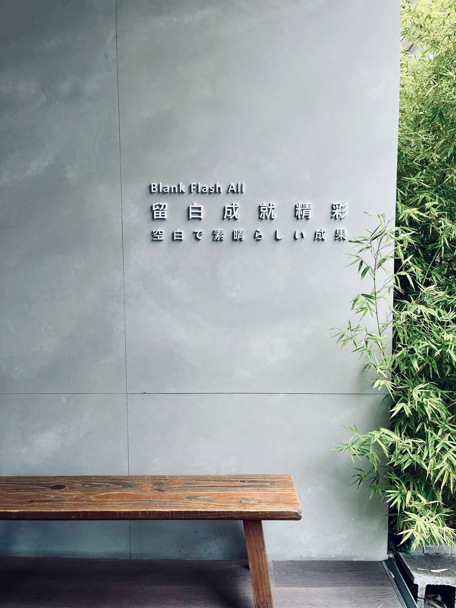

<!-- SELF-INTRO-START -->

_嗨，我是 [黃樺明](https://huam.ing)，我熱愛 [寫作](https://huam.ing/writing)、[耐力運動](https://www.strava.com/athletes/huaminghuang)、[開發提升生活品質的軟體工具](https://github.com/huaminghuangtw)。Enoughness，是我從 2023 年開始每天練習的生活哲學，一種「剛剛好」的生活態度。每週，我會在這份電子報分享三件有趣的事。如果這封信是朋友轉寄給你的，歡迎 [點此訂閱](https://huam.ing/newsletter)。想看看過往內容？[歷年電子報](https://huam.ing/enoughness) 都在這裡。_

<!-- SELF-INTRO-END -->

---

# 1

我報名了 [2025 故宮南院馬拉松](https://lohasnet.tw/SouthNPM2025/)！

日期是 12/7，這將會是 [我的第二場全馬](https://huam.ing/2025/12/12/enoughness-9/#2)（上一次是 [2024/6/1 的斯德哥爾摩 🇸🇪 馬拉松](https://www.strava.com/activities/11550346512)）。

這個想法來自日本 [Misogi](https://www.google.com/search?q=日本+Misogi)（禊 ㄒㄧˋ）的概念：每年選定一天，挑戰一件極度困難、難到會讓你懷疑人生的事。完成後，這個經驗將在接下來 364 天裡，為你帶來正面的漣漪效應。

對了，你有什麼長跑訓練的訣竅嗎？

我很喜歡 [李利恩 Liam | 教你如何成為自己的教練](https://www.instagram.com/liam0520/) 的專業教學！

# 2

你最近一次抬頭看天空是什麼時候呢？你會抬頭仰望白雲慢慢飄過嗎？[我會，尤其是等紅綠燈的時候](https://www.reddit.com/r/itookapicture/comments/yi8x9s/itap_of_a_sunset_and_a_powerline_over_2_hours/) 😌

# 3

[電扶梯走左邊 Jacky](https://podcasts.apple.com/tw/podcast/%E9%9B%BB%E6%89%B6%E6%A2%AF%E8%B5%B0%E5%B7%A6%E9%82%8A-with-jacky-left-side-escalator/id1544225078) 的這集專訪《[#175 文姿云 - 從奧運戰場到內心道場：探索第二人生的挑戰/好奇/勇氣](https://youtu.be/KiUf5rWI4DE)》聊了許多運動員的自我對話。

這讓我想到 [大谷翔平](https://www.google.com/search?q=大谷翔平) 在 [2023 年世界棒球經典賽冠軍戰前熱血又中二的喊話](https://youtu.be/9-yTtST_Fvk)：

> 光是仰慕對手是無法超越他們的，我們是為了超越他們才來到這裡的。

# 4

[張修修](https://www.google.com/search?q=張修修) 的影片《[消失 2 個月，我終於下定決心直面人生的大魔王](https://youtu.be/AA3JelDoOio)》好感人 🥹

每個人心裡都住著一位 [內在小孩](https://www.google.com/search?q=內在小孩)，記得常跟他說：「你很棒，放輕鬆，別太逼自己了。」

對了，10/10 是國慶日，也是 [世界心理健康日](https://www.google.com/search?q=世界心理健康日) 喔！

# 5

一個讓我驚嘆不已的發現：你看過 [像天鵝絨一樣的孔雀石](https://www.reddit.com/r/NatureIsFuckingLit/comments/jg9l6d/raw_velvety_malachite/) 嗎？看起來超不真實，但它竟然是真的！點進去看看大自然的鬼斧神工。

# 6

[Anu Atluru](https://x.com/anuatluru) 在 _[Make Something Heavy](https://www.workingtheorys.com/p/make-something-heavy)_ 寫的這句話，給了我一記當頭棒喝：

> What have you made that could survive a month offline? A year? A decade? If you stopped posting tomorrow, would anything remain? Creating for 24-hour cycles isn’t freedom, leverage, or legacy—it’s just renting out your time.

嗯，重質不重量！

# 7

最近好喜歡吃地瓜，直接去全台最大地瓜產區 [雲林水林鄉](https://www.google.com/maps?q=雲林水林鄉) 的 [美美地瓜行](https://www.google.com/maps?q=水林美美地瓜行) 扛了半個飼料袋（約 15 公斤）的 [紫心地瓜](https://www.google.com/search?q=紫心地瓜)。

熱情的老闆娘還額外送我們蜜地瓜、烤地瓜和冰心地瓜，滿滿的人情味。

順便分享個小知識：紫心地瓜富含 [花青素](https://www.google.com/search?q=花青素)，對於身體抗發炎、預防和降低肌肉酸痛很有幫助！而且膳食纖維高、甜度低，是營養美味的好選擇。


# 8

你是否也曾在夜深人靜時輾轉難眠？

也許，你需要給大腦一個「喘息」空間。

很多時候，不是因為不夠累，而是大腦沒有足夠時間，去消化一整天下來的 [資訊轟炸](https://huam.ing/2025/8/14/sherlock-holmes-brain-attic/)。

我們習慣在醒著時，把每個空檔都塞滿各種訊息、郵件、音樂、新聞、社群媒體。

代價就是剝奪靠近本心、與自己對話的機會。

很多 [人生大哉問](https://stephango.com/40-questions-decade) 的答案早已藏在內心深處；我們只需要用 [對的問題](https://huam.ing/journal-prompt) 讓它們浮現。

當我主動關掉外界的噪音，刻意讓自己「無聊」後，我發現許多想不通的問題都會在白天迎刃而解，夜晚也跟著平靜入睡。

試著在生活中刻意留白，每天 [留十八分鐘給自己](https://youtu.be/6i7RcP39NB0)：

* 早上起床後，不要馬上滑手機，坐在床邊，感受身體的訊號。
* 吃飯時，不要配 YouTube，也不要回訊息，就只是單純地品嚐食物。
* 等紅綠燈時，忍住不拿手機，觀察路人的表情，或是單純地發呆、深呼吸。

就如同愛情跟書寫，生活也需要適時地留白。你的靈魂也需要這些留白的片刻，才能從日常的喧囂裡浮現出來跟你對話。

**留白，是預留空間給奇蹟；留白，才能成就精彩。**



# 9

[生活小撇步](https://huam.ing/life-pro-tip)：逛大賣場時，經常找不到小孩嗎？[試試這個方法](https://www.reddit.com/r/lifehacks/comments/11o1u5z/works_on_kids_too_and_theyll_willingly_go_along/)。

# 10

偶然看到這個超精緻的 [Emoji 漸層金字塔](https://www.reddit.com/r/coolguides/comments/11vvgs5/comment/jcvw932)，太有才了！

```text
👊🏿👇🏿👇🏿👇🏿👇🏿👇🏿👇🏿👇🏿👇🏿👇🏿👊🏿
👉🏿👎🏾👇🏾👇🏾👇🏾👇🏾👇🏾👇🏾👇🏾👎🏾👈🏿
👉🏿👉🏾👎🏽👇🏽👇🏽👇🏽👇🏽👇🏽👎🏽👈🏾👈🏿
👉🏿👉🏾👉🏽👎🏼👇🏼👇🏼👇🏼👎🏼👈🏽👈🏾👈🏿
👉🏿👉🏾👉🏽👉🏼👎🏻👇🏻👎🏻👈🏼👈🏽👈🏾👈🏿
👉🏿👉🏾👉🏽👉🏼👉🏻🗿👈🏻👈🏼👈🏽👈🏾👈🏿
👉🏿👉🏾👉🏽👉🏼👍🏻👆🏻👍🏻👈🏼👈🏽👈🏾👈🏿
👉🏿👉🏾👉🏽👍🏼👆🏼👆🏼👆🏼👍🏼👈🏽👈🏾👈🏿
👉🏿👉🏾👍🏽👆🏽👆🏽👆🏽👆🏽👆🏽👍🏽👈🏾👈🏿
👉🏿👍🏾👆🏾👆🏾👆🏾👆🏾👆🏾👆🏾👆🏾👍🏾👈🏿
👊🏿👆🏿👆🏿👆🏿👆🏿👆🏿👆🏿👆🏿👆🏿👆🏿👊🏿
```

— [樺明](https://huam.ing/2025/10/17/enoughness-1)

---

<p align="center">
<sub>
“Be who you were created to be, and you will set the world on fire.”
<br>
— St. Catherine of Siena
</sub>
</p>
