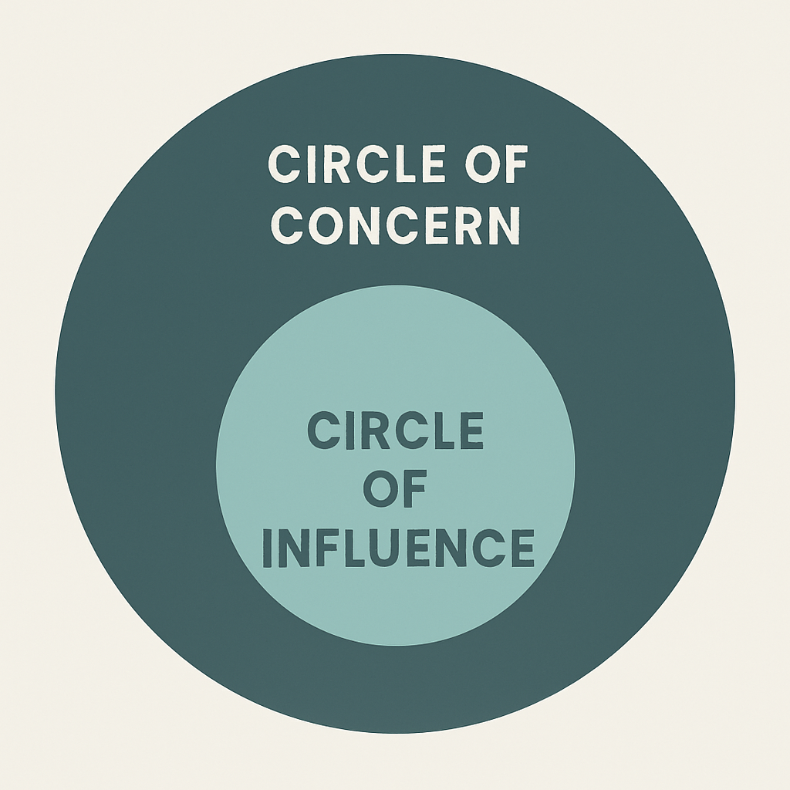

<!-- SELF-INTRO-START -->

_嗨，我是 [黃樺明](https://huam.ing)，我熱愛 [寫作](https://huam.ing/writing)、[耐力運動](https://www.strava.com/athletes/huaminghuang)、[開發提升生活品質的軟體工具](https://github.com/huaminghuangtw)。Enoughness，剛剛好，是我從 2023 年開始每天練習的生活態度。每週，我會在這份電子報分享三件有趣的事。如果這封信是朋友轉寄給你的，歡迎 [點此訂閱](https://huam.ing/newsletter)。想看看過往內容？[歷年電子報](https://huam.ing/enoughness) 都在這裡。_

<!-- SELF-INTRO-END -->

---

# 1

> 「古之欲明明德於天下者，先治其國。欲治其國者，先齊其家。欲齊其家者，先修其身。欲修其身者，先正其心。」—《禮記 · 大學》

美國著名的管理學大師 [Stephen Covey](https://www.google.com/search?q=Stephen+Covey) 在《[與成功有約](https://readingoutpost.com/the-7-habits/)》（The 7 Habits of Highly Effective People）書中提出 [「影響圈」（Circle of Influence）與「關注圈」（Circle of Concern）](https://smarter01.com/circle-of-control/) 的概念。

「關注圈」指我們關心但無法直接控制的事物（例如國家政策、氣候變遷、他人的看法等）；「影響圈」則涵蓋我們能直接掌控的事物（例如言行、習慣、態度、想法等）。

當我們持續專注於自己的「影響圈」，它就會慢慢擴大，最終讓我們擁有改變「關注圈」的實質力量。

所以，如果想改變世界，那麼，改變自己會是個很好的起點。

漸漸地，你就越有能力改善那些曾經無以力的事。

有一天，你會發現自己已經開始改變世界。

成為你想看見的改變。

# 2

[上一期](https://huam.ing/2025/10/31/enoughness-3/#2) 提到，人在臨終前，通常都是後悔那些沒做的事或沒說的話。

而我們之所以不敢行動，往往出自於對「失敗」的恐懼。

**但，失敗真的那麼可怕嗎？**

[失敗博物館](https://museumoffailure.com)（Museum of Failure）是一座專門展示「創新失敗案例」的博物館，由瑞典組織心理學家 [Samuel West](https://www.google.com/search?q=Samuel+West) 於 2017 年在瑞典 [Helsingborg](https://www.google.com/maps?q=Helsingborg) 創立。

他們的核心理念是：

> 失敗是創新的必要條件，沒有足夠的失敗，就沒有所謂的創造力。

展品涵蓋 [來自世界各地的「失敗產品」與「錯誤決策」](https://museumoffailure.com/#explore)，包括這些經典的「翻車」例子：

* [Coca-Cola BlāK](https://en.wikipedia.org/wiki/Coca-Cola_Bl%C4%81K) — 可口可樂混搭咖啡，聽起來很提神，喝起來卻令人提心吊膽，上市不到兩年就悄悄下架。
* [Segway](https://zh.wikipedia.org/wiki/%E8%B3%BD%E6%A0%BC%E5%A8%81) — 當年被譽為「改變人類交通方式」的發明，雖然技術創新，但又貴又笨重，最終淪為保全與觀光導覽工具的專用車。
* [三星 Galaxy Note 7 手機](https://zh.wikipedia.org/zh-tw/%E4%B8%89%E6%98%9FGalaxy_Note_7) — 原本主打「大電池、長續航」，卻因為電池瑕疵導致自燃、爆炸等安全問題，最後甚至被航空公司全面禁止帶上飛機。
* [高露潔冷凍義大利麵](https://museumoffailure.com/exhibition/colgate-kitchen-entrees) — 牙膏品牌跨界賣冷凍晚餐，理念是「吃完馬上刷牙」，但似乎沒人想吃「高露潔口味的義大利麵」。
* [Juicero](https://www.google.com/search?q=Juicero) — 矽谷著名的失敗之作：要價 400 美元的智慧型果汁機，還能連 Wi-Fi 驗證果汁包的新鮮度。直到 [有人發現](https://youtu.be/5lutHF5HhVA) 直接「用手擠」也能榨出一樣的汁，速度還一樣快。這場鬧劇完美詮釋了「[Don’t simplify and optimize a part or process that should not exist in the first place.（不要去簡化或優化那些一開始就不該存在的流程或環節。）](https://www.inc.com/jeff-haden/elon-musks-algorithm-a-5-step-process-to-dramatically-improve-nearly-everything-is-both-simple-brilliant.html)」的道理。

對這個主題有興趣的話，推薦《[工程、設計與人性：為什麼成功的設計，都是從失敗開始？](https://www.google.com/search?q=工程%E3%80%81設計與人性)》（To Engineer Is Human: The Role of Failure in Successful Design）這本書。

# 3

我們每天呼吸超過兩萬次，卻很少思考「如何呼吸」以及「如何呼吸得更好」。

身體有兩套自律神經系統：

1. 負責「戰或逃（Fight or Flight）」的 [交感神經](https://www.google.com/search?q=交感神經)。
2. 負責「休息與消化（Rest and Digest）」的 [副交感神經](https://www.google.com/search?q=副交感神經)。

當壓力來臨時，交感神經會被啟動，使我們心跳加速、肌肉緊繃；而緩慢、深沉的呼吸，則能快速地將身體切換回副交感神經模式，使人感到放鬆與平靜。

[「和諧式呼吸法」（Coherent Breathing）](https://youtu.be/Vi0_7idqcFI) 是一種透過鼻子吸氣與吐氣各 5—6 秒、將呼吸頻率維持在每分鐘 5—6 次的技巧。

如果你想找個工具輔助，可以跟著 [這支影片](https://youtu.be/8343-jcXj5k) 畫面上的指示練習，也可以試試 [這個引導呼吸的 App](https://www.thebreathing.app/)。

無論多忙，你都值得一個「重新整理」的機會。

現在就放下手邊任務，閉上眼，專注呼吸一分鐘。

這是隨時都能送給自己的小禮物！

— [樺明](https://huam.ing/2025/11/7/enoughness-4)

---

“Being realistic is the most common path to mediocrity.”
 
— Will Smith

