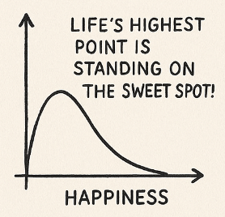

<!-- SELF-INTRO-START -->
_嗨，我是 [黃樺明](https://huami.ng)，我熱愛 [寫作](https://huami.ng/writing)、[戶外運動](https://www.strava.com/athletes/huaminghuang)、[開發提升生活品質的軟體工具](https://github.com/huaminghuangtw)。若有一天必須留下 [墓誌銘](https://huami.ng/2025/7/15/live-each-day-as-if-it-were-your-last)，我希望上面寫著：他致力於 [改善人類的手機使用習慣](https://shortcutomation.com)，也努力 [讓臺灣的學生運動員擁有更好的教育環境和適應環境的能力](https://adaptx.tw)。Enoughness，是我從 2023 年開始每天練習的生活哲學，一種「剛剛好」的生活態度。每週，我會在這份電子報分享幾件觸動我 [好奇心](https://huami.ng/weekly-mindware-update) 的事物、想法與學習。如果這封信是朋友轉寄給你的，歡迎 [點此訂閱](https://huami.ng/newsletter)。想看看過往內容？[歷年電子報](https://huami.ng/enoughness) 都在這裡。_
<!-- SELF-INTRO-END -->

---

# 1

兩週前，我到台北參加了 TED×Taipei 2025 年會《[THE Present 此刻 x 未來](https://tedxtaipei.oen.tw/)》。

我一直嚮往能親身坐在台下，聆聽啟發人心的 TED Talk。

於是，在 11/1 這天，我抱著開放、好奇的心態，走進松山文創園區四號倉庫，向大師們學習：如何用 18 分鐘，把一個故事說好。

👉 完整心得：《[什麼是更好的活著？我在 TED×Taipei 2025 年會得到的五個答案](https://huami.ng/2025/11/12/ted-taipei-2025/)》

# 2

健康是人生的「1」，名利與成就是後面的「0」。少了這個「1」，再多的「0」也是空數字。

《[納瓦爾寶典](https://www.google.com/search?q=納瓦爾寶典)》裡面有 [一段話](https://www.navalmanack.com/almanack-of-naval-ravikant/choosing-to-care-for-yourself)：

> _“My number one priority in life, above my happiness, above my family, above my work, is my own health. It starts with my physical health. Second, it’s my mental health. Third, it’s my spiritual health. Then, it’s my family’s health. Then, it’s my family’s wellbeing. After that, I can go out and do whatever I need to do with the rest of the world.”_
>
> 我一生中最優先的事情 — 甚至排在我的幸福、家庭與工作之前 — 是我自己的健康。首先是身體的健康；第二是心理的健康；第三是精神層面的健康。接著，才是家人的健康，再來是家人的福祉。這些都安穩之後，我才有餘力走向世界，完成我需要做的一切。

如果，現在要和最愛的人交換身體，並在一年後歸還給對方，你會如何照顧它呢？

你會讓他吃垃圾食物、熬夜、不運動嗎？

還是，你會確保他吃得健康、睡眠充足、心情愉快？

相信多數人會選擇後者吧！

**那麼，我們是不是也要用同樣的標準，無微不至地照顧自己呢？**

# 3

你是否也曾在夜深人靜時輾轉難眠？

也許，你需要給大腦一個「喘息」空間。

很多時候，不是因為不夠累，而是大腦沒有足夠時間，去消化一整天下來的 [資訊轟炸](https://huami.ng/2025/8/14/sherlock-holmes-brain-attic/)。

我們習慣在醒著時，把每個空檔都塞滿各種話語、訊息、郵件、音樂、新聞、社群媒體。

代價就是剝奪靠近本心、與自己對話的機會。

很多 [人生大哉問](https://stephango.com/40-questions-decade) 的答案早已藏在內心深處；我們只需要用 [對的問題](https://huami.ng/journal-prompt) 讓它們浮現。

當我主動關掉外界的噪音，刻意讓自己「無聊」後，我發現許多想不通的問題都會在白天迎刃而解，夜晚也跟著平靜入睡。

我們需要的不是更多娛樂，而是更多留白。

就如同愛情跟書寫，生活也需要適時地留白。

**留白，是預留空間給奇蹟；留白，才能成就精彩。**

# 4

說個故事：

星期天早上，阿明睡到自然醒。

打開冰箱，只剩下一盒雞蛋。他想了想，決定放進六顆蛋，加一碗水，按下開關。

「叭！」好不容易等到電鍋跳起來的那一刻，香氣慢慢飄出來。

阿明剝開第一顆，撒上一點鹽巴，咬下去 — OMG 😱 OMG 😱 OMG 😱，滑嫩、綿密、溫熱的口感，讓飢腸轆轆的他，爽到眼睛閉起來，仰天長嘯：

「這才是幸福的味道啊！」

吃完一顆意猶未盡，他拿起第二顆。

這次也不錯，更有飽足感，只是少了剛剛那份驚喜。

「嗯，還可以。」

第三顆下肚時，他開始有點撐。

「好像有點乾欸，應該配個古早味醬油膏。」

到了第四顆，他皺著眉吞下去，摸著肚子想：

「我再也不想看到水煮蛋了…」

最後剩下兩顆蛋躺在電鍋裡，孤單地涼掉。

---

這就是經濟學中的「**邊際效用遞減（Diminishing Marginal Utility）**」：

> 當一個需要被滿足後，對於重複或是類似東西的需求會大幅降低。

每多吃一顆水煮蛋，帶來的「快樂」就少一點。

再喜歡的東西，如果沒有節制地增加，也會失去它最初的美好。

⚖️ 很多時候，幸福不是多吃一點、多買一點、多做一點；而是在最剛好的那顆蛋停下來，見好就收。

**人生的最高點，是站在甜蜜點上！**

下次遇到「多一元多一件」、「第二件六折」這類促銷，不妨用「邊際效用」的角度思考：

多一件，真的多一分快樂嗎？

# 5

當然，邊際效益不會永遠遞減，有時候反而會出現「**邊際效益遞增（Increasing Marginal Utility）**」的情況：

<figure>
	
	<figcaption>
		<em>圖片來源： <a href="https://jamesclear.com/continuous-improvement">James Clear</a></em>
	</figcaption>
</figure>

## 學習與技能累積

例如寫程式、彈鋼琴、說外語，剛開始練習的第一次很吃力；隨著熟練度提升，到後面會越上手，成就感也越高。

## 運動與體能訓練

前幾分鐘覺得很痛苦；隨著體溫升高、持續投入，後半段帶來的愉悅感和身心滿足逐漸增加。

P.S. [沖冷水、泡冰浴的後座力更是強大！](https://www.instagram.com/jacky.wellness/)

## 長期人際關係

一開始彼此還不熟悉，交流有限；隨著時間醞釀，越相處越了解對方，信任與默契也日益增長。

## 工作流程自動化

初期設定時，很花時間；一旦 [系統建立起來](https://shortcutomation.com)，每次省下時間的複利效應會更明顯，就像雪球般越滾越大，形成正向循環。

<figure>
	
	<figcaption>
		<em>圖片來源： <a href="https://xkcd.com/1319/">xkcd</a></em>
	</figcaption>
</figure>

## 創作

無論是寫作、畫畫還是攝影，起初難免有些生硬；隨著 [獨處時間](https://huami.ng/2025/10/14/who-do-we-spend-time-with-across-our-lifetime/) 與經驗累積，個人風格逐漸成形，更容易進入「[心流](https://www.google.com/search?q=心流)（Flow State）」狀態，讓創作成為一種「自我表達」，對於「我是誰」的宣示。

# 6

我最近常跟自己說的話：

> 工作時「盡全力」工作，休息時「盡全力」休息。

這讓我想到《[學習的王道](https://www.google.com/search?q=學習的王道)》（The Art of Learning）的作者 [Josh Waitzkin](https://www.google.com/search?q=Josh+Waitzkin) 在 The Tim Ferriss Show 的 [訪談](https://tim.blog/2019/06/27/josh-waitzkin/) 中提到的一個概念：「Simmering Six」。

他說，許多在高壓、決策密集行業的人，總是讓自己處於一種「溫火慢燉」的六分力狀態，而非在「十分力」和「深度放鬆」之間切換。

> _“Most people in high-stress, decision-making industries are always operating at this kind of simmering six, or four, as opposed to the undulation between just deep relaxation and being at a 10. Being at a 10 is millions of times better than being at a 6. It’s just in a different universe.” — Josh Waitzkin_

Waitzkin 強調，十分力的狀態遠勝於六分力，兩者有天壤之別。

⚖️ 真正的平衡，並非在兩者間尋找妥協，而是讓工作與休息都達到極致的強度。

每天花六小時全力衝刺：專注最重要的專案、在健身房揮灑汗水、培養長遠受益的技能。

剩下的時間放慢腳步：公園走路、聽 Podcast、和朋友悠閒地吃頓晚餐。

無論如何，都要避免既無法完全放鬆，也無法真正前進的焦慮中間地帶。

**世界上沒有「太努力」這回事，只有「休息不足」。**

**學會有效恢復，而不是降低標準。**

最有生產力的人，也是最重視休息的人。

休息並非獎勵，而是高效工作的一部分。

在追求卓越的同時，別忘了給自己同樣品質的休息。

<em>圖片來源：[@valuethe.mind](https://www.instagram.com/valuethe.mind/p/CkG3Y8cNPGE/)</em>

週末愉快～

— [樺明](https://huami.ng/2025/11/14/enoughness-5)

---

“All of humanity’s problems stem from man’s inability to sit quietly in a room alone.”
 
— Blaise Pascal

