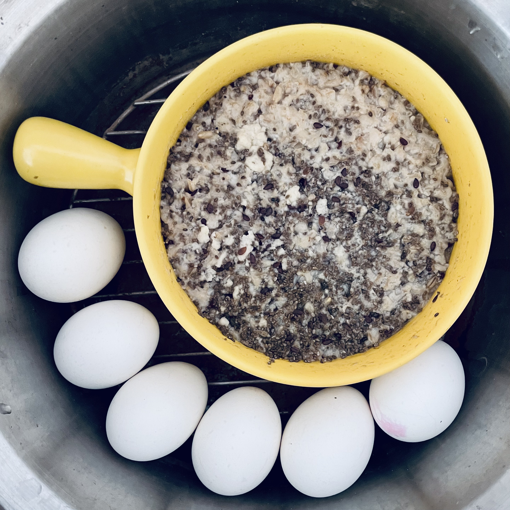
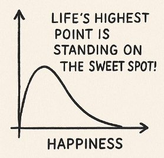
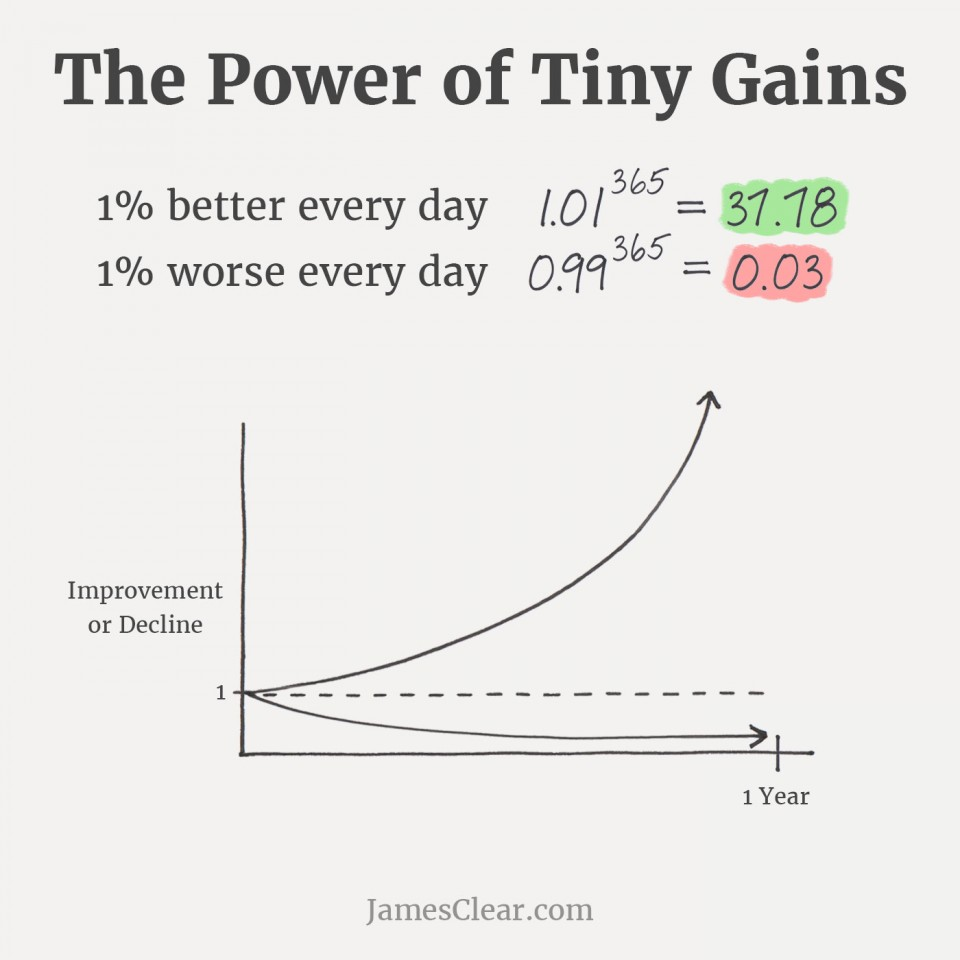

<!-- SELF-INTRO-START -->

_嗨，我是 [黃樺明](https://huam.ing)，我熱愛 [寫作](https://huam.ing/writing)、[耐力運動](https://www.strava.com/athletes/huaminghuang)、[開發提升生活品質的軟體工具](https://github.com/huaminghuangtw)。Enoughness，是我從 2023 年開始每天練習的生活哲學，一種「剛剛好」的生活態度。每週，我會在這份電子報分享三件有趣的事。如果這封信是朋友轉寄給你的，歡迎 [點此訂閱](https://huam.ing/newsletter)。想看看過往內容？[歷年電子報](https://huam.ing/enoughness) 都在這裡。_

<!-- SELF-INTRO-END -->

---

# 1

兩週前，我到台北參加了 TED×Taipei 2025 年會《[THE Present 此刻 x 未來](https://tedxtaipei.oen.tw/)》。

我一直嚮往能親身坐在台下，聆聽啟發人心的 TED Talk。

於是，在 11/1 這天，我抱著開放、好奇的心態，走進松山文創園區四號倉庫，向大師們學習：如何用 18 分鐘，把一個故事說好。

👉 完整心得：《[什麼是更好的活著？我在 TED×Taipei 2025 年會得到的五個答案](https://huam.ing/2025/11/12/ted-taipei-2025/)》

# 2

[健康](https://huam.ing/2025/12/26/enoughness-11/#3) 是人生的「1」，名利與成就是後面的「0」。少了這個「1」，再多的「0」也是空數字。

健康的人有一千個願望，不健康的人只有一個願望。

《[納瓦爾寶典](https://www.google.com/search?q=納瓦爾寶典)》裡面有 [一段話](https://www.navalmanack.com/almanack-of-naval-ravikant/choosing-to-care-for-yourself)：

> My number one priority in life, above my happiness, above my family, above my work, is my own health.
>
> 我一生中最優先的事情 — 甚至排在我的幸福、家庭與工作之前 — 是我自己的健康。
>
> It starts with my physical health. Second, it’s my mental health. Third, it’s my spiritual health. Then, it’s my family’s health. Then, it’s my family’s wellbeing.
>
> 首先，是身體的健康；第二，是心理的健康；第三，是精神層面的健康。接著，才是家人的健康，和家人的福祉。
>
> After that, I can go out and do whatever I need to do with the rest of the world.
>
> 這些都安穩之後，我才有餘力走向世界，完成我需要做的一切。

如果，現在要和最愛的人交換身體，並在一年後歸還給對方，你會如何照顧它呢？

你會讓他吃垃圾食物、熬夜、不運動嗎？

還是，你會確保他吃得健康、睡眠充足、心情愉快？

相信多數人會選擇後者吧！

**那麼，我們是不是也要用同樣的標準，無微不至地照顧自己呢？**

# 3

星期天早上，阿明睡到自然醒。

打開冰箱，只剩下一盒雞蛋。他想了想，決定放進六顆蛋，加一碗水，按下開關。

「叭！」好不容易等到電鍋跳起來的那一刻，香氣慢慢飄出來。

阿明剝開第一顆，撒上一點鹽巴，咬下去 — OMG 😱 OMG 😱 OMG 😱，滑嫩、綿密、溫熱的口感，讓飢腸轆轆的他，爽到眼睛閉起來，仰天長嘯：

「這才是幸福的味道啊！」

吃完一顆意猶未盡，他拿起第二顆。

這次也不錯，更有飽足感，只是少了剛剛那份驚喜。

「嗯，還可以。」

第三顆下肚時，他開始有點撐。

「好像有點乾欸，應該配個古早味醬油膏。」

到了第四顆，他皺著眉吞下去，摸著肚子想：

「我再也不想看到水煮蛋了…」

最後剩下兩顆蛋躺在電鍋裡，孤單地涼掉。

---

這就是經濟學中的「**邊際效用遞減（Diminishing Marginal Utility）**」：

> 當一個需要被滿足後，對於重複或是類似東西的需求會大幅降低。

每多吃一顆水煮蛋，帶來的「快樂」就少一點。

再喜歡的東西，如果沒有節制地增加，也會失去它最初的美好。

⚖️ 很多時候，幸福不是多吃一點、多買一點、多做一點；而是在最剛好的那顆蛋停下來，見好就收。

**人生的最高點，是站在甜蜜點上！**

下次遇到「多一元多一件」、「第二件六折」這類促銷，不妨用「邊際效用」的角度思考：

多一件，真的多一分快樂嗎？

# 4

當然，邊際效益不會永遠遞減，有時候反而會出現「**邊際效益遞增（Increasing Marginal Utility）**」的情況：

## 學習與技能累積

例如寫程式、彈鋼琴、說外語，剛開始練習的第一次很吃力；隨著熟練度提升，到後面會越上手，成就感也越高。

## 運動與體能訓練

前幾分鐘覺得很痛苦；隨著體溫升高、持續投入，後半段帶來的愉悅感和身心滿足逐漸增加。

P.S. [沖冷水、泡冰浴的後座力更是強大！](https://www.instagram.com/jacky.wellness/)

## 長期人際關係

一開始彼此還不熟悉，交流有限；隨著時間醞釀，越相處越了解對方，信任與默契也日益增長。

## 工作流程自動化

初期設定時，很花時間；一旦 [系統建立起來](https://shortcutomation.com)，每次省下時間的複利效應會更明顯，就像雪球般越滾越大，形成正向循環。

## 創作

無論是寫作、畫畫還是攝影，起初難免有些生硬；隨著 [獨處時間](https://huam.ing/2025/10/14/who-do-we-spend-time-with-across-our-lifetime/) 與經驗累積，個人風格逐漸成形，更容易進入「[心流](https://www.google.com/search?q=心流)（Flow State）」狀態，讓創作成為一種「自我表達」，對於「我是誰」的宣示。

— [樺明](https://huam.ing/2025/11/14/enoughness-5)

---

“All of humanity’s problems stem from man’s inability to sit quietly in a room alone.”
 
— Blaise Pascal

