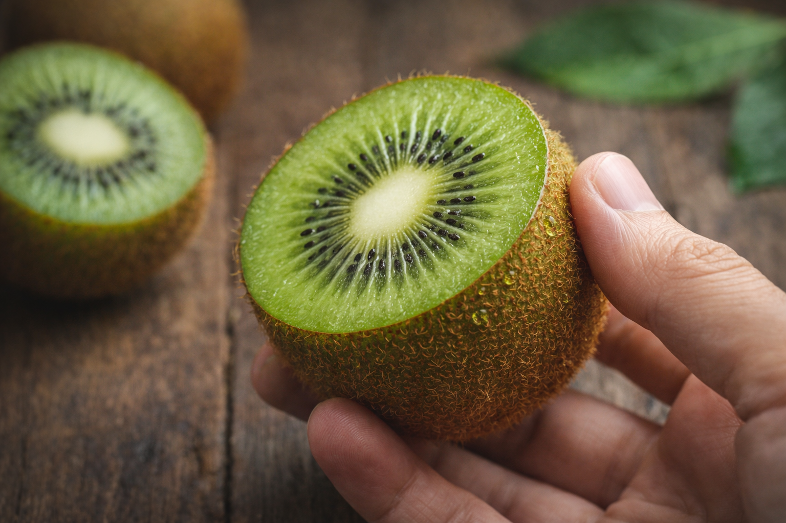
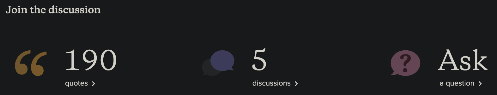
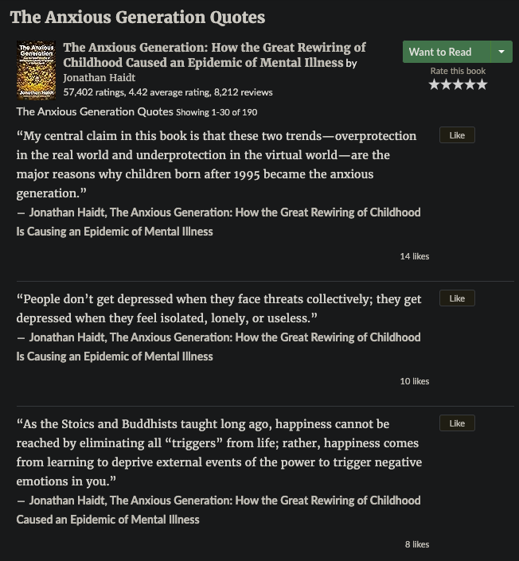
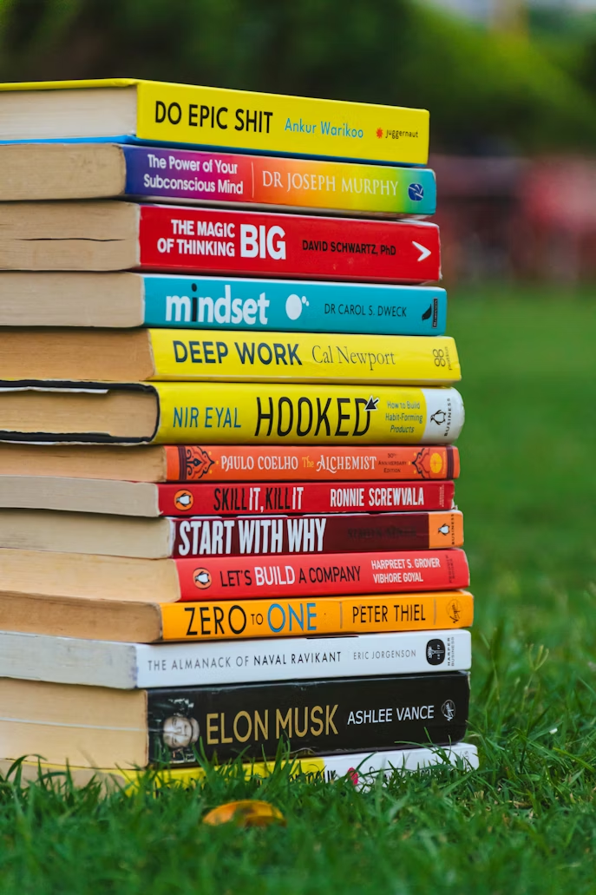

<!-- SELF-INTRO-START -->

_嗨，我是 [黃樺明](https://huami.ng)，我熱愛 [寫作](https://huami.ng/writing)、[戶外運動](https://www.strava.com/athletes/huaminghuang)、[開發提升生活品質的軟體工具](https://github.com/huaminghuangtw)。若有一天必須留下 [墓誌銘](https://huami.ng/2025/7/15/live-each-day-as-if-it-were-your-last)，我希望上面寫著：他致力於 [改善人類的手機使用習慣](https://shortcutomation.com)，也努力 [讓臺灣的學生運動員擁有更好的教育環境和適應環境的能力](https://adaptx.tw)。Enoughness，是我從 2023 年開始每天練習的生活哲學，一種「剛剛好」的生活態度。每週，我會在這份電子報分享幾件觸動我 [好奇心](https://huami.ng/weekly-mindware-update) 的事物、想法與學習。如果這封信是朋友轉寄給你的，歡迎 [點此訂閱](https://huami.ng/newsletter)。想看看過往內容？[歷年電子報](https://huami.ng/enoughness) 都在這裡。_

<!-- SELF-INTRO-END -->

---

# 1

綁鞋帶這種事聽起來好像大家都會，但你有沒有過這種經驗：跑得正起勁，呼吸與步伐完美同步，低頭一看，鞋帶竟然鬆了！？

[前陣子在準備馬拉松的時候](https://huami.ng/2025/12/12/enoughness-9/#2)，被這個問題困擾許久；不管我怎麼綁，跑一跑它就是會鬆掉！

那種跑到一半，被迫停下來蹲在路邊重綁的感覺，就像開車遇到 99 秒的紅燈一樣，令人悲傷…

為了不再重蹈覆徹，我決定補修這門小時候沒學好的功課，好好研究清楚：**到底要怎麼綁，鞋帶才不會半路離家出走？**

👉 閱讀全文：《[鞋帶一直掉？專業跑者都在用的打結術](https://huami.ng/2025/12/17/how-to-tie-shoelaces)》

# 2

這週讀了 [Stack Overflow](https://stackoverflow.com/)（全球最大的程式設計問答網站）創辦人 [Joel Spolsky](https://www.google.com/search?q=Joel+Spolsky) 的文章 _[Fire And Motion](https://www.joelonsoftware.com/2002/01/06/fire-and-motion/)_。

文中提到一個軍事策略：**邊開火邊移動（[Fire & Movement](https://en.wikipedia.org/wiki/Fire_and_movement)）**。

這讓我想起當兵時，那句單戰報告詞：「請鄰兵以火力掩護我。」

開火，是為了壓制敵人；移動，則是為了搶佔先機、掌握主導權。

在戰場上，唯有火力與移動並進，才不會被困在原地任人宰割。

---

這道理拿來看人生，好像說得通。

愛因斯坦（[Albert Einstein](https://www.google.com/search?q=Albert+Einstein)）曾說：

> _Life is like riding a bicycle, to keep balance you must keep moving._
>
> 生活就像騎腳踏車，要保持平衡，你就得一直騎下去。

存在主義之父、丹麥哲學家齊克果（[Søren Kierkegaard](https://www.google.com/search?q=Søren+Kierkegaard)）也說：

> _Life can only be understood backwards, but it must be lived forwards._
>
> 生命只能從回顧中領悟，但必須在前瞻中展開。

要理解人生，需要往後看；要過好人生，必須向前看。

過去的已成定局，逝去的無法挽回；人生的一大課題就是不斷前進。

只是，面對空曠的前方，不安是人的本能。

這時候，不妨想想經典科幻小說《[銀河便車指南](https://www.goodreads.com/book/show/79257.Don_t_Panic)》（The Hitchhiker’s Guide to the Galaxy）封面上的兩個大字標語：

> _Don’t panic._

別慌，繼續行動、繼續戰鬥就對了！

無論身處何種戰場，請記得這個生存法則：**維持火力，持續移動**。

# 3

跟大家分享一個生活冷知識：**[奇異果的皮其實是可以吃的！🥝](https://www.google.com/search?q=奇異果皮)**

而且你絕對想不到，整顆奇異果最營養的地方，就在皮上。

歐洲營養學期刊（European Journal of Nutrition）的 [一篇文章](https://doi.org/10.1007/s00394-018-1627-z) 指出：**與只吃果肉相比，連皮食用奇異果可大幅提升多種營養素的攝取量**。

以金色奇異果（SunGold）來說，連皮一起吃可讓膳食纖維、維生素 E 與葉酸的攝取量分別增加約 30%～50%，營養密度明顯高於只吃果肉。

> _“Consumption of whole SunGold kiwifruit (including the skin) increases the fibre, vitamin E and folate contents by 50 %, 32 % and 34 %, respectively, compared with consuming only the edible flesh portion.”_

如果你覺得表面的絨毛有點噁心，可以用水果刀輕輕刮掉，再用清水沖洗乾淨。

再不然，直接選擇 [黃金奇異果](https://www.google.com/search?q=黃金奇異果) 也是個好方法 — 它的皮比較薄、光滑，甜度也更高，咬下去幾乎無負擔，推薦大家試試看！

# 4

關心，是回應他人的需求；擔心，是投射自己的焦慮。

關心，是以對方為中心；擔心，是以自己為中心。

關心，會讓對方感到放鬆、平靜、被支持；擔心，只會讓對方焦慮、煩躁、壓力大。

關心，是單純地付出；擔心，是希望有所回報 —「符合自己的期許、期待」。

擔心，是一種負面情緒勒索、自以為是的善意。

擔心，是最無用的事情處理方式。

**[不要「擔心」，要「關心」。](https://huami.ng/2025/10/10/the-power-of-quiet)**

# 5

**Goodreads 隱藏版技巧：如何快速吸收書籍精華？**

[Goodreads](https://www.goodreads.com/) 是全球最大讀者社群網站，也是愛書人的必備工具。

面對數量龐大的好書們，如果一本一本買來慢慢啃，根本看不完。

但透過 Goodreads，我發現一個私藏技巧，讓我一天可以瀏覽一到兩本書。

比起閱讀他人加工過的二手書評或心得，這個方法可直接讀取「原文摘錄」，讓我們更能掌握作者的原始核心觀點。

以美國社會心理學家 [Jonathan Haidt](https://www.google.com/search?q=Jonathan+Haidt) 的著作《失控的焦慮世代》（The Anxious Generation）為例：

1. 首先，進入 [書籍頁面](https://www.goodreads.com/book/show/171681821-the-anxious-generation)。
2. 往下滑過留言區，直到看見「Join the discussion」區塊。
	
3. 點擊進入 [Quotes 頁面](https://www.goodreads.com/work/quotes/180330965)，這裡匯集了網友票選的重點金句，帶你快速掌握全書精華！
	

這招對 [紐約時報暢銷書榜（The New York Times Best Seller List）](https://www.nytimes.com/books/best-sellers/) 的熱門書籍特別有效，屢試不爽！

---

**⭐️ 同場加映：**

如果你是 Apple 用戶，[這款  蘋果捷徑（Apple Shortcuts）](https://www.icloud.com/shortcuts/97e330b8cff34d8e83cd6fbc69453312) 能幫你一鍵自動化上述流程（iPhone / Mac 皆適用）。

只要輸入書名關鍵字，在搜尋結果中選擇你想看的書，它就會直接帶你進入 Quotes 頁面，省去手動查找的時間！

%% #TODO P.S. 分享 Brain Food 書單 (link to website) %%

# 6

[CT Pan Foundation（潘政琮基金會）](https://www.ctpanfoundation.org) 共同創辦人林盈君（Michelle，潘政琮的太太）寫的兩篇文章，讓我深受感動。

這個基金會由台灣高球一哥 [潘政琮（C.T. Pan）](https://www.google.com/search?q=潘政琮) 創立，主要透過高爾夫運動幫助年輕人取得教育與競技機會。

以下節錄幾段我很喜歡的文字：

《[教育改變的是人類內心的貧窮](https://www.ctpanfoundation.org/post/%E6%95%99%E8%82%B2%E6%94%B9%E8%AE%8A%E7%9A%84%E6%98%AF%E4%BA%BA%E9%A1%9E%E5%85%A7%E5%BF%83%E7%9A%84%E8%B2%A7%E7%AA%AE)》

> 我們希望有一個系統能夠更大量的培育人才，培育有學習力、思考力、判斷力與語言能力的人才，不是只是培育選手。老虎伍茲的基金會一開始也只是專注在選手，後來全面轉向做教育，因為教育改變的是人類內心的貧窮。

> 一直以來我有一個夢想，希望台灣的運動員知書達禮，畢業後可以在社會上的各個崗位發揮他們的長才，讓國人可以看到運動員不是頭腦簡單四肢發達，讓社會看到運動員可以有格局、有思想。

《[你必須先是學生，才是運動員](https://www.ctpanfoundation.org/post/%E3%80%90%E4%BD%A0%E5%BF%85%E9%A0%88%E5%85%88%E6%98%AF%E5%AD%B8%E7%94%9F%EF%BC%8C%E6%89%8D%E6%98%AF%E9%81%8B%E5%8B%95%E5%93%A1%E3%80%91)》

> 學生運動員是一個兼顧學術和體育的人。這種雙重角色需要紀律和時間管理，因為學生運動員必須平衡他們的學業需求與運動訓練和比賽時間表。

> 我們在努力的一直都是教育，因為可以改變社會的因子裡面最重要的還是人。

— [樺明](https://huami.ng/2025/12/19/enoughness-10)

---

“Dreams are built on discipline; discipline is built on habits; habits are built on training. And training takes place in every single second and every situation of your life.”
 
― Will Smith

