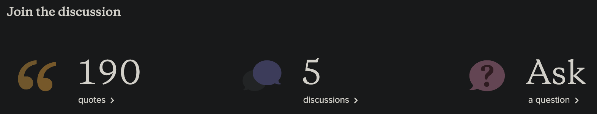
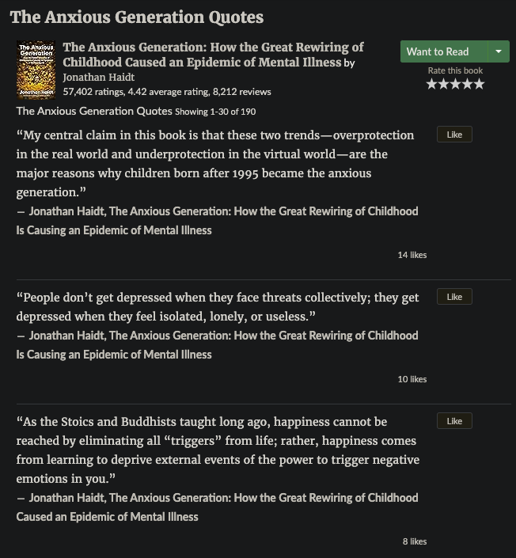
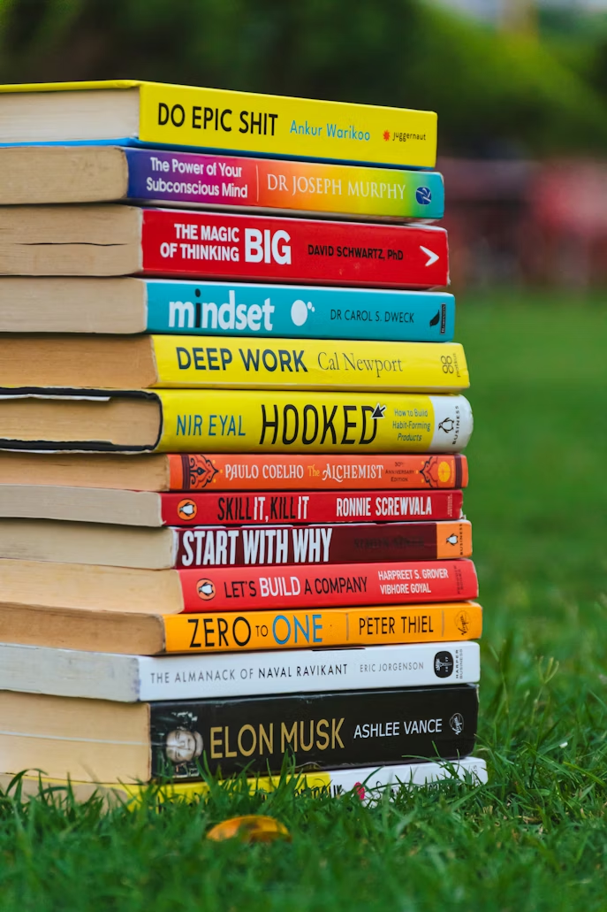

<!-- SELF-INTRO-START -->

_嗨，我是 [黃樺明](https://huam.ing)，我熱愛 [寫作](https://huam.ing/writing)、[耐力運動](https://www.strava.com/athletes/huaminghuang)、[開發提升生活品質的軟體工具](https://github.com/huaminghuangtw)。Enoughness，是我從 2023 年開始每天練習的生活哲學，一種「剛剛好」的生活態度。每週，我會在這份電子報分享三件有趣的事。如果這封信是朋友轉寄給你的，歡迎 [點此訂閱](https://huam.ing/newsletter)。想看看過往內容？[歷年電子報](https://huam.ing/enoughness) 都在這裡。_

<!-- SELF-INTRO-END -->

---

# 1

綁鞋帶這種事聽起來好像大家都會，但你有沒有過這種經驗：跑得正起勁，呼吸與步伐完美同步，低頭一看，鞋帶竟然鬆了！？

[前陣子在準備馬拉松的時候](https://huam.ing/2025/12/12/enoughness-9/#2)，被這個問題困擾許久；不管我怎麼綁，跑一跑它就是會鬆掉！

那種跑到一半，被迫停下來蹲在路邊重綁的感覺，就像開車遇到 99 秒的紅燈一樣，令人悲傷…

為了不再重蹈覆徹，我決定補修這門小時候沒學好的功課，好好研究清楚：**到底要怎麼綁，鞋帶才不會半路離家出走？**

👉 閱讀全文：《[鞋帶一直掉？專業跑者都在用的打結術](https://huam.ing/2025/12/17/how-to-tie-shoelaces)》

# 2

這週讀了 [Stack Overflow](https://stackoverflow.com/)（全球最大的程式設計問答網站）創辦人 [Joel Spolsky](https://www.google.com/search?q=Joel+Spolsky) 的文章 _[Fire And Motion](https://www.joelonsoftware.com/2002/01/06/fire-and-motion/)_。

文中提到一個軍事策略：**邊開火邊移動（[Fire & Movement](https://en.wikipedia.org/wiki/Fire_and_movement)）**。

這讓我想起當兵時，那句單戰報告詞：「請鄰兵以火力掩護我。」

開火，是為了壓制敵人；移動，則是為了搶佔先機、掌握主導權。

在戰場上，唯有火力與移動並進，才不會被困在原地任人宰割。

---

這道理拿來看人生，好像說得通。

愛因斯坦（[Albert Einstein](https://www.google.com/search?q=Albert+Einstein)）曾說：

> Life is like riding a bicycle, to keep balance you must keep moving.
>
> 生活就像騎腳踏車，要保持平衡，你就得一直騎下去。

存在主義之父、丹麥哲學家齊克果（[Søren Kierkegaard](https://www.google.com/search?q=Søren+Kierkegaard)）也說：

> Life can only be understood backwards, but it must be lived forwards.
>
> 生命只能從回顧中領悟，但必須在前瞻中展開。

要理解人生，需要往後看；要過好人生，必須向前看。

過去的已成定局，逝去的無法挽回；人生的一大課題就是不斷前進。

只是，面對空曠的前方，不安是人的本能。

這時候，不妨想想經典科幻小說《[銀河便車指南](https://www.goodreads.com/book/show/79257.Don_t_Panic)》（The Hitchhiker’s Guide to the Galaxy）封面上的兩個大字標語：

> Don’t panic.

別慌，繼續行動、繼續戰鬥就對了！

無論身處何種戰場，請記得這個生存法則：**維持火力，持續移動**。

# 3

**Goodreads 隱藏版技巧：如何快速吸收書籍精華？**

[Goodreads](https://www.goodreads.com/) 是全球最大讀者社群網站，也是愛書人的必備工具。

面對數量龐大的好書們，如果一本一本買來慢慢啃，根本看不完。

但透過 Goodreads，我發現一個私藏技巧，讓我一天可以瀏覽一到兩本書。

比起閱讀他人加工過的二手書評或心得，這個方法可直接讀取「原文摘錄」，讓我們更能掌握作者的原始核心觀點。

以美國社會心理學家 [Jonathan Haidt](https://www.google.com/search?q=Jonathan+Haidt) 的著作《失控的焦慮世代》（The Anxious Generation）為例：

1. 首先，進入 [書籍頁面](https://www.goodreads.com/book/show/171681821-the-anxious-generation)。
2. 往下滑過留言區，直到看見「Join the discussion」區塊。
	
3. 點擊進入 [Quotes 頁面](https://www.goodreads.com/work/quotes/180330965)，這裡匯集了網友票選的重點金句，帶你快速掌握全書精華！
	

這招對 [紐約時報暢銷書榜（The New York Times Best Seller List）](https://www.nytimes.com/books/best-sellers/) 的熱門書籍特別有效，屢試不爽！

---

如果你是 Apple 用戶，[這款  蘋果捷徑（Apple Shortcuts）](https://shortcutomation.com/goodreads-book-quotes) 能幫你一鍵自動化上述流程（iPhone / Mac 皆適用）。

只要輸入書名關鍵字，在搜尋結果中選擇你想看的書，它就會直接帶你進入 Quotes 頁面，省去手動查找的時間！

%% #TODO P.S. 分享 Brain Food 書單 (link to website) %%

— [樺明](https://huam.ing/2025/12/19/enoughness-10)

---

“Dreams are built on discipline; discipline is built on habits; habits are built on training. And training takes place in every single second and every situation of your life.”
 
— Will Smith

