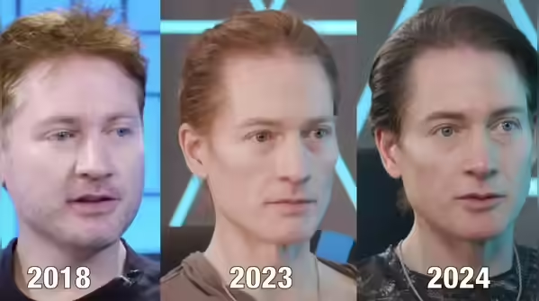

<!-- SELF-INTRO-START -->

_嗨，我是 [黃樺明](https://huam.ing)，我熱愛 [寫作](https://huam.ing/writing)、[耐力運動](https://www.strava.com/athletes/huaminghuang)、[開發提升生活品質的軟體工具](https://github.com/huaminghuangtw)。若有一天必須留下 [墓誌銘](https://huam.ing/2025/7/15/live-each-day-as-if-it-were-your-last)，我希望上面寫著：他致力於 [改善人類的手機使用習慣](https://shortcutomation.com)，也努力 [讓臺灣的學生運動員擁有更好的教育和訓練環境](https://adaptx.tw)。Enoughness，是我從 2023 年開始每天練習的生活哲學，一種「剛剛好」的生活態度。每週，我會在這份電子報分享幾件觸動我 [好奇心](https://huam.ing/weekly-mindware-update) 的事物、想法與學習。如果這封信是朋友轉寄給你的，歡迎 [點此訂閱](https://huam.ing/newsletter)。想看看過往內容？[歷年電子報](https://huam.ing/enoughness) 都在這裡。_

<!-- SELF-INTRO-END -->

---

# 1

1990 年 2 月 14 日，美國「旅行者 1 號」（Voyager 1）太空船在距離地球約 64 億公里處，捕捉了這張著名的照片。

在浩瀚的宇宙中，地球只是一個幾乎看不見的藍色小點。

就像天文學家 [Carl Sagan](https://www.google.com/search?q=Carl+Sagan) 在 1994 年的經典演講「[暗淡藍點](https://youtu.be/wupToqz1e2g)」（[Pale Blue Dot](https://huam.ing/pale-blue-dot)）中所說：

> 我們的星球，只是懸浮在陽光中的一粒塵埃。

相對於已經存在 137 億年的宇宙，每個人都只是轉瞬即逝的存在。

人世間的紛爭與煩惱，放在這樣的時間尺度下，顯得格外渺小。

在人生這趟旅程中，我們不過是來旅行的；[沒有任何事物能永久停留](https://huam.ing/2025/12/11/goodbye-past-me)，一切終將煙消雲散，不會有任何聲響。

---

我曾經陷入生產力焦慮的無限迴圈，總覺得自己不夠努力、不夠 [有用](https://youtu.be/Om5XuTbXP1U)，壓力大到喘不過氣，深受這種「毒性內省」所苦。

直到發現太空人口中的「[總觀效應](https://zh.wikipedia.org/zh-tw/%E7%B8%BD%E8%A7%80%E6%95%88%E6%87%89)」（The Overview Effect）後，我開始練習「拉遠視角」（Zoom Out）。

總觀效應，指人類從太空中俯瞰地球時，油然而生的一種敬畏感與心智轉變。那一刻，國界消失、分歧消融，原本巨大的衝突也變得微小無比。

為了在每天晚上感受總觀效應帶來的內在寧靜，[我設計了一個  蘋果捷徑（Apple Shortcuts）](https://shortcutomation.com/nasa-epic-gif)，自動抓取 NASA 最新的地球衛星影像，並在每晚睡前推播一段地球自轉的 GIF 動畫給自己。

這個小小的睡前儀式，提醒我：「你已經很棒了，別再逼自己了。」

當我學會把視角拉遠到大氣層外，原本那些過不去的坎，也都變得微不足道。

**我終於能夠跟自己和解，找回那個「自律但不焦慮」的工作節奏。**

👉 如果你也正處於高壓狀態，或被忙碌所困，推薦你閱讀這篇文章：_[Why I Watch the Earth Spin Every Night Before Bed](https://huam.ing/2025/12/24/why-i-watch-the-earth-spin-every-night-before-bed/)_

# 2

我希望自己在十年前就懂的事：**坦然接受自己的一切，尤其是不完美的部分。**

以前的我，每天都在經營偶像包袱，時時刻刻都在擔心別人怎麼看我，想要維護一個理想形象。

自從聽了納瓦爾（[Naval Ravikant](https://www.google.com/search?q=Naval+Ravikant)）[這集 Podcast 訪談](https://fs.blog/knowledge-project-podcast/naval-ravikant/) 後，我開始認真思考人生、死亡與快樂，並慢慢放下那些對完美的執著，學會承認自己的缺點和瑕疵。

不知道在哪邊看過這段話：

> I am complete in my incompleteness. I am perfect in my imperfectness.

**十年前，我追求的是「無懈可擊」； 十年後，我學會的是「怡然自得」。**

# 3

你能想像，有人把「睡覺」當成生命中最重要的專案，甚至每天 20:30 準時入睡嗎？

這位「矽谷抗老狂人」— [Bryan Johnson](https://www.google.com/search?q=Bryan+Johnson)，完全顛覆我對健康的認知，也啟發我將生活圍繞著「睡眠」重新設計。

更讓我下巴掉下來的是，儘管年近半百，他的外貌與體態卻像個三十歲出頭的年輕人。

這位被譽為「人類史上數據化最徹底的男人」（The Most Measured Man in Human History），在 2021 年啟動「藍圖計畫」（Project Blueprint），試圖以科學挑戰逆齡（Anti-aging），甚至探索永生的可能性。

他每年砸下 200 萬美金，請來 30 多位醫生組成的專業團隊，從大腦、心臟到皮膚，無死角監控全身每個器官。目標只有一個：**逆轉衰老，讓身體機能盡可能回到 18 歲的巔峰。**

在 Netflix 紀錄片《[長生不死：矽谷富豪的逆齡人生](https://www.imdb.com/title/tt34977130/)》（_Don’t Die: The Man Who Wants to Live Forever_）中，你會看到 Bryan 如何透過自律的飲食、運動、睡眠，[讓自己的生物年齡年輕 5 歲](https://timesofindia.indiatimes.com/life-style/health-fitness/health-news/bryan-johnson-explains-how-he-reversed-his-biological-age-by-half-a-decade/photostory/123333177.cms)。

我特別關注 Bryan 在睡眠上的努力成果 — 他不僅 [連續八個月達成睡眠品質 100% 完美的紀錄](https://twitter.com/bryan_johnson/status/1824078073018581129)，更能 [每天 20:30 就寢、3 分鐘內進入夢鄉](https://blueprint.bryanjohnson.com/pages/blueprint-protocol#bryans-daily-routine)，堪稱「地表最擅長睡覺的人類」。

在 [這支 YouTube 影片](https://youtu.be/Wk9p3dhMYdk) 中，他分享了十個改善睡眠的習慣：

1. **重新定義自我身分認同**：把自己當作「職業睡眠運動員」（Professional Sleep Athlete）。睡眠不是休息，而是工作；睡眠是行事曆上最重要的行程。將睡眠視為影響生理與心理表現的第一優先；所有活動（工作、飲食、社交）都應該以「睡眠」為中心來規劃，而非犧牲睡眠來成就其他事情。
2. **建立 30—60 分鐘的「睡前儀式」（Wind-Down）**：大腦需要緩衝才能從「工作模式」切換到「睡眠模式」，透過閱讀、[熱水澡](https://huam.ing/2026/3/13/enoughness-22/#3)、呼吸練習或聆聽古典音樂，引導大腦進入關機程序。
3. **早晨曬太陽**：醒來後 15—30 分鐘內接觸自然光，是調校生理時鐘（晝夜節律）最有效的方式。這道晨光就像是在宣告「新的一天開始了！」，也有助於夜晚褪黑激素的正常分泌。
4. **嚴格控管夜間光線**：睡前 1—2 小時調暗室內頭頂燈光，改用暖色（紅光尤佳）。安裝藍光過濾軟體（如 [f.lux](https://justgetflux.com/)），並降低螢幕時間。
5. **調整臥室溫度**：涼爽的環境最適合深度睡眠。建議室溫保持在 15—19°C，並搭配透氣床單。

	> 高品質的床墊和枕頭絕對值得投資，Bryan 本人就用了 [銅離子枕頭套](https://www.google.com/search?q=銅離子枕頭套) 和 [Eight Sleep 智能溫控床墊](https://www.eightsleep.com/product/pod-cover/)。

6. ⭐️ **固定睡眠時間**：每天固定就寢與起床時間（正負 1 小時），確保 7—9 小時的完整休息，即便週末、假日也不例外。

	> Bryan 特別建議避免設鬧鐘，讓身體「自然醒」，這代表睡眠週期是完整的。如果真的需要鬧鐘，可以採用「就寢鬧鐘」（Bedtime Alarm），提醒自己該進入睡前儀式了（如第二點所提及）。

7. **打造安靜舒適的睡眠環境**：保持臥室安靜、昏暗；必要時，使用 [白噪音機](https://www.google.com/search?q=白噪音機) 或 [（矽膠）耳塞](https://www.macksearplugs.com/product/pillow-soft-silicone-earplugs/) 來阻絕噪音。
8. **提早進食**：睡前至少 2 小時（他甚至建議 4—6 小時）結束最後一餐，並避免大餐。宵夜會讓腸胃在深夜還在蠕動，等於親手關掉一夜好眠的開關。

	> 「早上晚餐」（Morning Dinner）是 Bryan 最奇葩的飲食習慣。他實行 18/6 斷食法，將所有熱量攝取集中在 6 小時內，並將最後一餐固定在早上 11 點。從中午開始到睡前都不再進食，讓身體有充足的時間完成消化。他發現這樣的安排，能顯著提升深度睡眠品質，是維持高睡眠品質的關鍵之一。

9. **避免外界刺激物**：[咖啡因在體內的半衰期長達 6 小時](https://www.google.com/search?q=咖啡因+半衰期)，中午後攝取的咖啡因會殘留在體內，干擾深度睡眠。同樣地，酒精也會破壞睡眠結構，應盡全力避開。可選擇有助於放鬆舒壓的「草本茶」（Herbal Tea）。
10. **數據追蹤**：利用日誌或穿戴裝置（如 [Oura Ring](https://ouraring.com/) 戒指或 [Whoop](https://whoop.com/) 手環）記錄自己的睡眠數據。根據數據反映出的結果，持續優化上述習慣，找出最適合自己的每日流程。

	> 我自己則習慣在床邊放 [一張紙和一支筆](https://huam.ing/2025/10/24/enoughness-2/#3)，每天手寫記錄上、下床時間。雖然方法很老派，卻簡單實用，也讓我更有意識地關注自己的睡眠。

---

睡眠，是 [長壽](https://huam.ing/2025/11/28/enoughness-7/#2) 與高效生活的基石。

如果只能做一件對健康最有益的事，那就是好好睡覺。

自從我把睡覺視為「不可妥協」（Non-negotiable）的頭號任務，每天預留時間給神聖的 [睡前儀式](https://huam.ing/2026/4/3/enoughness-25/#3) 後，睡眠品質獲得明顯提升。

**早睡早起，日出（前）而作，日落而息，成為我一天中最重要的事情。**

[就像 Bryan 說的](https://blueprint.bryanjohnson.com/pages/blueprint-protocol)：

> 穩定、高品質的睡眠是人生的首要任務。
>
> Consistent, high quality sleep is your #1 life priority.

— [樺明](https://huam.ing/2025/12/26/enoughness-11)

---

"The secret of perfect health lies in keeping the mind always cheerful - never worried, never hurried, never borne down by any fear, thought or anxiety.”
 
— Sathya Sai Baba

