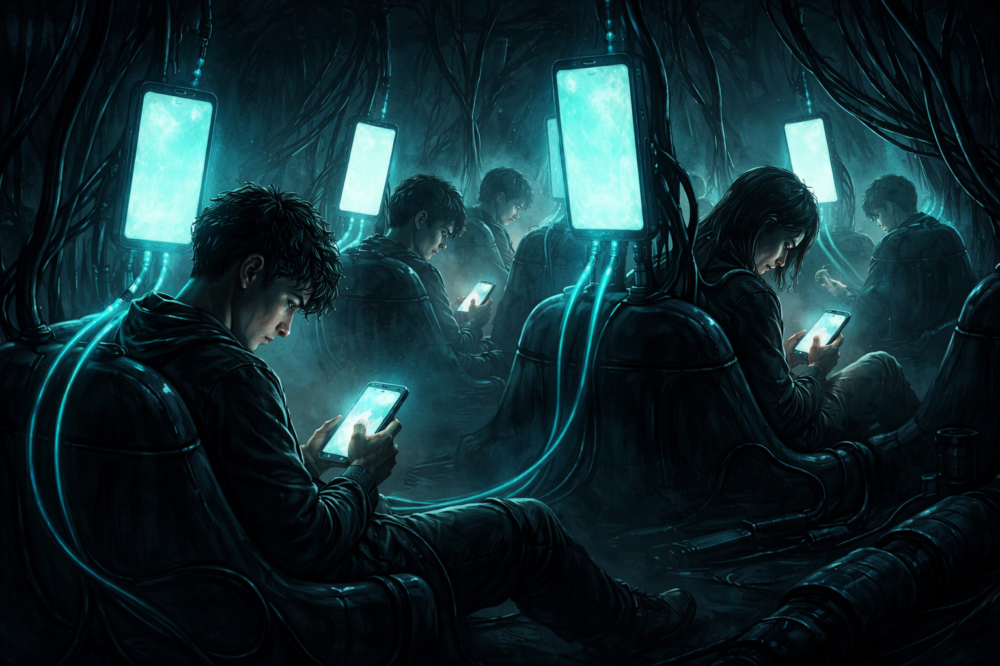
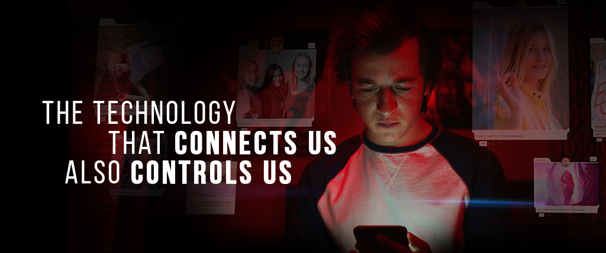

<!-- SELF-INTRO-START -->

_嗨，我是 [黃樺明](https://huami.ng)，我熱愛 [寫作](https://huami.ng/writing)、[耐力運動](https://www.strava.com/athletes/huaminghuang)、[開發提升生活品質的軟體工具](https://github.com/huaminghuangtw)。若有一天必須留下 [墓誌銘](https://huami.ng/2025/7/15/live-each-day-as-if-it-were-your-last)，我希望上面寫著：他致力於 [改善人類的手機使用習慣](https://shortcutomation.com)，也努力 [讓臺灣的學生運動員擁有更好的教育環境和適應環境的能力](https://adaptx.tw)。Enoughness，是我從 2023 年開始每天練習的生活哲學，一種「剛剛好」的生活態度。每週，我會在這份電子報分享幾件觸動我 [好奇心](https://huami.ng/weekly-mindware-update) 的事物、想法與學習。如果這封信是朋友轉寄給你的，歡迎 [點此訂閱](https://huami.ng/newsletter)。想看看過往內容？[歷年電子報](https://huami.ng/enoughness) 都在這裡。_

<!-- SELF-INTRO-END -->

---

# 1

前陣子造訪高雄 [駁二藝術特區](https://www.google.com/maps?q=駁二藝術特區)，漫步於 [大港橋](https://www.google.com/maps?q=大港橋) 畔，三個並排坐在長椅上、低頭滑手機的白色人像，瞬間抓住了我的目光。

他們的臉龐被螢幕光照亮，神情專注卻空洞。身體雖在現場，心思卻早已飄向遠方。

這一幕，無疑是現代生活的真實縮影與寫照。

這件名為《[手機人生](https://www.google.com/maps?q=手機人生)》（[Absorbed by Light](https://amsterdamlightfestival.com/en/artworks/absorbed-by-light)）的裝置藝術，是由英國平面設計師 [Gali May Lucas](https://www.google.com/search?q=Gali+May+Lucas) 與德國雕刻家 [Karoline Hinz](https://www.google.com/search?q=Karoline+Hinz) [聯手打造](https://www.designboom.com/art/absorbed-by-light-design-bridge-gali-may-lucas-amsterdam-light-festival-12-06-2018/)。它不僅曾在 2019 阿姆斯特丹燈光節（[Amsterdam Light Festival](https://amsterdamlightfestival.com/)）大放異彩，更是 2022 台灣燈會在高雄首件亮相的展品。

藝術家藉由這件作品，探討現代人過度沉迷於螢幕，逐漸失去與周遭環境連結的現象，發人深省。

《手機人生》呈現的封閉與疏遠，與駁二這片開放的公共空間，形成鮮明與諷刺的對比。

如果有機會，不妨親自坐在他們中間，感受一下那種靈魂「被手機吸走」的感覺。

---

捷運車廂裡，每個人都低著頭，手指在發光的玻璃板上滑動；餐廳裡，一群人面對面坐著，卻各自盯著手機，唯一的交流是把食物照片傳給對方；公園裡，推著嬰兒車的父母，視線停留在螢幕上，錯過了孩子第一次指著蝴蝶興奮大叫的瞬間。

我們手握能連結全世界的科技，卻失去與身邊的人建立深度連結的本能。

彼此身處同一空間，靈魂卻各自流浪。近在咫尺，卻毫無交集。

手機本該是替人類服務的工具，但曾幾何時，變成人類在服務手機。這般景象，宛如科幻電影情節成真 — 人類被機器人征服，淪為提供能量的「[人肉電池](https://www.google.com/search?q=人肉電池)」。

智慧型手機的出現，徹底改寫了人類閱讀、獲取資訊以及社交互動的方式。我們看似比以往任何時候都更緊密相連，內心卻感到前所未有的疏離。

社群媒體創造了空前的連結感，讓我們沉溺於源源不絕的 [多巴胺](https://www.google.com/search?q=多巴胺) 刺激。然而，它本質上卻如同成癮藥物，讓我們不由自主地幻想著去別的地方、做別的事、和別的人在一起。我們在虛擬世界中越陷越深，與真實世界漸行漸遠，最終陷入了「越連結，越孤單」的矛盾迴圈。

**手機成癮，或許正是這個時代正以倍速蔓延，卻沉默無聲的流行病。**

<figure>
	
	<figcaption>
		<em>圖片來源：<a href="https://unsplash.com/photos/person-holding-black-phone-FPt10LXK0cg">Unsplash</a></em>
	</figcaption>
</figure>

---

幾年前，受到 Netflix 紀錄片 《[智能社會：進退兩難](https://www.imdb.com/title/tt11464826/)》（The Social Dilemma）的醍醐灌頂，我開始意識到手機和社群媒體潛藏的心理健康危機，並下定決心 [投入改善現代人手機成癮的議題](https://shortcutomation.com)。

_我常在想，如果可以釋放那些被螢幕綁架的時間，讓人們將心力重新投注在自己熱愛的事情上，或許更多天賦會因此被點亮。_

_我常在想，如果可以改變人類的 3C 使用習慣，讓每個人都能學會適時放下手機，或許更多眼神交會的真實對話就能自然而然地發生。_

_我常在想，如果可以創造一個沒有電子產品干擾的神聖空間，找回人與人之間失去的溫度，或許躍上新聞版面的，會是更多發生在某個社會角落的溫暖故事。_

**我期待有一天，我們能活在一個沒有數位焦慮與末日狂刷（[Doomscrolling](https://www.google.com/search?q=Doomscrolling)）的世界。**

**這是我的使命，也是我追求的墓誌銘。**

<em>圖片來源：<a href="https://thesocialdilemma.com">The Social Dilemma</a></em>

# 2

那天，在全台灣最靠近海港的書店—[誠品駁二](https://www.google.com/maps?q=誠品駁二)，我遇見了這本《[北歐時間：世界第一幸福國度教會我的事](https://www.books.com.tw/products/0011035285)》。

作者是定居丹麥的日本人 [日暮 Inko（いくらし いんこ）](https://www.instagram.com/inkohigurashi)。透過她在當地的生活體驗與細膩觀察，歸納出以下 5 種「北歐時間」：

## 1. 自我照顧的時間

比起逛街購物，北歐人更重視與大自然的連結。他們常走進森林，任陽光灑落，沉澱心靈；與自然同步，順應四季與日照的變化來調整生活步調。

## 2. 活出本心的時間

放下「迎合正解」的壓力，[不再執著於做一個外人眼中的「體面人」](https://huami.ng/2025/8/30/you-and-your-timeline)。即使素顏出門、穿著舊衣，也能坦然自在、怡然自得。

## 3. 單一任務的時間

一次只專心做好一件事，專注於當下，並分清楚工作與休息的界線 — 工作只是人生的一部分，不是全部。

## 4. 創造探索的時間

在日常裡注入小巧思與新鮮感：親手烘焙肉桂捲、嘗試新的散步路線、或是為房間換上一束鮮花。這些細節，讓平凡的日子顯得不凡。

## 5. 享受 Hygge 的時間

丹麥語 [Hygge](https://www.google.com/search?q=Hygge)，代表的是一種輕鬆、舒適的個人狀態。人們會刻意放慢腳步、按下暫停鍵，安排留給自己的 [獨處](https://huami.ng/2025/10/14/who-do-we-spend-time-with-across-our-lifetime/#6-%E8%87%AA%E5%B7%B1) 時間（[Me Time](https://www.google.com/search?q=Me+Time)）。在這裡，慢不等於懶，而是為了更深度地體驗生活和思考人生。

---

對北歐人來說，時間不是壓力的來源，而是承載生活品質的容器。

他們不把忙碌視為成就，也不認為需要犧牲健康來換取未來的幸福。

他們深知長時間工作不等於高效率。不追求「做更多」，而是實踐「少，但是更好」的哲學。

他們擁有 [篩選](https://huami.ng/2025/9/30/the-monkey-and-pedestal-mindset) 與 [說不](https://huami.ng/2025/11/21/enoughness-6/#3) 的勇氣，清楚分辨什麼對自己重要、什麼只是他人的期待，並義無反顧地投入在最重要的人事物上。

他們實踐「減法生活」，主動刪減不必要的行程、社交與物質慾望。

這種慢活，既是一種時間的深呼吸，也是一種生活的禪。

北歐人的 [幸福密碼](https://huami.ng/2025/10/24/enoughness-2/#8)，不在於更快，而在於 [剛剛好](https://huami.ng/newsletter) ⚖️。

<figure>
	
	<figcaption>
		<em>圖片來源：<a href="https://unsplash.com/photos/green-plant-on-white-ceramic-pot-on-table-QHjfWvLUaxY">Unsplash</a></em>
	</figcaption>
</figure>

# 3

你知道嗎？上週的平安夜是《小熊維尼》（[Winnie-the-Pooh](https://www.goodreads.com/work/quotes/1225592-winnie-the-pooh)）初登場的 100 週年紀念日！

1925 年 12 月 24 日，「[小熊維尼](https://www.google.com/search?q=小熊維尼)」這個名字首次出現在《倫敦晚報》委託撰寫的一篇兒童故事中。這隻小熊的誕生，源於英國作家 [A. A. Milne](https://www.google.com/search?q=A.+A.+Milne) 與兒子 [Christopher Robin Milne](https://www.google.com/search?q=Christopher+Robin+Milne) 之間溫馨的父子關係。

故事的靈感全來自兒子的玩具箱：Robin 有一隻原名為 Edward Bear 的泰迪熊，後來結合倫敦動物園裡一隻叫 [Winnie](https://en.wikipedia.org/wiki/Winnipeg_(bear)) 的加拿大黑熊，以及 Robin 為一隻天鵝取的名字 Pooh，最終成為世人所熟知的「[Winnie-the-Pooh](https://www.google.com/search?q=Winnie-the-Pooh)」。

<figure>
	
	<figcaption>
		<em>圖片來源：<a href="https://en.wikipedia.org/wiki/A._A._Milne">Wikipedia</a></em>
	</figcaption>
</figure>

第一次世界大戰後，社會充滿失序、創傷與 [犬儒](https://www.google.com/search?q=犬儒)（cynicism）的氛圍，Milne 選擇用一個慢、單純、沒有英雄敘事的世界回應。

Milne 的文字，加上插畫家 [Ernest Howard Shepard](https://www.google.com/search?q=Ernest+Howard+Shepard) 的筆觸，讓維尼的形象躍然紙上。

1960 年代，迪士尼取得小熊維尼的版權後，推出一系列動畫短片與電影，讓維尼成為家喻戶曉的角色。

<figure>
	
	<figcaption>
		<em>圖片來源：<a href="https://unsplash.com/photos/a-book-and-two-yellow-candles-on-a-table-pUmKTw7UvKE">Unsplash</a></em>
	</figcaption>
</figure>

---

身體圓滾滾、表情傻呼呼的維尼，最愛大口大口地吃蜂蜜，毫不偽裝，只想過自己想過的生活。每天早上醒來，腦中想的第一件事都是「[今天早餐要吃什麼好呢？](https://www.youtube.com/watch?v=iDpP1RCnfd0)」

在百畝森林裡，維尼不追求成功，不強調成長速度，更 [不比較](https://huami.ng/2025/8/30/you-and-your-timeline)「這個好，那個壞」。

單純善良、天真憨厚的他有點笨拙，總敲著自己的小腦袋瓜，說著那句口頭禪：「Think, think, think…」即使想了老半天，他還是經常提出錯誤的解決辦法 😂

維尼不太做長期規劃，也不計算利與弊。他的行動風格非常直接：肚子餓了，就想到蜂蜜，然後立刻行動去找蜂蜜；朋友不開心時，他不會馬上分析原因或給建議，而是默默地陪伴對方，[安靜地傾聽](https://huami.ng/2025/10/10/the-power-of-quiet/)。

維尼不會 100% 解決問題，而是讓問題變得沒那麼可怕。他不追求最有效率、最完美的方法，而是問：事情有沒有變好一點？大家有沒有比較安心？現在能不能先過去？

這種「夠用就好」（good enough）的哲學，讓他在複雜的世界裡，總能找到簡單的出口，許多難題也跟著迎刃而解。

---

大部分時間，維尼喜歡和朋友一起度過，也非常講義氣！

他曾說：「沒有朋友的一天，就像是罐子裡沒有半滴蜂蜜一樣，令人沮喪。」（A day without a friend is like a pot without a single drop of honey left inside.）

他是大家心目中那個溫暖的存在，總是用最笨、但最真誠的方式支持朋友。當小豬害怕時，維尼會靜靜地坐在他身邊，什麼也不說，只是陪著他，讓小豬感到安心。

維尼不聰明伶俐，也不特別能幹，但他的動物朋友們依然需要他，因為他就是他。

[他的存在本身，就是價值](https://huami.ng/2025/11/12/ted-taipei-2025)。

---

在看似漫無目的的生活中，大智若愚的維尼有時候又能蹦出寓意深遠、妙語如珠的話：

> 小豬：「你如何拼寫『愛』呢？」
>
> 維尼：「愛不是拼寫出來的，而是體會出來的。」
>
> _Piglet: How do you spell love?_
>
> _Pooh: You don’t spell it. You feel it._

> 人們常說沒有事情是辦不到的，但我整天無所事事。
>
> _People say nothing is impossible, but I do nothing every day._

> 有時候無所事事，反而能成就最棒的事。
>
> _Doing nothing often leads to the very best of something._

他說的話從來不是什麼艱澀的大道理，卻總能在不經意間讓人熱淚盈眶。

---

維尼總是專注於眼前的小確幸，不被世俗煩惱所困。無論是品嚐蜂蜜，還是與朋友共度的簡單時光，他都能全心投入、用心感受，並細細品味每一個當下。

某天，他問小豬：「今天是什麼日子呢？」

小豬回答：「是今天！」

維尼開心地說：「我最愛的日子就是今天！」

我想，這就是小熊維尼快樂的秘訣吧 🫶

---

有些東西，一旦長大，就很難再找回來。

**保持善良、知足常樂，是我從小熊維尼身上學到的事。**

<figure>
	
	<figcaption>
		<em>「專注當下，並且善良。」—《小熊維尼的正念筆記》 圖片來源：<a href="https://www.spp.com.tw/SalePage/Index/11378673">尖端網路書店</a></em>
	</figcaption>
</figure>

# 4

有一天，小熊維尼（Pooh）和小豬（Piglet）並肩躺在草坪上，望著天空，想著今天要做什麼。

維尼首先打破沉默：「不如去拜訪大家吧。」

小豬有點猶豫：「我們要不要想個理由？比如說，一起去冒險之類的。」

維尼搖搖頭：「理由很簡單。**今天是星期四，我們去祝大家星期四快樂！**」

他們來到兔子家，那位每天都辛勤工作、家裡總是儲存大量食物的兔子，皺起眉頭問：「為什麼要祝我星期四快樂？星期四有什麼特別的嗎？」

維尼耐心地解釋：「**沒什麼特別的理由，就是想祝你星期四快樂，因為今天是星期四！**」

最討厭在忙碌時被打擾的兔子聽完後，淡淡地說：「喔，我還以為你們是為了什麼正經事來的。」

離開兔子家後，維尼沉思了一會兒，接著說：「兔子很聰明。」

小豬點點頭：「對啊，兔子真的很聰明。」

「而且他有一個腦袋。」維尼補了一句。

「對！他有一顆腦袋。」小豬附和道。

維尼沉默了很久，最後說：「**也許，這就是他什麼都不懂的原因吧。**」

— [樺明](https://huami.ng/2026/1/2/enoughness-12)

---

“Did you ever stop to think, and forget to start again?”
 
— Winnie-the-Pooh

