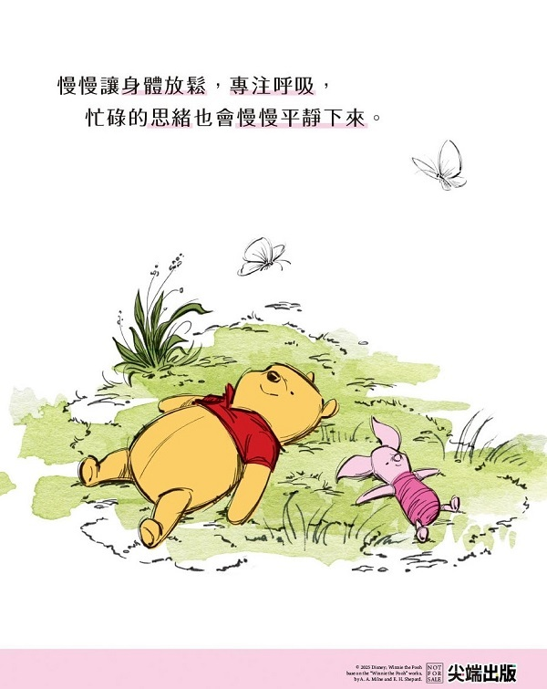

<!-- SELF-INTRO-START -->

_嗨，我是 [黃樺明](https://huam.ing)，我熱愛 [寫作](https://huam.ing/writing)、[耐力運動](https://www.strava.com/athletes/huaminghuang)、[開發提升生活品質的軟體工具](https://github.com/huaminghuangtw)。Enoughness，剛剛好，是我從 2023 年開始每天練習的生活態度。每週，我會在這份電子報分享三件有趣的事。如果這封信是朋友轉寄給你的，歡迎 [點此訂閱](https://huam.ing/newsletter)。想看看過往內容？[歷年電子報](https://huam.ing/enoughness) 都在這裡。_

<!-- SELF-INTRO-END -->

---

# 1

前陣子造訪高雄 [駁二藝術特區](https://www.google.com/maps?q=駁二藝術特區)，漫步於 [大港橋](https://www.google.com/maps?q=大港橋) 畔，三個並排坐在長椅上、低頭滑手機的白色人像，瞬間抓住了我的目光。

他們的臉龐被螢幕光照亮，神情專注卻空洞。身體雖在現場，心思卻早已飄向遠方。

這件名為《[手機人生](https://www.google.com/maps?q=手機人生)》（[Absorbed by Light](https://amsterdamlightfestival.com/en/artworks/absorbed-by-light)）的裝置藝術，由英國平面設計師 [Gali May Lucas](https://www.google.com/search?q=Gali+May+Lucas) 與德國雕刻家 [Karoline Hinz](https://www.google.com/search?q=Karoline+Hinz) [聯手打造](https://www.designboom.com/art/absorbed-by-light-design-bridge-gali-may-lucas-amsterdam-light-festival-12-06-2018/)。它不僅曾在 2019 阿姆斯特丹燈光節（[Amsterdam Light Festival](https://amsterdamlightfestival.com/)）大放異彩，更是 2022 台灣燈會在高雄首件亮相的展品。

藝術家藉由這件作品，探討現代人過度沉迷於螢幕，逐漸失去與周遭環境連結的現象。

這一幕，無疑是現代生活的真實縮影，發人深省。

如果有機會，不妨親自坐在他們中間，感受一下「被手機吸走」的感覺。

# 2

那天，在全台灣最靠近海港的書店—[誠品駁二](https://www.google.com/maps?q=誠品駁二)，我遇見了這本《[北歐時間：世界第一幸福國度教會我的事](https://www.books.com.tw/products/0011035285)》。

作者是定居丹麥的日本人 [日暮 Inko（いくらし いんこ）](https://www.instagram.com/inkohigurashi)。透過她在當地的生活體驗與細膩觀察，歸納出以下 5 種「北歐時間」：

## 1. 自我照顧的時間

比起逛街購物，北歐人更重視與大自然的連結。他們常走進森林，任陽光灑落，沉澱心靈；與自然同步，順應四季與日照的變化來調整生活步調。

## 2. 活出本心的時間

放下「迎合正解」的壓力，[不再執著於做一個外人眼中的「體面人」](https://huam.ing/2025/8/30/you-and-your-timeline)。即使素顏出門、穿著舊衣，也能坦然自在、怡然自得。

## 3. 單一任務的時間

一次只專心做好一件事，專注於當下，並分清楚工作與休息的界線 — 工作只是人生的一部分，不是全部。

## 4. 創造探索的時間

在日常裡注入小巧思與新鮮感：親手烘焙肉桂捲、嘗試新的散步路線、或是為房間換上一束鮮花。這些細節，讓平凡的日子顯得不凡。

## 5. 享受 Hygge 的時間

丹麥語 [Hygge](https://www.google.com/search?q=Hygge)，代表的是一種輕鬆、舒適的個人狀態。人們會刻意放慢腳步、按下暫停鍵，安排留給自己的 [獨處](https://huam.ing/2025/10/14/who-do-we-spend-time-with-across-our-lifetime/#6-%E8%87%AA%E5%B7%B1) 時間（[Me Time](https://www.google.com/search?q=Me+Time)）。在這裡，慢不等於懶，而是為了更深度地體驗生活和思考人生。

---

對北歐人來說，時間不是壓力的來源，而是承載生活品質的容器。

他們不把忙碌視為成就，也不認為需要犧牲健康來換取未來的幸福。

他們深知長時間工作不等於高效率。不追求「做更多」，而是實踐「少，但是更好」的哲學。

他們擁有 [篩選](https://huam.ing/2025/9/30/the-monkey-and-pedestal-mindset) 與 [說不](https://huam.ing/2025/11/21/enoughness-6/#3) 的勇氣，清楚分辨什麼對自己重要、什麼只是他人的期待，並義無反顧地投入在最重要的人事物上。

他們實踐「減法生活」，主動刪減不必要的行程、社交與物質慾望。

這種慢活，既是一種時間的深呼吸，也是一種生活的禪。

北歐人的 [幸福密碼](https://huam.ing/2025/10/24/enoughness-2/#4)，不在於更快，而在於 [剛剛好](https://huam.ing/newsletter) ⚖️。

# 3

你知道嗎？上週的平安夜是《小熊維尼》（[Winnie-the-Pooh](https://www.goodreads.com/work/quotes/1225592-winnie-the-pooh)）初登場的 100 週年紀念日！

1925 年 12 月 24 日，「[小熊維尼](https://www.google.com/search?q=小熊維尼)」這個名字首次出現在《倫敦晚報》委託撰寫的一篇兒童故事中。這隻小熊的誕生，源於英國作家 [A. A. Milne](https://www.google.com/search?q=A.+A.+Milne) 與兒子 [Christopher Robin Milne](https://www.google.com/search?q=Christopher+Robin+Milne) 之間溫馨的父子關係。

故事的靈感全來自兒子的玩具箱：Robin 有一隻原名為 Edward Bear 的泰迪熊，後來結合倫敦動物園裡一隻叫 [Winnie](https://en.wikipedia.org/wiki/Winnipeg_(bear)) 的加拿大黑熊，以及 Robin 為一隻天鵝取的名字 Pooh，最終成為世人所熟知的「[Winnie-the-Pooh](https://www.google.com/search?q=Winnie-the-Pooh)」。

第一次世界大戰後，社會充滿失序、創傷與 [犬儒](https://www.google.com/search?q=犬儒)（cynicism）的氛圍，Milne 選擇用一個慢、單純、沒有英雄敘事的世界回應。

Milne 的文字，加上插畫家 [Ernest Howard Shepard](https://www.google.com/search?q=Ernest+Howard+Shepard) 的筆觸，讓維尼的形象躍然紙上。

1960 年代，迪士尼取得小熊維尼的版權後，推出一系列動畫短片與電影，讓維尼成為家喻戶曉的角色。

---

身體圓滾滾、表情傻呼呼的維尼，最愛大口大口地吃蜂蜜，毫不偽裝，只想過自己想過的生活。每天早上醒來，腦中想的第一件事都是「[今天早餐要吃什麼好呢？](https://youtu.be/iDpP1RCnfd0)」

在百畝森林裡，維尼不追求成功，不強調成長速度，更 [不比較](https://huam.ing/2025/8/30/you-and-your-timeline)「這個好，那個壞」— 總是抱持著如初生嬰兒般的赤子之心。

單純善良、天真憨厚的他有點笨拙，總敲著自己的小腦袋瓜，說著那句口頭禪：「Think, think, think…」即使想了老半天，他還是經常提出錯誤的解決辦法 😂

維尼不太做長期規劃，也不計算利與弊。他的行動風格非常直接：肚子餓了，就想到蜂蜜，然後立刻行動去找蜂蜜；朋友不開心時，他不會馬上分析原因或給建議，而是默默地陪伴對方，[安靜地傾聽](https://huam.ing/2025/10/10/the-power-of-quiet/)。

維尼不會 100% 解決問題，而是讓問題變得沒那麼可怕。他不追求最有效率、最完美的方法，而是問：事情有沒有變好一點？大家有沒有比較安心？現在能不能先過去？

這種「夠用就好」（good enough）的哲學，讓他在複雜的世界裡，總能找到簡單的出口，許多難題也跟著迎刃而解。

---

大部分時間，維尼喜歡和朋友一起度過，也非常講義氣！

他曾說：

> 沒有朋友的一天，就像是罐子裡沒有半滴蜂蜜一樣，令人沮喪。
>
> A day without a friend is like a pot without a single drop of honey left inside.

他是大家心目中那個溫暖的存在，總是用最笨、但最真誠的方式支持朋友。當小豬害怕時，維尼會靜靜地坐在他身邊，什麼也不說，只是陪著他，讓小豬感到安心。

維尼不聰明伶俐，也不特別能幹，但他的動物朋友們依然需要他，因為他就是他。

[他的存在本身，就是價值](https://huam.ing/2025/11/12/ted-taipei-2025)。

---

在看似漫無目的的生活中，大智若愚的維尼有時候又能蹦出寓意深遠、妙語如珠的話：

> 小豬：「你如何拼寫『愛』呢？」
>
> Piglet: How do you spell love?
>
> 維尼：「愛不是拼寫出來的，而是體會出來的。」
>
> Pooh: You don’t spell it. You feel it.

> 人們常說沒有事情是辦不到的，但我整天無所事事。
>
> People say nothing is impossible, but I do nothing every day.

> 有時候無所事事，反而能成就最棒的事。
>
> Doing nothing often leads to the very best of something.

他說的話從來不是什麼艱澀的大道理，卻總能在不經意間讓人熱淚盈眶。

---

維尼總是專注於眼前的小確幸，不被世俗煩惱所困。無論是品嚐蜂蜜，還是與朋友共度的簡單時光，他都能全心投入、用心感受，並細細品味每一個當下。

某天，維尼問小豬：「今天是什麼日子呢？」

小豬回答：「是今天！」

維尼開心地說：「我最愛的日子就是今天！」

「現在是幾點？」維尼又問。

「是現在！」小豬尖聲說。

「我最喜歡的時間！」維尼說。

「那我們在哪裡？」維尼問。

「我們在這裡。」小豬驚叫道。

「我最喜歡的地方！」維尼說。

「你今天要做什麼？」小豬問。

「更像是我沒有在做什麼。」維尼回答。

我想，這就是小熊維尼快樂的秘訣吧 🫶

---

有些東西，一旦長大，就很難再找回來。

**保持善良、知足常樂，是我從小熊維尼身上學到的事。**

— [樺明](https://huam.ing/2026/1/2/enoughness-12)

---

“Did you ever stop to think, and forget to start again?”
 
— Winnie-the-Pooh

