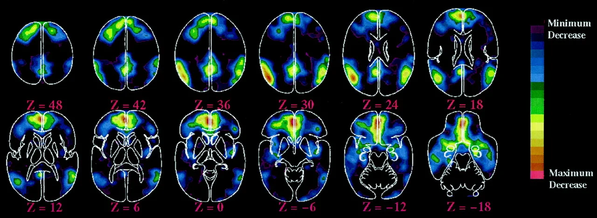
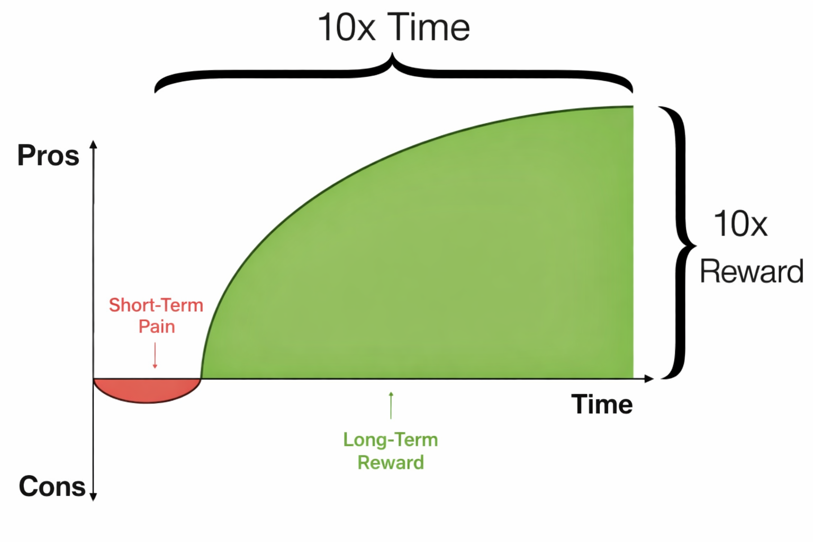

<!-- SELF-INTRO-START -->

_嗨，我是 [黃樺明](https://huami.ng)，我熱愛 [寫作](https://huami.ng/writing)、[耐力運動](https://www.strava.com/athletes/huaminghuang)、[開發提升生活品質的軟體工具](https://github.com/huaminghuangtw)。若有一天必須留下 [墓誌銘](https://huami.ng/2025/7/15/live-each-day-as-if-it-were-your-last)，我希望上面寫著：他致力於 [改善人類的手機使用習慣](https://shortcutomation.com)，也努力 [讓臺灣的學生運動員擁有更好的教育環境和適應環境的能力](https://adaptx.tw)。Enoughness，是我從 2023 年開始每天練習的生活哲學，一種「剛剛好」的生活態度。每週，我會在這份電子報分享幾件觸動我 [好奇心](https://huami.ng/weekly-mindware-update) 的事物、想法與學習。如果這封信是朋友轉寄給你的，歡迎 [點此訂閱](https://huami.ng/newsletter)。想看看過往內容？[歷年電子報](https://huami.ng/enoughness) 都在這裡。_

<!-- SELF-INTRO-END -->

---

# 1

矽谷預言先知、科技趨勢家 [Kevin Kelly](https://www.google.com/search?q=Kevin+Kelly)（大家都稱他為 KK），是我很喜歡的一位長線思考者。

他最廣為流傳的洞見之一是「[1,000 True Fans](https://kk.org/thetechnium/1000-true-fans/)」理論。KK 認為在網路時代，創作者無需追求百萬粉絲的虛名，只需要擁有 1,000 個真心相信、信任，並願意購買你所有作品的「鐵粉」，就能維持創作生活的生計。這個觀點至今仍是創作者經濟（Creator Economy）的核心精神。

在展望未來的著作《[5000天後的世界](https://kk.org/books/the-next-5000-days)》中，KK 則預言了 AI 與 AR/VR 下一步的融合。他描述一個即將到來的「鏡像世界」（Mirror World），不僅是物理世界的數位孿生，更是一個能讓數百萬人同時協作、實體與虛擬深度交織的全新平台。

除了這些硬派的科技觀察，KK 在 2023 年也出版過一本小書《[Excellent Advice for Living](https://kk.org/books/excellent-advice-for-living)》。

這本書源自於他對孩子們的愛與傳承。KK 在 68 歲生日時，決定為子女們寫下 [68 條人生建議](https://kk.org/thetechnium/68-bits-of-unsolicited-advice/)，這些都是他 [希望自己年輕時就能懂的事](https://huami.ng/2025/10/15/30-things-i-wish-i-knew-in-20s)。從那時開始，「[寫下建議](https://kk.org/thetechnium/101-additional-advices/)」成了他每年生日的慣例。隨著歲月積累，他將多年來的紀錄去蕪存菁，最終集結成 450 條人生智慧收錄於書中。

身為資深背包客的 KK，也曾寫過一篇《[50 Years of Travel Tips](https://kk.org/thetechnium/50-years-of-travel-tips/)》，對於熱愛旅行的人來說相當實用。

# 2

另一位長者，是以互動式閱讀體驗聞名的《多重結局冒險案例》（[Choose Your Own Adventure](https://www.goodreads.com/series/393396-choose-your-own-adventure)）系列童書作者 [Edward Packard](https://www.google.com/search?q=Edward+Packard)。

他在邁入九十歲高齡之際，於《[Nine Things I Learned in Ninety Years](https://edwardpackard.com/wp-content/uploads/2025/09/Nine-Things-I-Learned-in-Ninety-Years.pdf)》寫下他學到的九件事：

1. 建立自我（To be self-constituted）
2. 保持清醒與覺察（To keep awake and aware）
3. 換位思考他人所想所感（To consider what others may be thinking and feeling）
4. 將快樂設為預設心智狀態（To make happiness my default state of mind）
5. 尋求永恆的視角（To seek an eternal perspective）
6. 防範自我欺騙（To guard against self-deception）
7. 學習如何面對死亡（How to confront mortality）
8. 理解運氣扮演的巨大角色（What an outsized role is played by luck）
9. 珍惜當下所擁有的一切（To consider what you have at the moment）

這些文字雖然精簡，卻濃縮了九十年的人生精華。我將其中特別有共鳴的段落整理在 [這則筆記](https://huami.ng/nine-things-i-learned-in-ninety-year)，推薦你找個空閒的時間細細品味。

# 3

前幾天去醫院探病。

在地下停車場取車時，剛好路過「[安息室](https://www.google.com/search?q=安息室)」。家人突然轉頭問我：「你會害怕（死亡）嗎？」

我停頓了一下，回答道：「**[比起死亡，我更害怕虛度光陰，害怕自己沒有用盡全力過好每一天。](https://huami.ng/2025/10/14/who-do-we-spend-time-with-across-our-lifetime)**」

---

電影《[鐵達尼號](https://www.imdb.com/title/tt0120338)》（Titanic）中，李奧納多（[Leonardo DiCaprio](https://www.google.com/search?q=Leonardo+DiCaprio)）在晚宴舉杯時說出的那句「_[Make each day count.](https://youtu.be/JYdCltjvrxg)_」，至今仍是我用來反覆提醒自己的箴言。

每天早上醒來，太陽都像第一次升起；每一天，也都像獨立的另一輩子。

歸零、新開始、全力以赴。

**生命是一個提問，而我們 [如何活著](https://huami.ng/2025/11/12/ted-taipei-2025)，就是對它的回答。**

# 4

[第五期](https://huami.ng/2025/11/14/enoughness-5/#3) 提過在生活中「留白」的重要性。

[研究](https://doi.org/10.4103/0973-1229.77424) 指出，愛因斯坦、莫札特和達文西等極具創造力的人物，都非常重視這種「自由漂浮」的思考時段。

神經科學家也發現，在這些放鬆的閒置時段，大腦並非處於休息狀態，而是進入一種活躍的「[預設模式網路（Default Mode Network, DMN）](https://doi.org/10.1016/j.neuroimage.2007.02.041)」。

在 DMN 模式下，大腦會主動尋找連結，並建立關聯性。這通常發生在我們從事低認知需求的活動時 — 如散步、跑步、洗澡、做家事，甚至是單純的放空、發呆、做白日夢。

這些看似無所事事、甚至有些無聊的時刻，就像核融合反應一樣，正在悄悄聚集能量，準備釋放驚人的創造力。

[J.K. Rowling](https://www.google.com/search?q=J.K.+Rowling) [就是在等待火車的空檔，構思出《哈利波特》的雛形](https://stories.jkrowling.com/my-story#:~:text=A%20few%20years%20later%20in%E2%80%AF1990%2C%20after%20moving%20to%20London%2C%20I%20was%20sitting%20on%20a%20delayed%20train%20back%20home%20from%20Manchester%20when%20suddenly%20I%20had%20the%20idea%20of%20a%20boy%20wizard%20who%20went%20to%20wizarding%20school.%20Harry%20Potter%20and%20Hogwarts%20came%20out%20of%20nowhere%20in%20the%20most%20physical%20rush%20of%20excitement%2C%20and%20ideas%20came%20teeming%20into%20my%20head.)。

# 5

我在 2025 年養成最棒的習慣，大概就是每天的「沖冰水/泡冰浴」練習。

專門研究 [老化](https://huami.ng/2025/12/26/enoughness-11/#4) 的哈佛醫學院終身教授 [David Sinclair](https://www.google.com/search?q=David+Sinclair) 博士，也是暢銷書《[可不可以不變老？](https://www.google.com/search?q=可不可以不變老)》（[Lifespan](https://www.amazon.com/Lifespan-Why-Age_and-Dont-Have/dp/1501191977)）的作者，曾在 [一篇論文](https://doi.org/10.1089/met.2014.0027) 中提出「代謝寒冬」（[Metabolic Winter](https://www.google.com/search?q=Metabolic+Winter)）假說。

他認為，現代人長期處於恆溫且衣食無虞的的舒適圈中，導致體內具備修復 DNA、抵禦疾病及延長壽命功能的「長壽基因」，因缺乏刺激而進入休眠狀態，使身體漸漸失去應對環境變化的韌性。

只有當身體感知到「生存壓力」時，這套防禦機制才會被啟動。因此，我們需要刻意地讓身體短暫承受壓力（[Hormetic Stress](https://www.google.com/search?q=Hormetic+Stress)）— 像是高強度運動、間歇性斷食或泡冰水 — 來喚醒這些沉睡的長壽基因。

以泡冰水來說，每天只要花幾分鐘，就能獲得兩大好處：

首先，它是天然的「快樂引擎」。泡冰水會刺激大腦分泌多巴胺，讓你感到更專注、更有動力。這種快樂不是像 [吃甜點](https://huami.ng/2025/11/21/enoughness-6/#2) 那樣曇花一現，而是能持續好幾個小時的穩定燃料，讓你在面對工作挑戰時更有衝勁。

其次，它是焦慮的「重置按鈕」。當冰水接觸臉部，身體會啟動一種叫「潛水反射」（[The Diving Reflex](https://en.wikipedia.org/wiki/Diving_reflex)）的機制。這就像強制幫過熱的電腦關機重啟，能迅速放慢心跳，幫助我們從高壓、煩躁的情緒中冷靜下來。

這麼好康的事，不每天給它做好做滿，對得起自己嗎？

---

老實說，我一開始也是非常抗拒。

每當想到要面對那盆冰水，我就會開始替自己找藉口：「今天天氣有點涼，我會不會因此感冒啊？」、「昨天沒睡飽，這樣會不會太刺激了？」，然後到處東摸摸、西摸摸，想盡辦法拖延那個命運的時刻 XD

後來，我允許自己先從「泡臉 30 秒」開始，慢慢適應後，才進階到沖冷水 2 分鐘，甚至是挑戰泡冰浴 4 分鐘。

在這個過程中，我領悟到一個關鍵的精髓：「臣服」（Surrender）。

沒錯，我要做的，不是聳起肩膀硬碰硬，或是亂吼亂叫，而是學會放下，學會臣服。

我體會到，**冰浴訓練的不是耐寒能力，而是在外來刺激中，保持內心平穩的能力**。

當我越緊張、越緊繃、越想抵抗，刺骨的痛楚就越強烈；但當我選擇坦然接受冰水滑過肌膚的感覺，專注於深長的呼吸，身體竟然神奇地安靜下來。

結束的那一刻，把頭抬起來深吸一口氣，有一種「重生」的錯覺。整個人瞬間清醒，充滿活力，覺得這個世界上沒有任何事情可以難得倒我。

雖然一直到今天，走進浴室準備讓自己發抖的那幾分鐘，依然是我一天中最討厭的時刻，但我仍舊每天執行。

就像拳王泰森（[Mike Tyson](https://www.google.com/search?q=Mike+Tyson)）說的：

> _[Discipline is doing what you hate to do, but nonetheless doing it like you love it.](https://x.com/MikeTyson/status/1051925919710027777)_
>
> 所謂紀律，就是做你討厭做的事，但依然像深愛它一樣去完成。

短暫的痛苦，是為了換取長遠的快樂；不舒服，是成長必須繳納的入場費。

**在這場修煉中，我們戰勝的不是冰水，而是那個曾經想要退縮的自己。**

---

如果你對背後的科學機制或實作細節感興趣，可以參考 [張修修](https://shosho.tw/) 的 [這兩支](https://www.youtube.com/watch?v=HgvQq6Tek48)[影片](https://www.youtube.com/watch?v=v-zXN_xB_Io)，以及我的 [筆記](https://huami.ng/the-science-and-use-of-cold-exposure-for-health-and-performance)。

需要一點激勵你的精神糧食？可以關注這兩位猛男：[Jordan Ferrone](https://www.instagram.com/jordan.ferrone) 和 [Sahil Bloom](https://x.com/SahilBloom/status/1744357477716566467)。

歐對了，台灣第一間專業的冷熱交替冰浴桑拿體驗店 [Chill Taiwan](https://www.instagram.com/chill.taiwan) 在 2025 年底盛大開幕了。有機會到訪台北的話，一定要去 [朝聖](https://www.google.com/maps?q=Chill+Ice+Bath+%26+Sauna+冰浴桑拿體驗店)！

Let’s get cold! 🥶

— [樺明](https://huami.ng/2026/1/9/enoughness-13)

---

“It is our choices, Harry, that show what we truly are, far more than our abilities.”
 
— J.K. Rowling, Harry Potter and the Chamber of Secrets

