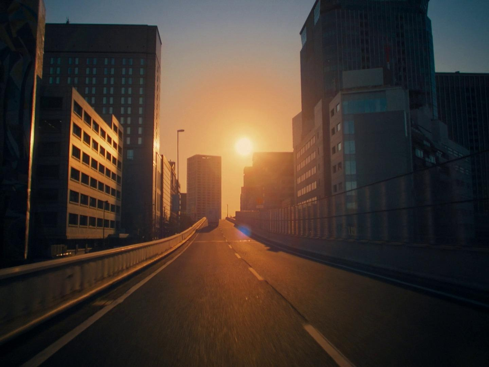
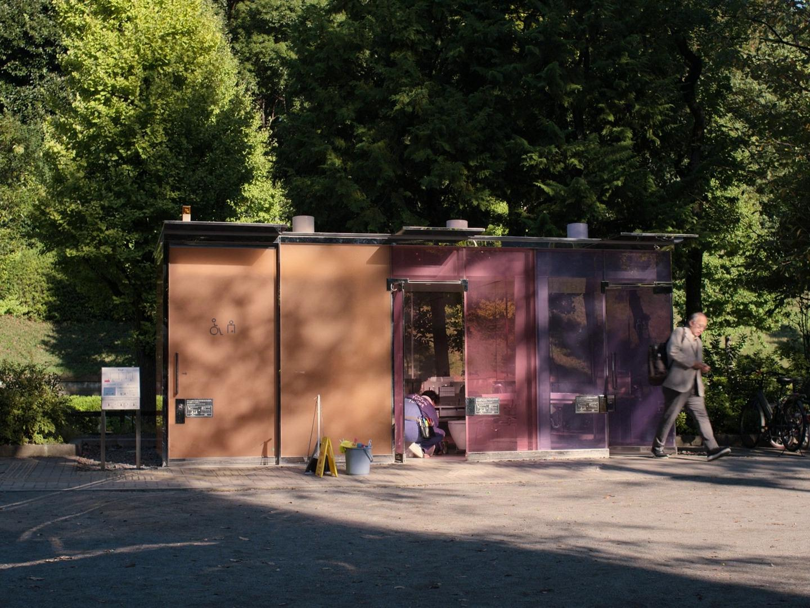
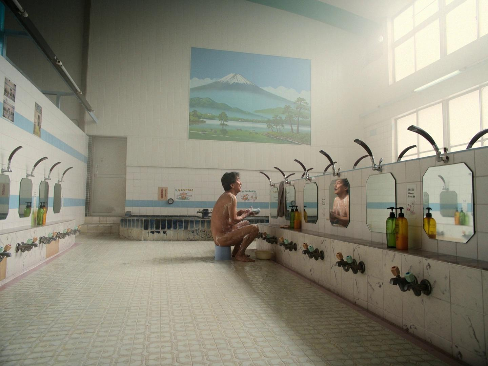
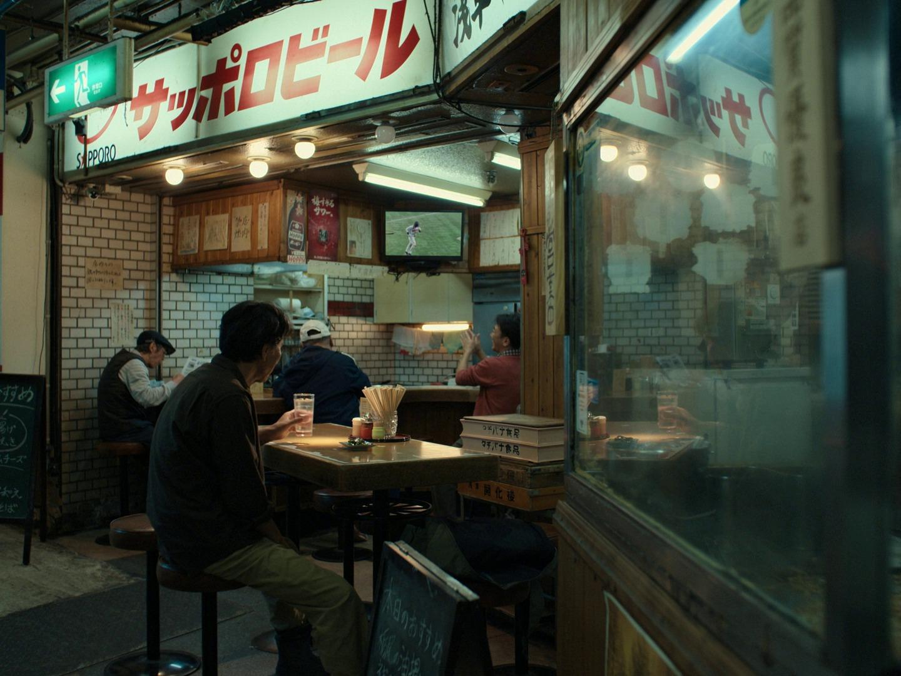
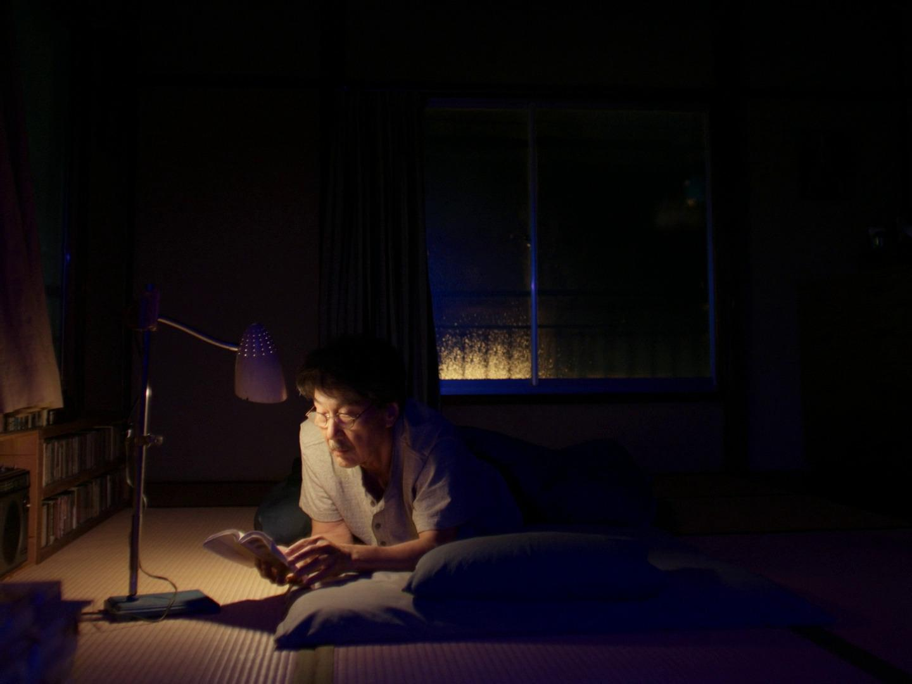
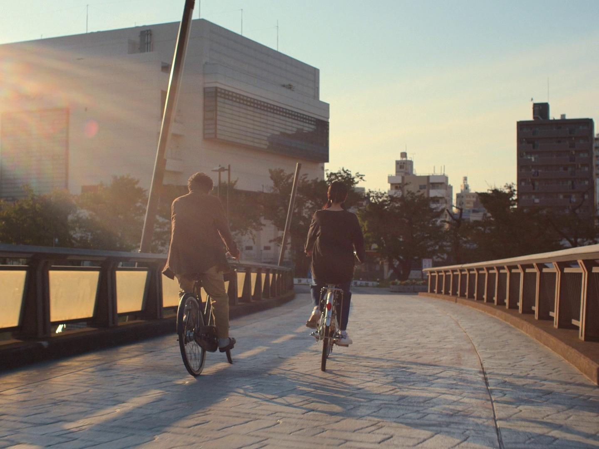

<!-- SELF-INTRO-START -->

_嗨，我是 [黃樺明](https://huami.ng)，我熱愛 [寫作](https://huami.ng/writing)、[戶外運動](https://www.strava.com/athletes/huaminghuang)、[開發提升生活品質的軟體工具](https://github.com/huaminghuangtw)。若有一天必須留下 [墓誌銘](https://huami.ng/2025/7/15/live-each-day-as-if-it-were-your-last)，我希望上面寫著：他致力於 [改善人類的手機使用習慣](https://shortcutomation.com)，也努力 [讓臺灣的學生運動員擁有更好的教育環境和適應環境的能力](https://adaptx.tw)。Enoughness，是我從 2023 年開始每天練習的生活哲學，一種「剛剛好」的生活態度。每週，我會在這份電子報分享幾件觸動我 [好奇心](https://huami.ng/weekly-mindware-update) 的事物、想法與學習。如果這封信是朋友轉寄給你的，歡迎 [點此訂閱](https://huami.ng/newsletter)。想看看過往內容？[歷年電子報](https://huami.ng/enoughness) 都在這裡。_

<!-- SELF-INTRO-END -->

---

最近看了 [《我的完美日常》（Perfect Days）](https://www.imdb.com/title/tt27503384/)。正如其名，這是一部關於「日常」的電影。由 [役所廣司](https://www.google.com/search?q=役所廣司) 飾演的主角平山先生，是一位不愛說話、沉默寡言的公廁清潔工，獨自住在東京一棟老舊的兩層樓房裡，過著極簡而規律的生活。

一大早天色微亮，他已經熟練地摺好被褥、刷牙洗臉、替窗台盆栽澆水，接著換上印有「[THE TOKYO TOILET](https://tokyotoilet.jp/)」的工作服。

<em>圖片來源：<a href="https://film-grab.com/2024/04/12/perfect-days/">Filmgrab</a></em>

踏出家門時，他總會抬頭對著天空微笑，像是在跟嶄新的「今天」打招呼。

<em>圖片來源：<a href="https://film-grab.com/2024/04/12/perfect-days/">Filmgrab</a></em>

出發前，他會在自動販賣機投一罐 BOSS 咖啡，然後坐進小貨車，將老舊的卡式錄音帶塞進播放設備，今天選到的歌曲是 [Lou Reed 的 Perfect Day](https://www.youtube.com/watch?v=9wxI4KK9ZYo)。發動引擎，穿梭在河岸高架橋與晴空塔之間，開車上工去。

<em>圖片來源：<a href="https://film-grab.com/2024/04/12/perfect-days/">Filmgrab</a></em>

抵達公廁之後，他拿出自備的各種專業刷具（有些似乎還是自己改裝過的），仔細刷洗每一個角落，甚至用隨身鏡檢查馬桶內緣的死角；偶爾遇上急用者，便禮貌性回避，在公廁外面等待。

<em>圖片來源：<a href="https://film-grab.com/2024/04/12/perfect-days/">Filmgrab</a></em>

午餐時間，他固定在神社公園長椅吃三明治，並用底片相機捕捉光線灑落樹梢的瞬間。

<em>圖片來源：<a href="https://film-grab.com/2024/04/12/perfect-days/">Filmgrab</a></em>

某次外甥女 Nico 陪他一起仰望樹影時問道：「這棵樹是你的朋友嗎？」他微笑不語，似乎很喜歡這樣的說法。

<em>圖片來源：<a href="https://film-grab.com/2024/04/12/perfect-days/">Filmgrab</a></em>

結束白天一絲不苟的勞動工作，他騎上腳踏車，穿過 [跨河大橋](https://www.google.com/maps?q=桜橋(隅田川)) 前往大眾澡堂，洗去一身的汗水與疲憊。

<em>圖片來源：<a href="https://film-grab.com/2024/04/12/perfect-days/">Filmgrab</a></em>

傍晚，他來到淺草地下街那間每天報到的 [小餐館](https://www.google.com/maps?q=車站內炒麵+福ちゃん)，點一份懷舊炒麵。店內總是坐著關注球賽的顧客，在此起彼落的庶民喧鬧聲中，平山安靜地享受一個人的晚餐時光。

<em>圖片來源：<a href="https://film-grab.com/2024/04/12/perfect-days/">Filmgrab</a></em>

果腹之後，便返家休息。睡前，他戴著老花眼鏡，在微弱的燈光下看小說，直到睡意襲來。

<em>圖片來源：<a href="https://film-grab.com/2024/04/12/perfect-days/">Filmgrab</a></em>

我觀察到，平山似乎每天都帶著心滿意足的心情入睡，這應該就是靈魂飽滿的最高境界吧！

對了，平山通常是在凌晨街道傳來的掃地聲中醒來，背景只有這單純的聲響。但到了電影後段，卻多了平交道的警鈴與電車的聲響。我想，這是導演 [Wim Wenders](https://www.google.com/search?q=Wim+Wenders) 刻意的鋪陳，讓觀眾隨著聲音的變化，感受到平山內在世界的細微轉折與成長。

---

在看似枯燥乏味、一成不變的作息裡，平山依舊為它增添了「變」的層次。

雖然每天中午都對著同一棵樹拍照，但隨著陽光灑落的角度不同、枝葉隨風搖曳的姿態變化，每一張照片呈現的光影都不同 — 都是獨一無二的瞬間。

還有每天的錄音帶旋律也是。他在車上置物箱裡放了好幾張專輯，每天上路前，會依據當日的天氣與心境挑選一捲來播放。

**看似重複的事，每次的體驗卻都不一樣。**

平山對於生活的細膩度和敏銳度，從很多小細節可以觀察出來。

每到周末，他喜歡去二手書店挖寶，也會到相片沖洗店洗照片，並拿回上一次沖出的照片。打掃家裡時，他會順便整理照片，細心挑選幾張，收藏進有標記年份的鐵盒裡；從櫥子中按照日期整齊收納的大量照片，便能看出他對每一天的重視。

他在二樓特地開闢了一個溫室邊間，專門安頓那些從樹根旁小心翼翼挖回來的野生幼苗。對旁人而言，或許只是不起眼的雜草，但在平山眼裡，它們都是值得被重視的生命。

正是這些簡約而慎重的儀式，為他日復一日的樸實生活，譜出了不單調的變奏。

<em>圖片來源：<a href="https://film-grab.com/2024/04/12/perfect-days/">Filmgrab</a></em>

---

劇中有一幕格外動人：平山與外甥女 Nico 沿著 [吾妻橋](https://www.google.com/maps?q=吾妻橋) 騎著單車，Nico 望著遠方，突然問舅舅要不要一起去看海。

平山用一貫平和的口吻回答：「下次吧。」

「下次是什麼時候？」Nico 不死心地追問。

平山淡然地說：「下次是下次，現在是現在。」（今度は今度、今は今。）

畫面便帶到兩人迎著風、踩著踏板，在陽光下放聲大喊。

那一刻，沒有過去的悔恨，也沒有未來的擔憂，只有純粹而飽滿的「現在」。

**生命的真諦，無非是當下的酸甜苦辣。除了此時此刻，我們一無所有。**

<em>圖片來源：<a href="https://film-grab.com/2024/04/12/perfect-days/">Filmgrab</a></em>

---

片尾字幕跑完後出現一個彩蛋，是對日文「木漏れ日」（[Komorebi](https://www.google.com/search?q=Komorebi)）的註解，意思是「從枝葉搖曳的縫隙中散落的陽光」。

樹葉隨風起舞，穿透其中的光影每一秒都在變化；光影錯落，沒有一刻重複，只存在於當下，稍縱即逝，這是未曾停下腳步的人不會注意到的。

對平山來說，每分每秒都是無法重來的絕版「木漏」。

頭頂飛過的鳥兒、與迷路的小孩玩捉迷藏、從廂型車窗望出去的天色、在公園裡與流浪漢交換眼神、午餐時與坐在身旁的上班族女子點頭致意，甚至是在公廁的夾縫中，發現無名氏留下的紙條，索性玩起「一天走一步」的井字遊戲。

生活中不乏這樣的小確幸，這就是所謂的「完美日常」（Perfect Days）— 加了複數，因為完美不是偶然，一切都是日常。

日日是好日，美好人生始於美好今日。好好活著，完美便是日常，每天都可以是完美的一天。

**也許我們需要的，只是靜靜地凝視著樹林之間滲下的陽光。**

<em>圖片來源：<a href="https://unsplash.com/photos/a-forest-filled-with-lots-of-trees-and-leaves-iN5jOYa724Y">Unsplash</a></em>

---

電影的最後，平山駕駛著小貨車，清晨的陽光照在他臉上，背景播放著 [Nina Simone 的《Feeling Good》](https://www.youtube.com/watch?v=oHRNrgDIJfo)。他時而展露笑顏，時而眼眶泛淚，那不僅是悲喜交加的神情，更是一種對生命全然接納的釋懷。

<em>圖片來源：<a href="https://film-grab.com/2024/04/12/perfect-days/">Filmgrab</a></em>

其中一句歌詞是：「Oh, freedom is mine, and I know how I feel.」

究竟何謂自由？

也許，自由是即使外在世界喧囂，內心仍不為所動、泰然處之。

也許，自由是即便擁有再多金錢，仍選擇過與今天相同的生活。

最富有的人，不是口袋最厚的人，而是給他更多錢，也依然過著同樣日子的人。

---

這是一部有很多 [留白](https://huami.ng/2025/11/14/enoughness-5/#3) 的電影，甚至有超過十分鐘的畫面完全沒有對白。如同一幅水墨畫，適合靜靜地觀賞，也替觀眾留下豐富的想像與詮釋空間。

電影中的平山，雖然物質並不富裕，卻相當自得其樂。身處繁忙的東京大都會，卻能保有森林般的從容節奏。

這讓我明白，真正的快樂不假外求，而是一種向內探尋的選擇。

**對生活保持專注，對世界保有好奇與關懷，我正在學習成為這樣的人。**

 — [樺明](https://huami.ng/2026/1/16/enoughness-14)

---

“People sometimes fail to live because they are always preparing to live.”
 
— Alan Watts

