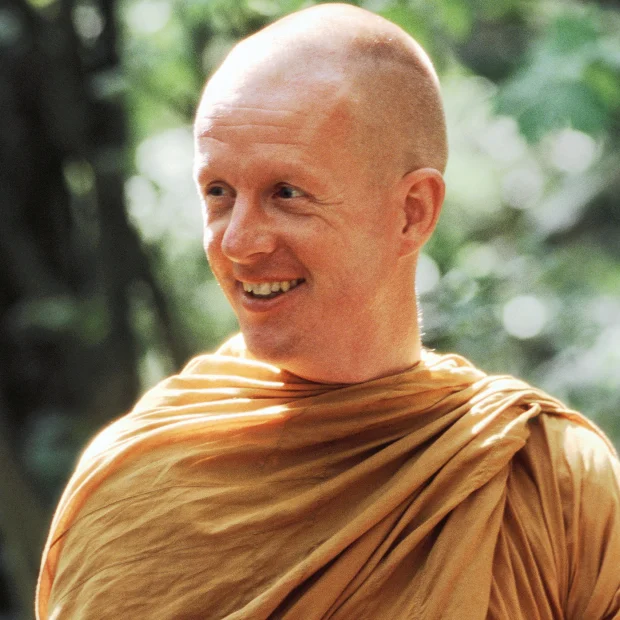
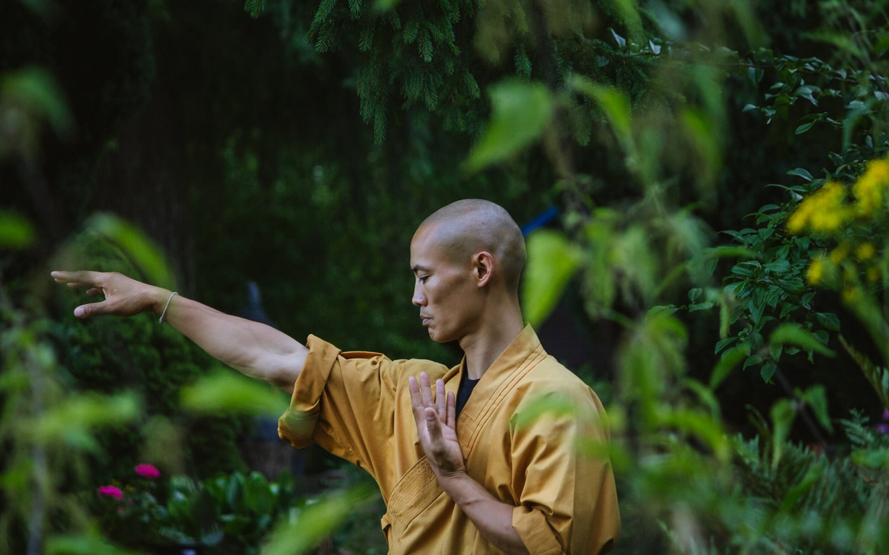

<!-- SELF-INTRO-START -->

_嗨，我是 [黃樺明](https://huami.ng)，我熱愛 [寫作](https://huami.ng/writing)、[耐力運動](https://www.strava.com/athletes/huaminghuang)、[開發提升生活品質的軟體工具](https://github.com/huaminghuangtw)。若有一天必須留下 [墓誌銘](https://huami.ng/2025/7/15/live-each-day-as-if-it-were-your-last)，我希望上面寫著：他致力於 [改善人類的手機使用習慣](https://shortcutomation.com)，也努力 [讓臺灣的學生運動員擁有更好的教育環境和適應環境的能力](https://adaptx.tw)。Enoughness，是我從 2023 年開始每天練習的生活哲學，一種「剛剛好」的生活態度。每週，我會在這份電子報分享幾件觸動我 [好奇心](https://huami.ng/weekly-mindware-update) 的事物、想法與學習。如果這封信是朋友轉寄給你的，歡迎 [點此訂閱](https://huami.ng/newsletter)。想看看過往內容？[歷年電子報](https://huami.ng/enoughness) 都在這裡。_

<!-- SELF-INTRO-END -->

---

# 1

最近在讀《[我可能錯了：森林智者的最後一堂人生課](https://www.google.com/search?q=我可能錯了)》。據說這是瑞典人的床頭書 — 每 30 個人就有 1 個人曾看過這本書。

<em>封面圖片：<a href="https://www.instagram.com/p/C1uUyfPu_t_/">《崇敬》（Adoración）</a>，<a href="https://www.google.com/search?q=Tomás+Sánchez">Tomás Sánchez</a></em>

作者是瑞典人 [Björn Natthiko Lindeblad](https://www.google.com/search?q=Björn+Natthiko+Lindeblad)。他是標準的人生勝利組：斯德哥爾摩經濟學院經濟學碩士、年紀輕輕就當上跨國大企業的財務長，被視為瑞典商界的明日之星，擁有多數人夢寐以求的金錢、地位、名聲。然而，他卻發現這些外在成就，並無法填補內心的空缺。

他並不快樂。

他在書中有一段寫給身體的一封信：

> 身體啊，謝謝你。
>
> 謝謝你每天都竭盡全力地支撐著我。
>
> 我知道，你正在打一場艱難的仗。
>
> 你是我的英雄。
>
> 我答應你，當有一天你無法完成某個動作時，我不會責怪你。
>
> 我答應你，我會比以往任何時候，都更用心地傾聽你的聲音。
>
> 我答應你，我不再向你索求超出你能力、也超出你意願的付出。
>
> 對不起，過去的我常常忽略了這一點。
>
> 最後，也是最重要的 — 我鄭重承諾，當你真的撐不下去時，我會尊重你、相信你，並按照你的意思去做。

我們的軀體並不屬於我們，而是為了探索世界「借來」的太空服。

所有東西都會消失，即使是最健康的身體也會退化。

[沒有任何事是永恆的](https://huami.ng/2025/12/26/enoughness-11/#1)，一切都是無常；無論是美好的事物或痛苦的經歷，人生的起起伏伏都會過去。

所以，練習 [將緊握的拳頭鬆開](https://huami.ng/2025/12/5/enoughness-8/#3) 吧！

# 2

[歐洲少林寺](https://www.google.com/maps?q=Shaolin+Temple+Europe) 掌門人 [釋恆義](https://www.google.com/search?q=Shi+Heng+Yi)（Shi Heng Yi）在 [TED 演講](https://www.youtube.com/watch?v=4-079YIasck) 中提到：

> _[I’m not the body, I’m not the mind, I’m not my emotion, I can just see all these 3 aspects about me.](https://www.youtube.com/watch?v=4-079YIasck&t=16m41s)_
>
> 我不是我的身體，我不是我的心智，我不是我的情緒，我只是能夠從旁看見這三個面向的自己。

長時間的獨處、走路與冥想後，我逐漸體悟：我只是一名自己的「觀察員」，靜靜觀照著一切的存在。

持續練習覺察當下後，我逐漸發現：一切都是順其自然的能量流動。我的任務只是順勢而為 — 讓身體交由心靈統御，心靈交由靈魂管轄，靈魂則 [臣服](https://huami.ng/2026/1/9/enoughness-13/#5) 於 [天賦](https://huami.ng/you-and-your-timeline) 的指引。

自我覺察，是開啟與自己真誠對話、自在相處的能力。唯有 [對「感覺」保持敏銳](https://huami.ng/2025/12/5/enoughness-8/#4)，才能察覺情緒、發現真實感受。

與自己對話很重要。當一個人不夠瞭解自己的時候，往往很難喜歡自己；反之，當一個人越瞭解自己，就越能接受，甚至改變自己。

理解自己，是喜歡自己的開始，也是改變自己的起點。

老子《道德經》第三十三章寫道：「知人者智，自知者明。勝人者有力，自勝者強。」

了解別人是聰明，了解自己才是真正的智慧；駕馭他人是力量，駕馭自己才是真正的強大。

修行並不侷限於和尚，每個人都能在日常中學會看見自己、成為自己的主人。

# 2

⚖️ 知足，是一種內在力量。它不是外在追求的目標，而是心理上的平衡與安定。

網路公益家 [沈芯菱](https://www.google.com/search?q=沈芯菱) 曾說：「真正的窮，不是沒有錢，而是沒有能力去付出。相對的，富裕是什麼？不是誰擁有得多，而是誰需要的少。」

知足，來自於珍惜當下所擁有，而非一味追逐得不到的東西。

當收入增加時，生活開支也隨著提升；這種「預期膨脹」現象，讓我們無論累積多少財富，也永遠無法滿足，因為慾望總是超越現實，總是渴望更多。

《[致富心態](https://www.google.com/search?q=致富心態)》（The Psychology of Money）的作者 [Morgan Housel](https://www.google.com/search?q=Morgan+Housel) 曾舉過一個例子：

> _[John D. Rockefeller was worth the equivalent of $400 billion, but he never had penicillin, sunscreen, or Advil. For most of his adult life he didn’t have electric lights, air conditioning, or sunglasses. Everything about wealth is circumstances in the context of expectations.](https://collabfund.com/blog/little-rules-about-big-things/#:~:text=Everything%20about%20wealth%20is%20circumstances%20in%20the%20context%20of%20expectations.)_
>
> [約翰 · 洛克斐勒](https://www.google.com/search?q=John+D.+Rockefeller) 的財富相當於四千億美元，但他一生中從未擁有過青黴素、防曬乳或止痛藥。在他大部分成年時期，沒有電燈、空調或太陽眼鏡。所有關於財富的感受，取決於你所處的時代背景與你的期望。

讓生活水準遠低於自己的能力範圍，並做好「預期管理」，才能在有限中體會到無限的富足。

Enough is enough.

— [樺明](https://huami.ng/2026/1/23/enoughness-15)

---

“The purpose of life is to discover your gift. The work of life is to develop it. The meaning of life is to give your gift away.”
 
— David Viscott

