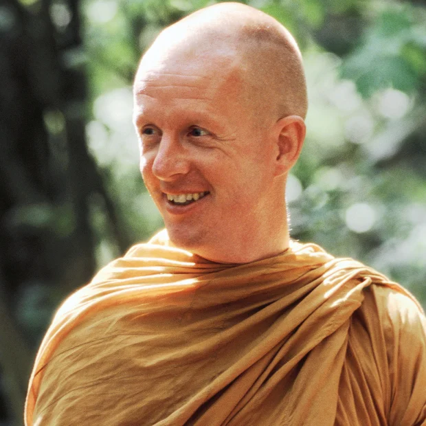
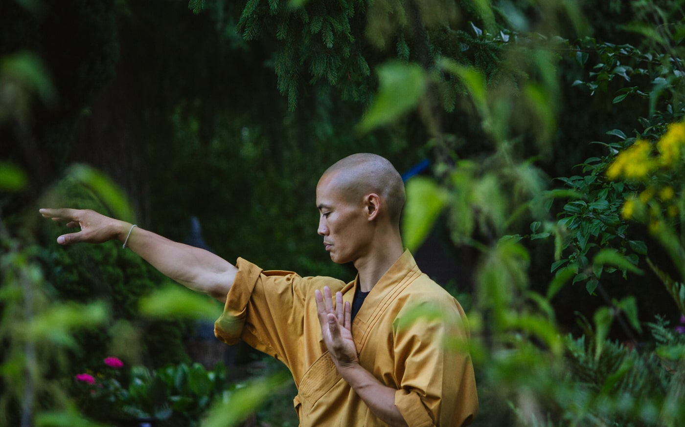

<!-- SELF-INTRO-START -->

_嗨，我是 [黃樺明](https://huam.ing)，我熱愛 [寫作](https://huam.ing/writing)、[耐力運動](https://www.strava.com/athletes/huaminghuang)、[開發提升生活品質的軟體工具](https://github.com/huaminghuangtw)。Enoughness，剛剛好，是我從 2023 年開始每天練習的生活態度。每週，我會在這份電子報分享三件有趣的事。如果這封信是朋友轉寄給你的，歡迎 [點此訂閱](https://huam.ing/newsletter)。想看看過往內容？[歷年電子報](https://huam.ing/enoughness) 都在這裡。_

<!-- SELF-INTRO-END -->

---

# 1

最近在讀《[我可能錯了：森林智者的最後一堂人生課](https://www.google.com/search?q=我可能錯了)》。據說，這是瑞典人的床頭書，每 30 個人就有 1 個人看過這本書。

作者是瑞典人 [Björn Natthiko Lindeblad](https://www.google.com/search?q=Björn+Natthiko+Lindeblad)。他是標準的人生勝利組：斯德哥爾摩經濟學院經濟學碩士、年紀輕輕就當上跨國大企業的財務長，被視為瑞典商界的明日之星，擁有多數人夢寐以求的金錢、地位、名聲。然而，他卻發現這些外在成就，無法填補內心的空缺。

他活得並不快樂。

他在書中有一段寫給身體的一封信：

> 身體啊，謝謝你。
>
> 謝謝你每天都竭盡全力地支撐著我。
>
> 我知道，你正在打一場艱難的仗。
>
> 你是我的英雄。
>
> 我答應你，當有一天你無法完成某個動作時，我不會責怪你。
>
> 我答應你，我會比以往任何時候，都更用心地傾聽你的聲音。
>
> 我答應你，我不再向你索求超出你能力、也超出你意願的付出。
>
> 對不起，過去的我常常忽略了這一點。
>
> 最後，也是最重要的 — 我鄭重承諾，當你真的撐不下去時，我會尊重你、相信你，並按照你的意思去做。

我們的軀體並不屬於我們，而是為了探索世界「借來」的太空服。

所有東西都會消失，即使是最健康的身體也會退化。

[沒有任何事是永恆的](https://huam.ing/2025/12/26/enoughness-11/#1)，凡事皆無常；人生的起起伏伏都會過去，無論是美好的事物或痛苦的經歷。

所以，練習 [將緊握的拳頭鬆開](https://huam.ing/2025/12/5/enoughness-8/#3) 吧！

# 2

[歐洲少林寺](https://www.google.com/maps?q=Shaolin+Temple+Europe) 掌門人 [釋恆義](https://www.google.com/search?q=Shi+Heng+Yi)（Shi Heng Yi）在 TED 演講 中 [提到](https://youtu.be/4-079YIasck?t=16m41s)：

> 我不是我的身體，我不是我的心智，我不是我的情緒，我只是能夠從旁看見這三個面向的自己。
>
> I’m not the body, I’m not the mind, I’m not my emotion, I can just see all these 3 aspects about me.

長時間獨處、走路與冥想後，我深刻體悟到：我只是一名自己的「觀察員」，靜靜觀照著一切的存在。

持續練習正念（Mindfulness）後，我發現：一切都是順其自然的能量流動。我的任務，只是順勢而為 — 讓身體交由心靈統御，心靈交由靈魂管轄，靈魂則 [臣服](https://huam.ing/2026/1/9/enoughness-13/#3) 於 [天賦](https://huam.ing/you-and-your-timeline) 的指引。

自我覺察，是開啟與自己真誠對話、自在相處的能力。唯有 [對「感覺」保持敏銳](https://huam.ing/2026/3/13/enoughness-22/#3)，才能察覺情緒、發現真實感受。

理解自己，是喜歡自己的開始，也是改變自己的起點。

老子《道德經》第三十三章寫道：「知人者智，自知者明。勝人者有力，自勝者強。」

了解別人是聰明，了解自己是智慧；駕馭他人是力量，駕馭自己是強大。

修行並不侷限於和尚，每個人都能在日常中學會看見自己、成為自己的主人。

# 3

⚖️ 知足，是一種內在力量。它不是外在追求的目標，而是心理上的平衡與安定。

網路公益家 [沈芯菱](https://www.google.com/search?q=沈芯菱) 曾說：

> 真正的窮，不是沒有錢，而是沒有能力去付出；相對的，富裕是什麼？不是誰擁有得多，而是誰需要的少。

成功是得到你想要的，快樂是想要你得到的。

很多時候，不快樂都源自於不滿足和那個總是渴望更多的「慾望」。

獲得滿足最快的方法是 [簡單生活](https://huam.ing/2026/3/6/enoughness-21/#3)，當一個極簡主義者（Minimalist）。

讓生活水準遠低於自己的能力範圍，並做好「預期管理」，就能在有限中體會到無限的富足。

富足，是永遠比「夠用」多一點點。

Enough is enough.

— [樺明](https://huam.ing/2026/1/23/enoughness-15)

---

“The purpose of life is to discover your gift. The work of life is to develop it. The meaning of life is to give your gift away.”
 
— David Viscott

