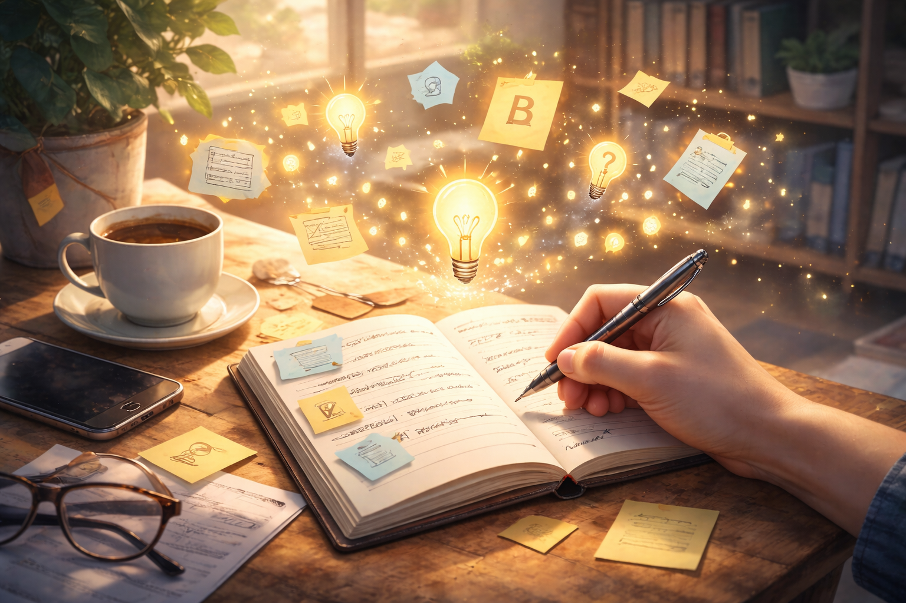

<!-- SELF-INTRO-START -->

_嗨，我是 [黃樺明](https://huam.ing)，我熱愛 [寫作](https://huam.ing/writing)、[耐力運動](https://www.strava.com/athletes/huaminghuang)、[開發提升生活品質的軟體工具](https://github.com/huaminghuangtw)。Enoughness，剛剛好，是我從 2023 年開始每天練習的生活態度。每週，我會在這份電子報分享三件有趣的事。如果這封信是朋友轉寄給你的，歡迎 [點此訂閱](https://huam.ing/newsletter)。想看看過往內容？[歷年電子報](https://huam.ing/enoughness) 都在這裡。_

<!-- SELF-INTRO-END -->

---

# 1

最近聽了瓦基的 Podcast [《吳淡如的財商必修課》如何慢慢變富、快快過好生活](https://readingoutpost.com/rich-with-betty/)，裡面有句話讓我印象深刻：

> 投資人生，做困難的事；投資金錢，做簡單的事。

真正值得我們投入的，是那些只能透過「努力」贏來、換來的東西：

1. 健康的身體
2. 平靜的內心
3. 充滿愛的家

這些「[人生難題](https://youtu.be/rVEMTxg_LrU)」無法外包給他人，也不是有錢就能買到。就算是 [Elon Musk](https://www.google.com/search?q=Elon+Musk)、[Jeff Bezos](https://www.google.com/search?q=Jeff+Bezos)、[黃仁勳](https://www.google.com/search?q=黃仁勳)，也只能靠自己日復一日、一點一滴地經營與累積。

而金錢，反而要 [用最簡單、穩健的方式管理](https://huam.ing/2026/4/3/enoughness-25/#1)。

這讓我聯想到 [村上春樹](https://www.google.com/search?q=村上春樹) 的一句話：

> Spend your money on the things money can buy. Spend your time on the things money can’t buy.
>
> 把錢花在錢能買到的事物上，把時間花在 [錢買不到的事物](https://huam.ing/2026/1/30/enoughness-16/#1) 上。

# 2

幾年前疫情時，很喜歡看 [曾寶儀](https://www.google.com/search?q=曾寶儀) 主持的行腳實境節目《[我們回家吧](https://www.youtube.com/playlist?list=PLjXc5eLBNkueCSWO48H40b96Jn3ud6U6t)》。

她在 TED×Taipei 演講《[你們跟我們之間的差別](https://youtu.be/7Hq-Q-JE74Q)》的結語：

> 什麼是訊息？我就是訊息；我努力活出的生命就是我想帶給這個世界的訊息。你也是訊息；你說的每一句話、做的每一個決定，都是對這個世界的表態。希望我們帶給這個世界的，都是充滿愛與能量的訊息，也希望我們都能夠無畏無懼地活在自己的人生裡。

讓我想起愛爾蘭詩人 [Oscar Wilde](https://www.google.com/search?q=Oscar+Wilde) 一句很有力量的話：

> Be yourself; everyone else is already taken.
>
> 做你自己，因為其他角色都有人演了。

[每個人都活在自己的時區。](https://huam.ing/2025/8/30/you-and-your-timeline/)

# 3

你是否也有過這樣的經驗？任務做到一半，被其他事情打斷，接下來持續惦記著那件沒做完的事。

科學家稱這種現象為「注意力殘留」（Attention Residue）：當我們在任務之間切換時，注意力會殘留在前一個尚未完成的任務上。

心理學中的「蔡氏現象」（The Zeigarnik Effect）也指出：未完成的任務比已完成的更容易被記住。

如果我們總是把事情做到一半就放下，不僅容易遺忘細節，還會讓這些「未完成」成為心中的負擔，等到重新拾起時，得花更多精力進入狀態。

這個時候，可以準備一本「[分心筆記本](https://huam.ing/2025/10/24/enoughness-2/#3)」：將正在進行中、尚未完成的任務寫下來。

另一種情況，是自己突然冒出靈感。

其實，[大腦天生擅長分心](https://huam.ing/2026/4/17/enoughness-27/#2)。與其用意志力強迫自己不走神，不如善用這種「[漫遊](https://huam.ing/2026/2/13/enoughness-18/#3)」的特性，把想到的事通通捕捉起來。

透過這個方法，能幫助自己回歸當下、將 [專注力](https://huam.ing/2026/2/6/enoughness-17/#2) 拉回手邊工作。

— [樺明](https://huam.ing/2026/1/30/enoughness-16)

---

“Focus is about saying no.”
 
— Steve Jobs

