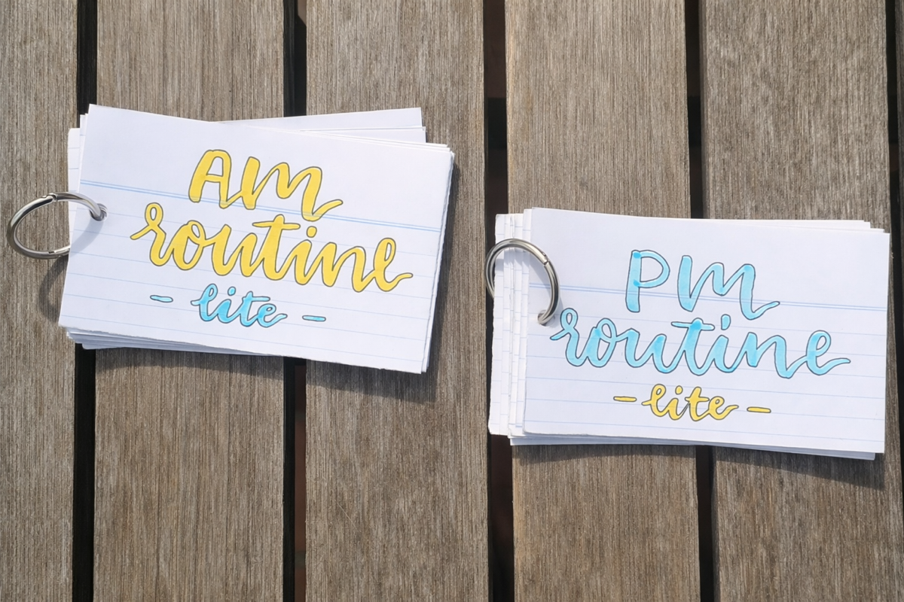

<!-- SELF-INTRO-START -->

_嗨，我是 [黃樺明](https://huami.ng)，我熱愛 [寫作](https://huami.ng/writing)、[耐力運動](https://www.strava.com/athletes/huaminghuang)、[開發提升生活品質的軟體工具](https://github.com/huaminghuangtw)。若有一天必須留下 [墓誌銘](https://huami.ng/2025/7/15/live-each-day-as-if-it-were-your-last)，我希望上面寫著：他致力於 [改善人類的手機使用習慣](https://shortcutomation.com)，也努力 [讓臺灣的學生運動員擁有更好的教育環境和適應環境的能力](https://adaptx.tw)。Enoughness，是我從 2023 年開始每天練習的生活哲學，一種「剛剛好」的生活態度。每週，我會在這份電子報分享幾件觸動我 [好奇心](https://huami.ng/weekly-mindware-update) 的事物、想法與學習。如果這封信是朋友轉寄給你的，歡迎 [點此訂閱](https://huami.ng/newsletter)。想看看過往內容？[歷年電子報](https://huami.ng/enoughness) 都在這裡。_

<!-- SELF-INTRO-END -->

---

# 1

之前 [Reddit](https://www.reddit.com/r/productivity/comments/fj71ik/routine_flashcards/) 上看到有人分享「日常作息字卡」（[Daily Routine Flashcards](https://www.google.com/search?q=Daily+Routine+Flashcards)）的做法，啟發我用更簡單直接的方式來建立生活儀式。

過去我嘗試過各種生產力 App（例如 [Streaks](https://streaksapp.com/)、[TickTick](https://ticktick.com/)、[Atoms](https://atoms.jamesclear.com/) 等）來養成好習慣，但結果只是讓自己分心，反而難以專注在真正重要的事：習慣養成。這些工具看似高效，卻讓人陷入「管理」，而非「實踐」的循環。

我已經用這個方法練習約六個月，現在不需要字卡也能順利完成，因為已經訓練成一種自動反應 — 時間到了，身體自然開始行動。

可以先選擇一個簡單的起點，例如起床後的第一個動作，然後用紙卡或便條紙把你的日常小習慣依序排列，每天照順序執行。就像背單字，把一連串小動作串接起來，每個動作緊接著下一個。

這和生產力書籍常提到的「習慣堆疊」（[Habit Stacking](https://huami.ng/habit-stacking)）很類似：將正向的小習慣一個個疊加，逐步建立完整的日常流程。

遇到分心時，就提醒自己回到卡片，不必追求完美，重點是持續累積。

美國作家 [Annie Dillard](https://www.google.com/search?q=Annie+Dillard) 曾說：

> “How we spend our days is, of course, how we spend our lives.”
>
> 如何過一天，就是如何過一生。

只要堅持下去，慢慢地就會體會到 [習慣的力量](https://www.google.com/search?q=習慣的力量)。這種累積的效果就像滾雪球一樣，時間越久，回報越大。

# 2

一些生活觀察和體悟：

1. 專注力 > 時間。若沒有專注力，時間便失去價值，因為時間沒有被好好利用，等於白白流逝（所以我把房間內所有時鐘都藏起來了 😆）。與其追求「更多時間」，不如先學會 [守護自己的專注力](https://huami.ng/2025/8/14/sherlock-holmes-brain-attic)，把有限的精力用在最重要的人事物上。
2. 時間是最珍貴、不可再生的資源，而「學習」則是對時間最值得的投資。每一次學習，都是在為未來的自己累積複利。
3. 如果想讓學習真正內化，最有效的方法就是「寫作」。寫作不只是整理思緒，更能深化理解，讓所學成為自己的一部分。

這些體會讓我明白：專注、學習與書寫，才能讓 [有限的時間](https://huami.ng/2025/10/14/who-do-we-spend-time-with-across-our-lifetime) 發揮最大價值。

# 3

澳洲哲學家 [Peter Singer](https://www.google.com/search?q=Peter+Singer) 在 1972 年的論文《飢荒、富裕與道德》（[Famine, Affluence, and Morality](https://www.google.com/search?q=Famine,+Affluence,+and+Morality)）中，提出著名的「池塘裡溺水的孩子」（[The Drowning Child in the Pond](https://www.google.com/search?q=The+Drowning+Child+in+the+Pond)）思想實驗：

想像你在上班途中，發現池塘裡有個小孩正在溺水。即使穿著昂貴的西裝、皮鞋，會弄髒衣服、耽誤行程，大多數人仍會毫不猶豫地跳下去救人，因為我們直覺地認為這是自己的責任與義務。

但當我們面對遠在地球另一端、同樣處於生命危險的兒童時，卻很少主動伸出援手。事實上，只要我們省下日常中那些非必要的開銷，就能拯救因缺乏食物、乾淨飲水與醫療資源而逐漸死去的孩子。

為什麼我們對近在眼前的危機反應強烈，對遙遠的苦難卻表示冷漠？

1. 我們很少主動思考長遠的事物，無論是時間還是空間上的距離。
2. 我們不確定捐出去的錢，是否真的能解決那些孩子的生存問題。

換個角度想：即使這些錢最後沒有發揮作用，對我們而言也只是微小的犧牲（甚至可以說是零損失，因為原本只是用來購買非必要物品）。但如果這些小小的捐助真的能幫助到孩子，甚至拯救一條生命，難道不是一件非常值得的事嗎？

現今世界上也有許多公信力高、值得信賴的公益組織（例如 Peter Singer 本人創立的 _[The Life You Can Save](https://www.thelifeyoucansave.org/)_），能幫助我們克服空間上的障礙，讓捐款發揮最大影響力。

所以，無論距離遠近，我們都能選擇成為那個願意跳進池塘、伸出援手的人。否則，我們不就等於選擇直接走過池塘、見死不救的人嗎？

— [樺明](https://huami.ng/2026/2/6/enoughness-17)

---

“I want to live my life in such a way that when I get out of bed in the morning, the devil says, ‘aw shit, he’s up!’”
 
— Steve Maraboli, Unapologetically You: Reflections on Life and the Human Experience

