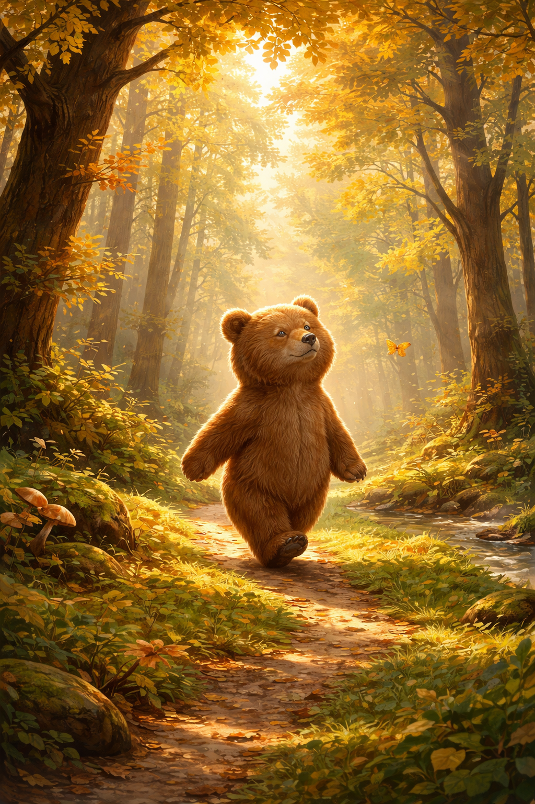

<!-- SELF-INTRO-START -->

_嗨，我是 [黃樺明](https://huam.ing)，我熱愛 [寫作](https://huam.ing/writing)、[耐力運動](https://www.strava.com/athletes/huaminghuang)、[開發提升生活品質的軟體工具](https://github.com/huaminghuangtw)。Enoughness，剛剛好，是我從 2023 年開始每天練習的生活態度。每週，我會在這份電子報分享三件有趣的事。如果這封信是朋友轉寄給你的，歡迎 [點此訂閱](https://huam.ing/newsletter)。想看看過往內容？[歷年電子報](https://huam.ing/enoughness) 都在這裡。_

<!-- SELF-INTRO-END -->

---

# 1

[這可能是近年來最重要的睡眠研究之一。](https://doi.org/10.1093/sleep/26.2.117)

美國賓州大學醫學院（[University of Pennsylvania School of Medicine](https://www.google.com/search?q=University+of+Pennsylvania+School+of+Medicine)）的 [Hans P.A. Van Dongen](https://www.google.com/search?q=Hans+P.A.+Van+Dongen) 等學者，讓受試者連續 14 天，每晚只睡 4、6 或 8 小時，並每兩小時測試認知表現。

結果令人震驚：睡 6 小時的受試者，認知能力下降幅度等同於連續熬夜 24 小時；睡 4 小時則等同於 48 小時未眠。

重點來了，雖然反應時間變慢、注意力斷片、工作記憶退化，**主觀疲倦感卻在第 3、4 天後趨於平穩，受試者並未覺得自己越來越累**。大腦功能持續惡化，但自身卻感覺不到。

論文的統計模型也指出：無論是哪種睡眠剝奪方式，只要清醒時間超過約 16 小時（15.84 小時），大腦的警覺與認知功能就會開始線性下降。

睡眠需求是生理決定的，大多數成年人需要 7–9 小時睡眠。會說「我只需要 6 小時」的人，通常只是忘記什麼是「正常狀態」，因為已經習慣慢性疲勞。

短睡＝短命。不要再用「習慣了」來合理化睡眠不足，因為大腦的損耗是長期累積且無法自我察覺的。

如果想讓自己更快樂、更有生產力、過上更好的生活，最值得率先優化的，就是 [睡眠](https://huam.ing/2025/12/26/enoughness-11/#3)。

# 2

最近很喜歡一位荷蘭森林攝影師 [Rob Visser](https://robvisserphotography.nl/)！

Rob 在 2014 年買了人生第一台單眼相機。原本只是隨手拍拍，沒想到某一次走進森林拍照後，整個人就被「森林攝影」深深吸引。從此，他幾乎每個週末都會拜訪森林，不只是為了拍照，更是為了享受那種獨自等待陽光、霧氣、天氣變化的寧靜時刻。

Rob 的作品有細膩的 [光影變化](https://robvisserphotography.nl/raysoflight/)、[秋天的色彩](https://robvisserphotography.nl/forest-art/)，還有 [奇特的樹木](https://robvisserphotography.nl/solotrees/)。每一張都像童話世界，讓人看了很想立刻來一場「森林浴」🌲

# 3

[森林浴（shinrin-yoku）](https://sketchplanations.com/forest-bathing) 來自日本，強調只要靜靜地待在森林裡，[什麼都不做](https://huam.ing/2026/4/17/enoughness-27/#2)，就能療癒身心。

[小熊維尼](https://huam.ing/2026/1/2/enoughness-12/#3) 最愛在百畝森林裡漫無目的的散步（[wander](https://www.google.com/search?q=wander)）。

維尼說，這時候最重要的，就是「留意」— 灑落的陽光、柔軟的苔蘚、空氣裡的香氣，還有那清爽怡人的秋日微風。

他會 [把感官全部打開](https://huam.ing/2026/3/13/enoughness-22/#3)，用開放的心胸接收此時此地的一切：看見所能看見的，聽見所能聽見的，聞到所能聞到的。如果剛好有蜂蜜出現，他也會嚐嚐所能品嚐到的。

偶爾腦袋瓜冒出「要不要去找蜂蜜？」或「要不要去找小豬玩？」的念頭，他會輕輕地讓這些想法飄走，繼續享受「什麼都不用想、什麼都不用做」的自在。

有時遇到叉路，維尼心想：「我該走哪一條呢？」腦袋瓜開始有點吃力，但他很快想起，**在這條沒有目的地的道路上，根本不需要選擇 — 因為沒有所謂「對的路」或「錯的路」**。這讓他鬆了一口氣，繼續享受這段旅程。

維尼讓雙腳引領身體，單純地留意周遭正在發生的事情。每一個片刻都充滿新的驚喜，而維尼最愛的，就是體驗這些驚喜。

我們總是習慣當人生的導演，試圖控制、安排、掌控每一步，卻因此錯過當下的美好。

或許，我們更適合當一名「[觀察員](https://huam.ing/2026/1/23/enoughness-15/#2)」。

在這個身體過勞、[感官過載](https://huam.ing/2026/4/10/enoughness-26) 的時代，能夠和一棵樹安靜相處五分鐘的人，也許比一次處理十件事的人，更靠近真正的自由。

森林浴是一種存在練習：不需要感受什麼，而是允許那些感受發生；不需要感覺什麼，而是讓感覺自己回來。

下次當你覺得壓力大、思緒紛亂時，不妨走進大自然，什麼都不做，只是在樹下待一下。

— [樺明](https://huam.ing/2026/2/13/enoughness-18)

---

"Nature never deceives us; it is we who deceive ourselves."
 
— Jean-Jacques Rousseau

