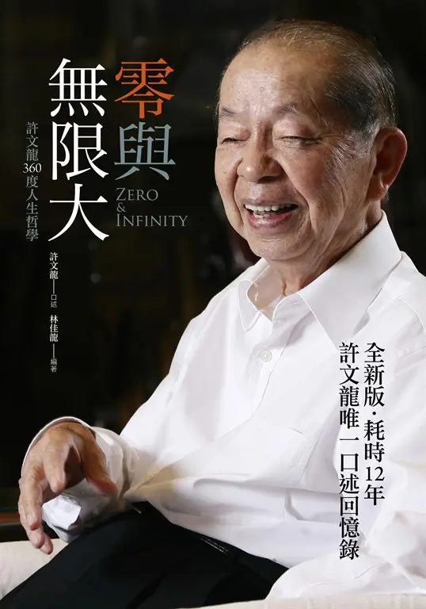
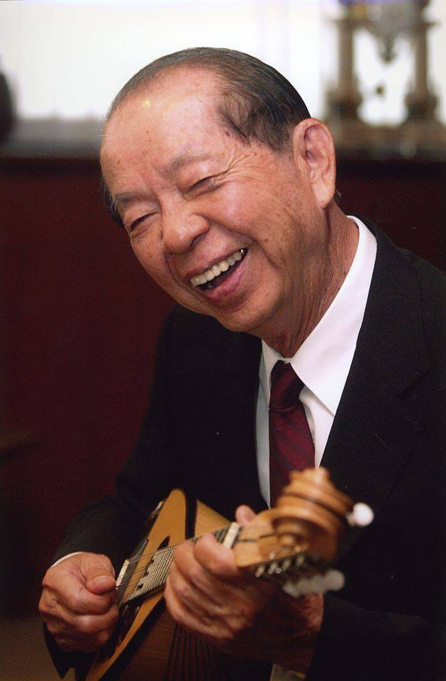
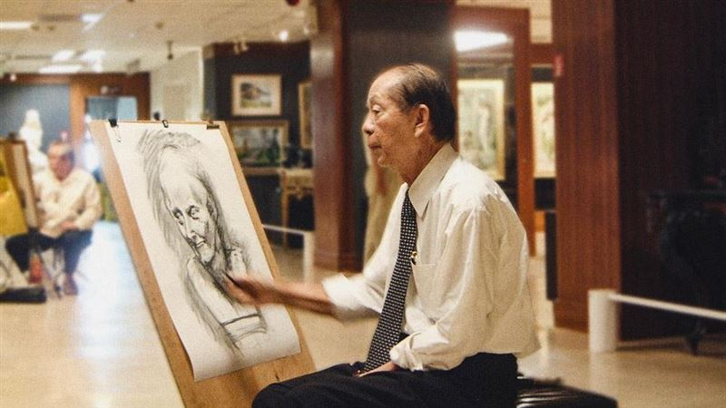
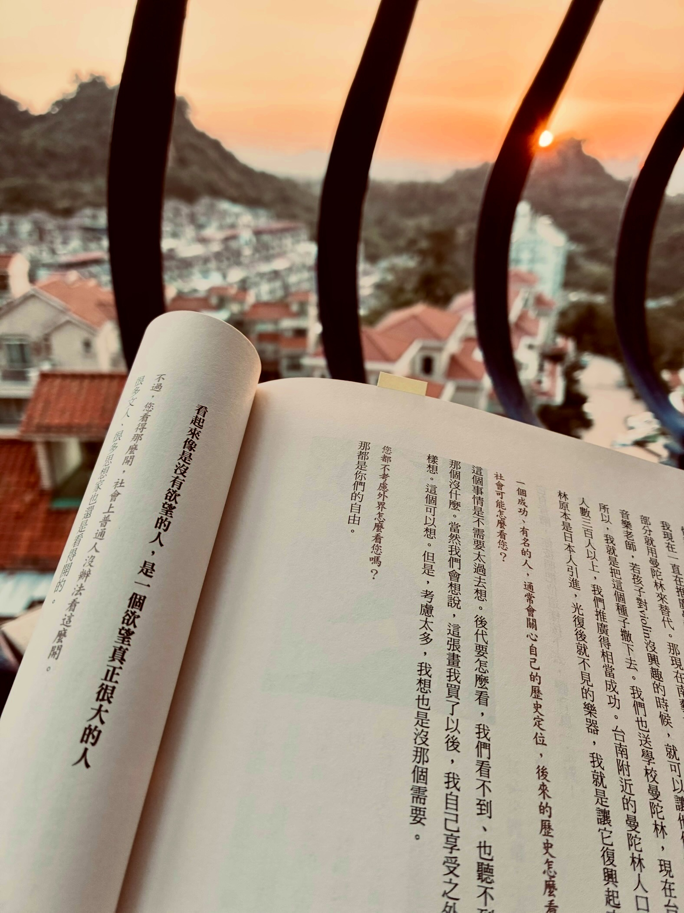
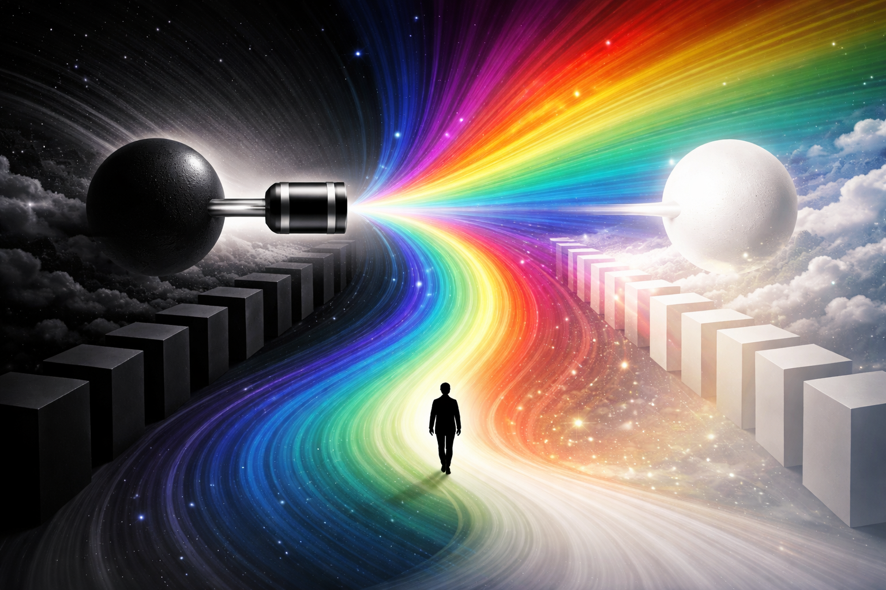

<!-- SELF-INTRO-START -->

_嗨，我是 [黃樺明](https://huam.ing)，我熱愛 [寫作](https://huam.ing/writing)、[耐力運動](https://www.strava.com/athletes/huaminghuang)、[開發提升生活品質的軟體工具](https://github.com/huaminghuangtw)。Enoughness，是我從 2023 年開始每天練習的生活哲學，一種「剛剛好」的生活態度。每週，我會在這份電子報分享三件有趣的事。如果這封信是朋友轉寄給你的，歡迎 [點此訂閱](https://huam.ing/newsletter)。想看看過往內容？[歷年電子報](https://huam.ing/enoughness) 都在這裡。_

<!-- SELF-INTRO-END -->

---

# 1

> 「圓滿的人生要有三百六十度，工作只是其中九十度，剩下的二百七十度，要用你的興趣、家人與社會責任來填滿。」— 許文龍

> 「企業沒有永遠這回事。永遠存在的，將是我的博物館和醫院。這兩個存在就好了，剩下的都沒關係。」— 許文龍

這週我讀了 [許文龍](https://www.google.com/search?q=許文龍) 口述、[林佳龍](https://www.google.com/search?q=林佳龍) 編著的《[零與無限大：許文龍 360 度人生哲學](https://www.books.com.tw/products/0010788200)》。

每當 [有智慧的長者](https://huam.ing/2026/1/9/enoughness-13) 說話時，我總是會不自覺放慢腳步、靜心聆聽。因為他們常提出令人意想不到的洞見，自成一家，渾然天成。

許文龍是奇美實業、奇美醫院和奇美博物館的創辦人，有「台灣壓克力之父」之美譽。

他的公司以人本管理聞名，重視員工福利與企業社會責任，長期以來堅持不上市，甚至不設董事長辦公室，也不使用外勞。

他有錢，卻 [身居陋巷](https://www.threads.com/@cynthiasfoodietime/post/DNhVOlOBSIC?xmt=AQF028PD5dvLMvSrkLp06svjaKTXS0RqncVboFpPjBhFkQ)，物質慾望極低。

許文龍熱愛音樂與藝術，自詡是「一個收藏小提琴的人」。也將大部分財富投入文化發展，因為他知道文化才是一個民族真正的驕傲所在。

1989 年，許文龍創立「[奇美藝術獎](https://www.google.com/search?q=奇美藝術獎)」，透過長期獎助機制，幫助青年藝術家減少經濟負擔、提升創作能量，對台灣的美術與音樂界貢獻深遠。

深受十九世紀思想家馬克思（[Karl Marx](https://www.google.com/search?q=Karl+Marx)）的「三塊麵包論」啟發，許文龍最討厭聽到政府說「拚經濟」，相信「拼文化」才是我們要留給下一代的東西。

---

許文龍很喜歡釣魚，也從中體會到「尊重生態、與大自然共存」的重要性：

> 大多數早晨，我都在海裡，如果天氣不好，我就在溪裡。我很喜歡破曉時分四下無人的大自然，那是個極美的時刻 — 自然的天空，海面的光影變化 — 真的是美。
>
> 人一但到了大自然裡，處理事情的心境就會不一樣。你會覺得自己平常在忙碌的，都是非常渺小的事情。但若每天待在辦公室，就會覺得自己是全世界。
>
> 魚比人更聰明，驕傲的人不會知道自然有多偉大。
>
> 唯有接受自然的偉大，人才能學會「謙卑」。人類只是大自然的一部分，受其支配，絕不能有「我是整個世界」這種驕傲的念頭。
>
> 在大自然裡，思緒會變得超脫，格局也會提升；不然，每天只會困在瑣碎的小事裡，難以自拔。
>
> 許多煩惱，其實只要退一步來看，就會發現根本沒有爭執的必要。當你能真正體會自然的偉大，心境也會隨之放鬆，即使面對死亡，也能坦然以對。

---

書中也有許多類似斯多葛主義（[Stoicism](https://www.google.com/search?q=Stoicism)）的思想，例如：

> 我最大的資產，就是我可以在任何時候去菜市場賣魚。我並不怕歸零。經營事業真正要害怕的，是沒把最壞的情況先想清楚。當你有這個打算時，整個人都會「勇」起來。

> 跌倒時，不要急著爬起來，先看看地上有沒有寶貝可以撿。多數人只會自怨自艾，覺得自己運氣不好，卻忽略了身邊的機會。

當被問到外界眼光時，他淡淡地說：「**那都是你們的自由。**」

看到這句話的時候，我的嘴角瞬間失守，心想怎麼有人可以這麼豁達 😆

同時也對這種「不解釋」的氣度與格局，感到敬佩 🫡

這就跟 [周杰倫](https://www.google.com/search?q=周杰倫) 被問到：「萬一別人不看你拍的電影怎麼辦？」，會說：「[那是他們的損失。](https://huam.ing/kevin-tsai-drinking-library)」

一樣瀟灑帥氣。

---

⚖️ 全書最後一句：「**我所需要的，都已經足夠。**」

看似簡單，卻蘊含豐盛的生活智慧。

許文龍學，是一門關於知足幸福的人生管理哲學，值得我們學習。

---

我寫了一篇 [書摘](https://huam.ing/wen-long-hsu-zero-and-infinity)，有興趣更深入了解這本書的話，可以看看。

如果能親自翻閱這本書，細細品味原汁原味的許文龍，當然是更好。

# 2

莊子在《齊物論》常說：萬物都有個相對性。

「老鷹飛得那麼高，一不小心摔下來肯定沒命。」這是我們以人類的角度看老鷹。但如果換成老鷹的視角，牠會納悶：「人類怎麼這麼笨？地上到處是車子、水溝和電線桿，不是跌進臭水溝，就是被車撞到，哪有我們在天空自在？」我們勸老鷹：「你飛太高很危險！」老鷹卻反過來笑我們：「人才危險呢！我在天上才真正自由！」

這既不是老鷹對，也不是人類對，只是角度不同而已。

再說一個故事：

從前有一位皇帝，白天享盡榮華富貴，晚上卻夢見自己變成一名流落街頭、忍受飢餓的乞丐，因此每到夜晚都很害怕睡著。同時，民間有個乞丐，白天辛苦討生活，夜裡一躺下，卻夢見自己成了享受無盡榮耀的皇帝，所以每天都期待趕快入睡。

還有一棵大樹，大家都在樹蔭下乘涼。這時，有人說：「這棵樹沒什麼用處，木材也派不上用場，只是長得特別大罷了。」大樹聽了，反而笑著說：「正因為我沒什麼用處，才沒被砍去做家具，也才能一直留在這裡，讓你們乘涼啊！」

這三個故事都在說明：**同一件事，用不同立場、面向、角度來看，會有完全不同的解讀。**

---

世間萬物常被簡化為對與錯、黑與白、是與非，如同 [二極體](https://www.google.com/search?q=二極體)。

但事實上，世事更像一條 [光譜](https://www.google.com/search?q=光譜)，並沒有絕對的標準與界線。

正如股癌 [謝孟恭](https://www.google.com/search?q=謝孟恭) 在《[灰階思考](https://www.books.com.tw/products/0010888435)》中所說：

> 零到一之間，有無限個數字；黑與白之間，也有無限個灰階。

大多數問題其實存在更多層次與可能，值得我們跳脫二元框架，以開放視角和好奇心，探索世界的多樣性與複雜性。

# 3

我常提醒自己：「**我來到這個世界，是為了理解它，而不是為了評斷它。**」

[現實本身是中性的。對一棵樹來說，根本沒有所謂「對錯」、「好壞」的概念。](https://youtu.be/3qHkcs3kG44?t=1h56m55s)

羅馬帝國五賢帝之一、哲學家皇帝 [Marcus Aurelius](https://www.google.com/search?q=Marcus+Aurelius) 在《[沉思錄](https://www.books.com.tw/products/0010816881)》（Meditations）中也提到：

> 如果你因為外在事物而痛苦，折磨你的並非事物本身，而是你對它的評價；而你隨時都擁有拋開這些評價的能力。
>
> If you are distressed by anything external, the pain is not due to the thing itself, but to your estimate of it; and this you have the power to revoke at any moment.

> 只要放下「這讓我受傷」的念頭，傷害自然就消失了。
>
> Get rid of the judgment; you are rid of the ‘I am hurt’; get rid of the ‘I am hurt,’ you are rid of the hurt itself.

破除成見，拋棄「正面或負面」的評價。訓練自己在面對各種事物時，內心不產生意見、靈魂不為之躁動的能力。

當我們能夠接受每件事物自然運行的樣貌，單純欣賞他們原本的樣子，日子就會快樂許多。

畢竟，事物本來就不具備讓我們評論的本事。

— [樺明](https://huam.ing/2026/2/20/enoughness-19)

---

“You never know what will be the consequence of the misfortune; or, you never know what will be the consequences of good fortune.”
 
— Alan Watts

