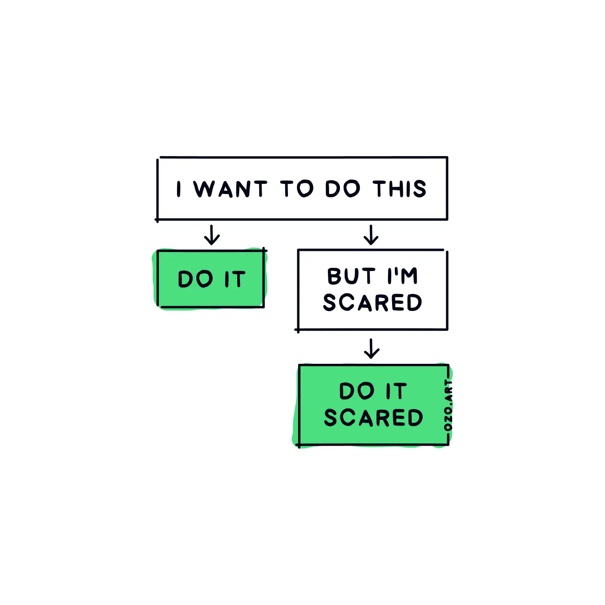
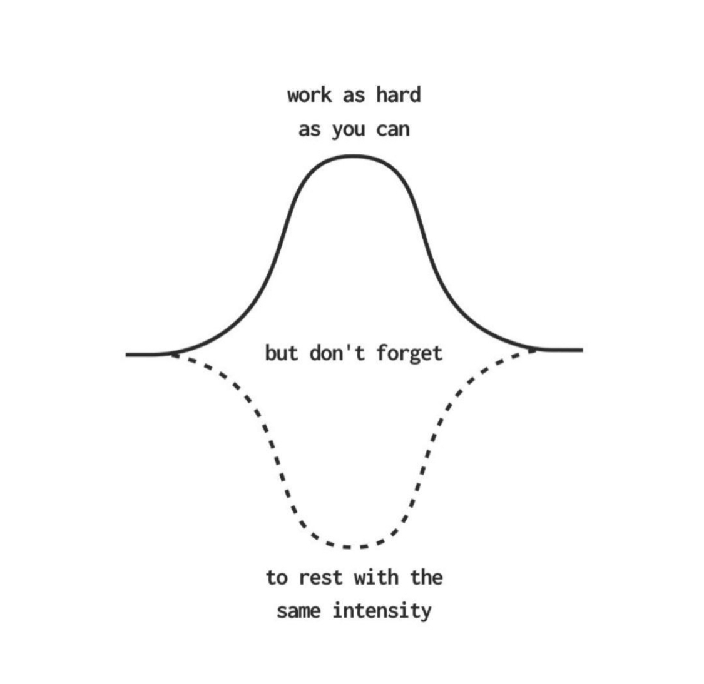

<!-- SELF-INTRO-START -->

_嗨，我是 [黃樺明](https://huam.ing)，我熱愛 [寫作](https://huam.ing/writing)、[耐力運動](https://www.strava.com/athletes/huaminghuang)、[開發提升生活品質的軟體工具](https://github.com/huaminghuangtw)。Enoughness，剛剛好，是我從 2023 年開始每天練習的生活態度。每週，我會在這份電子報分享三件有趣的事。如果這封信是朋友轉寄給你的，歡迎 [點此訂閱](https://huam.ing/newsletter)。想看看過往內容？[歷年電子報](https://huam.ing/enoughness) 都在這裡。_

<!-- SELF-INTRO-END -->

---

# 1

「千金買死馬」講的是戰國時期一段求賢若渴的故事：

當時燕國國力衰弱，燕昭王一心想振興國家，於是向賢士郭隗請教：「我要招攬天下賢才，該怎麼做？」

郭隗講了一個故事：

> 從前有一位國君，想要買到一匹千里馬，於是開出高價千金懸賞，但歷經三年都沒下文。
>
> 這時，有個貼身小臣對國君說：「請讓我去試試看吧！」國君答應了。
>
> 小臣出發後，過了三個月，終於找到一匹千里馬，但這匹馬已經死了。小臣還是花了五百金把馬骨買下來，帶回去向國君報告。
>
> 國君一聽，非常生氣：「我要的是活馬，買一匹死馬回來做什麼？還花了五百金！」
>
> 小臣不慌不忙地說：「連死馬您都願意花大錢買，何況是活的千里馬呢？這消息一傳出去，大家一定會相信國君真的很想要千里馬，願意出高價收購。這樣一來，千里馬很快就會送上門來了。」
>
> 果然，不到一年，三匹千里馬就真的送到了國君面前。

郭隗接著對燕昭王說：「如果您真的想招攬賢才，不妨就從我這個資質普通的郭隗開始重用。這樣一來，天下人就會想：『連郭隗這樣的人都能被重用，那比他更有本事的人一定更受重視。』只要君王帶頭做給大家看，賢士們自然會相信您求才若渴，還會擔心沒有人來嗎？」

燕昭王聽了郭隗的話，立刻拜他為師。

消息傳開後，樂毅、鄒衍等人紛紛投效燕國，燕國也逐漸國富民強。

---

從小處做起，微小成功會累積成巨大成功。

就像一個人選擇不吃肉，雖然對全球暖化的改善幫助有限，但對於餐廳、超市和供應商來說，卻是一個明確的訊號，讓他們意識到消費者的需求正在改變。

又比如，當你主動拒絕使用塑膠袋，改用環保袋，雖然只是舉手之勞，卻能讓店家和身邊的人注意到減塑的可能性，進而帶動更多人響應。

或者你選擇每天自備水壺、不購買瓶裝水，這個小小的習慣，也會讓同事、朋友開始思考「是不是也可以這麼做」，久而久之，影響力就會擴散開來。

「1」這個數字看似微不足道，但它代表的是真實的第一步；而「0」仍只是停留在想像和夢裡。

「1」比「0」多的，是無限的可能。只要開始行動，就有可能 [改變世界](https://huam.ing/2025/11/7/enoughness-4/#1)。

# 2

演員 [鳳小岳](https://www.google.com/search?q=鳳小岳) 在《[只能喝酒的圖書館](https://www.google.com/search?q=只能喝酒的圖書館)》的 [訪談](https://youtu.be/eIjruwuY8XQ)：

## ① [孩子的永恆](https://youtu.be/eIjruwuY8XQ?t=4050s)

> 你有沒有注意過，小孩肚子餓的時候可以哭得驚天動地、像世界末日一樣？（俗稱「靠腰」）因為他們根本沒有時間概念，對他們來說，那種痛苦是「永恆」的。也因為這樣，他們開心的時候也能非常徹底 — 因為當下就是全部。

對小嬰兒來說，「五分鐘後吃晚餐」等同於「沒有晚餐」，因為此刻眼前沒有晚餐，就是沒有晚餐。

**兒童，果然是成人之父。**

## ② [戀愛觀的新鮮](https://youtu.be/eIjruwuY8XQ?t=5059s)

> 如果經常在換伴侶，那麼你一直在談戀愛的角色，其實是自己，並不是對方。當感情走到需要調整的階段時，你討厭那個不安全的感覺，就決定結束，然後再去尋找下一段新的關係。到最後，你會發現自己只是一直在重複同樣的劇本，因為在親密關係中，最難的是願意改變自己 — 面對自己的課題是不舒服的，所以很多人會選擇從新鮮感再次獲得「不會出錯」的愛。

## ③ [全片最精華結語](https://youtu.be/eIjruwuY8XQ?t=5336s)

> 你內心最大的恐懼是什麼？Didn’t try. 沒有去嘗試。

---

如果要問「你最怕的是什麼？」很多人會說失敗、被拒絕、丟臉。

但其實最大的風險是不敢承擔任何風險。沒試過，才是最令人遺憾的事。

美國歷史上任期最長的第一夫人 [Eleanor Roosevelt](https://www.google.com/search?q=Eleanor+Roosevelt) 曾說：

> Do one thing every day that scares you.
>
> 每天做一件讓你感到害怕的事。

* 主動跟一名陌生人打招呼或聊天
* 在公開場合中舉手發言、[提問](https://books.cw.com.tw/article/389)
* 傳訊息給一位你想關心的人
* 開啟一個困難的對話
* 遠離螢幕，直面內心的不安或焦慮，[往裡面看一點點](https://youtu.be/uIFMlKWQnmk?t=51m53s)

[業餘玩家以為必須先戰勝恐懼，才能開始行動；專業玩家知道恐懼永遠不會消失，所以他們不等待勇氣降臨，而是帶著恐懼去做、在不確定中前進。](https://www.goodreads.com/quotes/555698-the-amateur-believes-he-must-first-overcome-his-fear-then)

古羅馬哲學家塞內卡（[Seneca](https://www.google.com/search?q=Seneca)）也說過：

> It is not because things are difficult that we do not dare; it is because we do not dare that they are difficult.
>
> 不是因為事情困難我們才不敢嘗試；而是因為我們不敢嘗試，事情才變得困難。

即使心中充滿恐懼，還是可以 [做讓你害怕的事](https://huam.ing/2026/1/9/enoughness-13/#3)。

# 3

我最近常對自己說的話：

> 工作時「盡全力」工作，休息時「盡全力」休息。

人生有四種速度：

1. 休息
2. 散步
3. 衝刺
4. 慢跑

多數人預設用「慢跑」這種不快不慢的方式工作，長時間維持在中等強度。

但若想走得更遠、更快，反而應該在「休息」、「散步」和「衝刺」之間切換，然後重複循環。

生活裡，不該出現「慢跑」這個選項。

《[學習的王道](https://www.books.com.tw/products/0010861638)》（The Art of Learning）的作者 [Josh Waitzkin](https://www.google.com/search?q=Josh+Waitzkin) 在 [The Tim Ferriss Show 的 訪談](https://tim.blog/2019/06/27/josh-waitzkin/) 中曾提過一個概念：「**溫火六分力**」（Simmering Six）。

他說，許多在高壓、決策密集行業的人，總是讓自己處於一種「溫火慢燉」的六分力狀態，而非在「十分力」和「深度放鬆」之間切換。

Waitzkin 強調，十分力的狀態遠勝於六分力，兩者有天壤之別。

⚖️ 真正的平衡，並非在兩者間尋找妥協，而是讓工作與休息都達到極致的強度。

每天花六小時全力衝刺：專注最重要的專案、在健身房揮灑汗水、培養長遠受益的技能。

剩下的時間放慢腳步：公園走路、聽 Podcast、和朋友悠閒地吃頓晚餐。

無論如何，都要避免既無法完全放鬆，也無法真正前進的焦慮中間地帶。

**世界上沒有「太努力」這回事，只有「休息不足」。**

**學會有效恢復，而不是降低標準。**

最有生產力的人，也是最重視休息的人。

休息並非獎勵，而是高效工作的一部分。

在追求卓越的同時，別忘了給自己相同品質的休息。

— [樺明](https://huam.ing/2026/2/27/enoughness-20)

---

“The cave you fear to enter holds the treasure you seek.”
 
— Joseph Campbell

