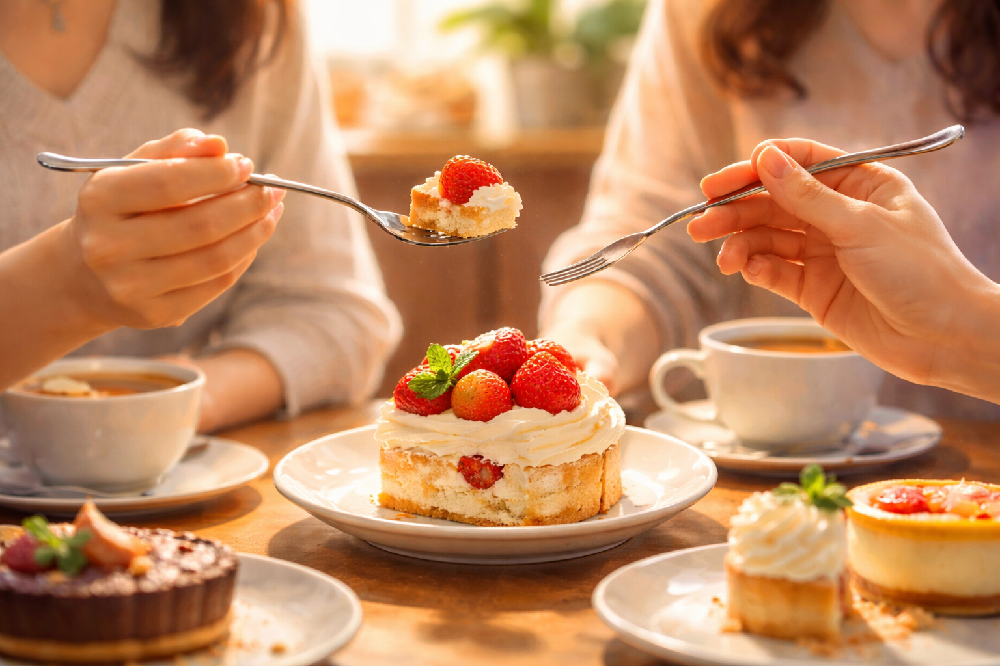
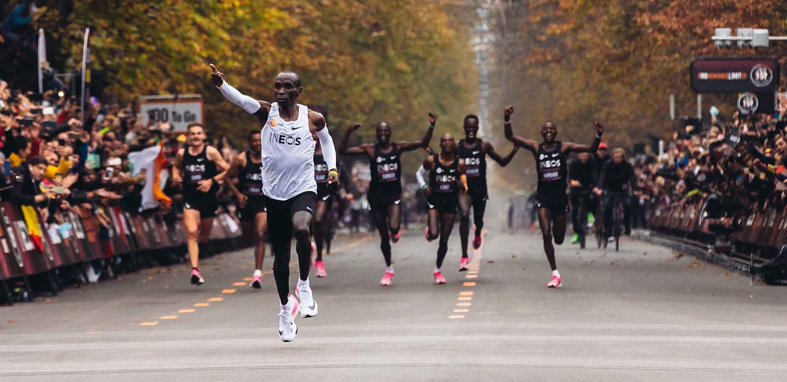

<!-- SELF-INTRO-START -->

_嗨，我是 [黃樺明](https://huam.ing)，我熱愛 [寫作](https://huam.ing/writing)、[耐力運動](https://www.strava.com/athletes/huaminghuang)、[開發提升生活品質的軟體工具](https://github.com/huaminghuangtw)。Enoughness，剛剛好，是我從 2023 年開始每天練習的生活態度。每週，我會在這份電子報分享三件有趣的事。如果這封信是朋友轉寄給你的，歡迎 [點此訂閱](https://huam.ing/newsletter)。想看看過往內容？[歷年電子報](https://huam.ing/enoughness) 都在這裡。_

<!-- SELF-INTRO-END -->

---

# 1

[第五期](https://huam.ing/2025/11/14/enoughness-5/#3) 提到「邊際效用遞減（Diminishing Marginal Utility）」的概念。

我在閱讀美國網路作家 [David Perell](https://www.google.com/search?q=David+Perell) 的文章 _[28 Pieces of Life Advice](https://perell.com/note/28-pieces-of-life-advice/)_ 時，剛好看到一段完美呼應這個想法的文字：

> Most of the pleasure in a dessert comes in the first three bites. After that, you should stop eating it. As a reward, you can eat dessert more often because you don’t binge it.
>
> 一份甜點的樂趣，大多來自前三口；之後，你就該停下來。作為獎勵，你可以更常享用甜點，因為你不會一次把它吃光。

[人有兩個胃](https://www.scitw.cc/posts/20250219-17918)，一個裝主食，一個裝甜食。

我正在練習吃甜點的時候，只吃別人的一口，或一起分著吃。

⚖️ 奇妙的是，淺嚐即止的那一口，反倒比整份更好吃！

我終於體會到 A.A. Milne 在《小熊維尼》（[Winnie-the-Pooh](https://www.goodreads.com/work/quotes/1225592)）中所寫的那種心境：

> I wasn’t going to eat it, I was just going to taste it.
>
> 我本來不是要吃掉它，我只是想嚐一口而已。

# 2

上週末在菜市場，我看到一位攤販的女主人戴著耳機，專注地在筆記本上寫字。

好奇心驅動下，主動上前攀談，才知道她正在練習聽寫 [鄧麗君](https://www.google.com/search?q=鄧麗君) 的日文歌，而且已經學日文三十多年！

這段意想不到的對話，讓我一整天心情都很好。大概是因為在平凡的角落，看到有人默默堅持自己熱愛的事，被感染了。

這就是「**微互動（micro-interactions）**」的力量。

我們總是高估與陌生人互動的尷尬，卻低估一次簡短交流能為心情帶來的正面影響。

下次出門時，試著練習看看：

* 和鄰居打聲招呼
* 真誠地讚美他人的穿著
* 向需要幫助的長者伸出援手
* 排隊時，問問身旁的人有什麼推薦
* 在火車或飛機上，和鄰座的乘客聊上幾句

# 3

前陣子重看 [Nike](https://www.nike.com/tw/running/breaking2) 和國家地理頻道聯合製作的紀錄片《[Breaking2](https://www.imdb.com/title/tt7293698/)》，這項計劃是要幫助人類突破馬拉松 2 小時極限障礙。

來自肯亞的馬拉松之神 [Eliud Kipchoge](https://www.google.com/search?q=Eliud+Kipchoge) 說：

> It’s not about the legs, but the heart and mind.
>
> 這不是關於雙腳，而是關於心靈和思想。

> In life, the idea is to be happy. I believe in calm, simple, low-profile life. You live simple, you train hard, and live an honest life. Then you are free.
>
> 人活著就是要快樂。我相信平靜、簡單、低調的生活。你過得樸實，努力訓練，誠實地過每一天，這樣你就自由了。

嗯，沒有比每天努力工作、訓練，好好吃飯、大便、睡覺，更棒的生活品質了！☺️

— [樺明](https://huam.ing/2026/3/6/enoughness-21)

---

“Freedom is secured not by the fulfilling of one’s desires, but by the removal of desire.”
 
— Epictetus

