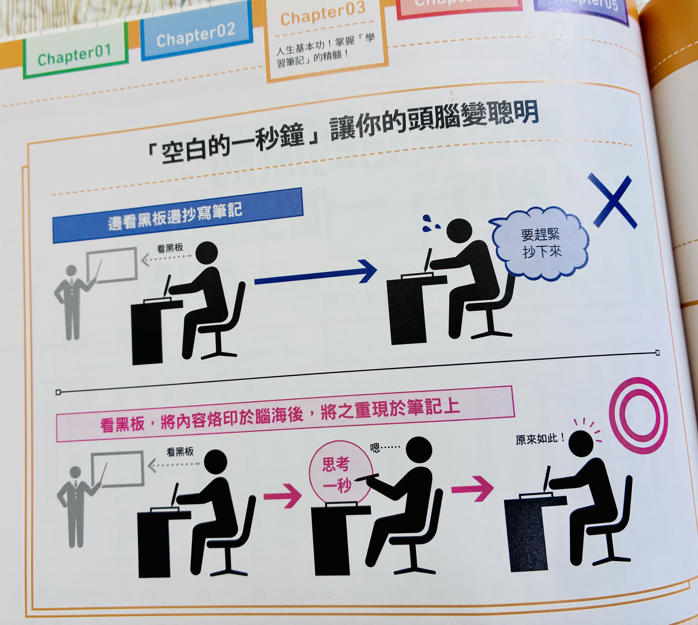
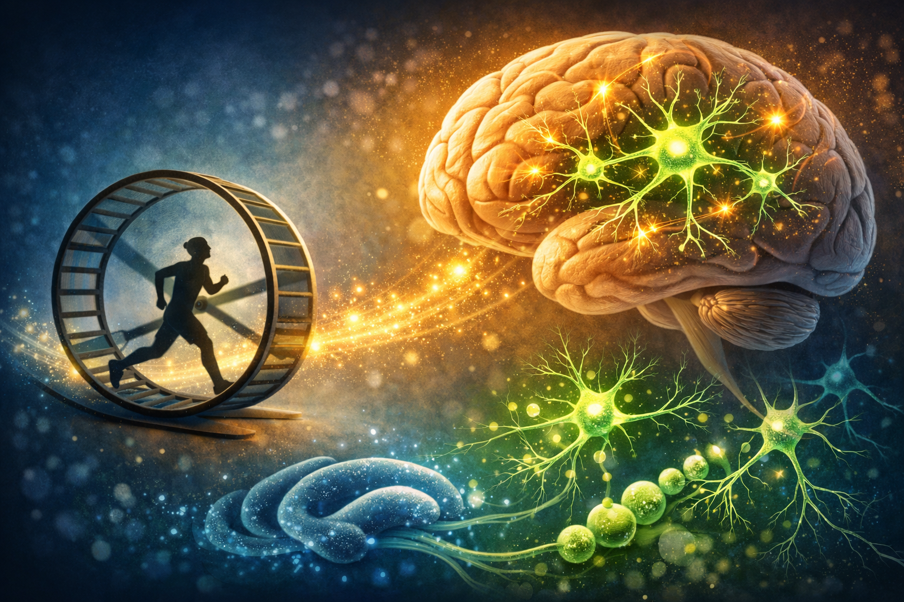
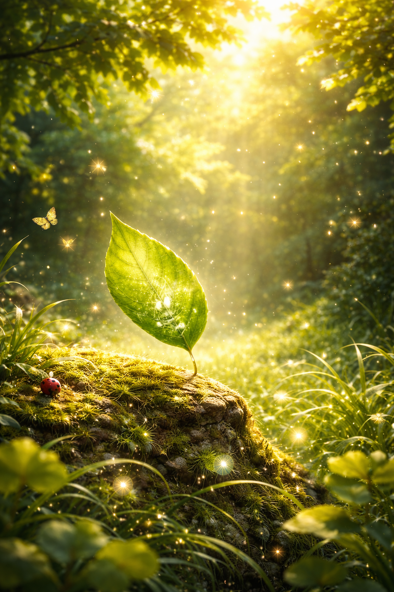

<!-- SELF-INTRO-START -->

_嗨，我是 [黃樺明](https://huam.ing)，我熱愛 [寫作](https://huam.ing/writing)、[耐力運動](https://www.strava.com/athletes/huaminghuang)、[開發提升生活品質的軟體工具](https://github.com/huaminghuangtw)。Enoughness，剛剛好，是我從 2023 年開始每天練習的生活態度。每週，我會在這份電子報分享三件有趣的事。如果這封信是朋友轉寄給你的，歡迎 [點此訂閱](https://huam.ing/newsletter)。想看看過往內容？[歷年電子報](https://huam.ing/enoughness) 都在這裡。_

<!-- SELF-INTRO-END -->

---

# 1

你有沒有過這種經驗？上課時，老師在黑板上寫什麼，你就一股腦兒全部抄下來，心想：「管它的，先寫下來再說，總有一天會用到！」甚至特地用五顏六色的螢光筆做各種標記，然後沾沾自喜，覺得自己有夠認真。

這種「板書機器」式的抄寫，因為缺乏理解，導致記憶無法有效被強化。

《[為什麼聰明人都用方格筆記本？](https://www.books.com.tw/products/0010662839)》分享一個小技巧：「**空白的一秒鐘**」。

怎麼做呢？

1. 首先，專心看黑板，並專注聆聽老師的講解，把內容烙印在腦海裡。
2. 接著，不看黑板，把腦袋裡的畫面寫下來。

下次上課時，試試這個方法吧！

調整手眼使用習慣，用「空白的一秒鐘」創造永不遺忘的深刻記憶。

# 2

如果說，有個不用錢的方法，可以讓你多點腦細胞、變得更聰明，有興趣試試嗎？

過去，科學界普遍認為成年人的大腦已經定型，無法再長出新的神經元。直到 1999 年，美國加州沙克生物研究所（[Salk Institute](https://www.google.com/search?q=Salk+Institute)）的神經科學家 [Fred Gage](https://www.google.com/search?q=Fred+Gage) 團隊在權威期刊《[Nature Neuroscience](https://doi.org/10.1038/6368)》發表了一項震撼學界的研究，徹底打破這項迷思！

在實驗中，他們將成年小老鼠分成兩組：一組提供可以自由奔跑的滾輪，另一組則維持不運動的狀態。

結果發現，那些每天在滾輪上快樂奔跑的「運動鼠」，大腦中掌管學習與記憶的「[海馬迴](https://www.google.com/search?q=海馬迴)」（Hippocampus）竟然大量增生了新細胞，且順利分化為成熟的神經元！

這提供了「運動能促進大腦長出新細胞」的直接證據，在科學上被稱為「[神經新生](https://www.google.com/search?q=神經新生)」（Neurogenesis）。

那麼，是不是所有的運動都一樣有效呢？

[另一篇研究](https://doi.org/10.1113/jp271552) 指出：想要刺激大腦長出新神經元，關鍵在於「**持久性的有氧運動**」。

所以，如果你想要免費提升認知能力、增強記憶力，只需要進行能讓心跳穩定加速，並維持一段時間的有氧運動，如慢跑、騎腳踏車或游泳，大腦就會感謝你！

# 3

[《我們回家吧 3》EP11 阮經天與最挺他的臺北家人](https://youtu.be/T0hKmjsnGSs?t=20m55s)：

> 人要懂得一件事，就是該坐下的時候就好好坐，該站著的時候就好好站著。如果你在外面走路、騎摩托車，剛好遇到下雨的時候，你就好好淋著雨，好好感受現在感覺到的一切，無論這個事情是好是壞。不要因為現實、生活或工作的煩躁，而放棄感覺的能力。

我最近正嘗試建立一個有意識的洗澡儀式：

首先 [關燈](https://www.google.com/search?q=Showering+in+the+dark)、播放 [古典音樂](https://open.spotify.com/playlist/37i9dQZF1DWWEJlAGA9gs0)（如果想要更有情調一點，再點個蠟燭 🕯️），接著閉上眼睛，開始做「[身體掃描](https://www.google.com/search?q=身體掃描)」（Body Scan）：感受溫暖的水流經臉頰和背部、穿過指縫，覺察任何緊繃處或情緒聚焦點，並讓它們隨著水流慢慢釋放。

淋浴結束後，我會花 30 到 60 秒的時間，繼續站在原地，做一次深呼吸，鼻吸口吐。

然後用手將身上的水珠拍掉（或者像小狗一樣甩乾身體 😆）— 這不僅大幅減少毛巾吸收的水分，讓它更容易保持乾爽，還能避免浴室地板濕滑，提升安全性（一個「乾溼分離」的概念）。

透過這個能量清理的淨化過程，洗澡不再只是例行清潔，而是一場正念練習、一段讓身心復位的重置儀式。

《[納瓦爾寶典](https://www.google.com/search?q=納瓦爾寶典)》中有一句話：

> We’re probably evolved to use all of our five senses equally as opposed to favoring the visual cortex.
>
> 也許我們該均衡地使用五種感官，而不是偏重於視覺。

18 世紀法國啟蒙思想家、《[百科全書](https://en.wikipedia.org/wiki/Encyclop%C3%A9distes)》主編 [Denis Diderot](https://www.google.com/search?q=Denis+Diderot) 也說：

> 我逐漸明白，在所有感官之中，
> 視覺最流於表象，聽覺最顯自負；
> 嗅覺最容易帶來快感，味覺迷人而多變；
> 唯有觸覺最為深刻，也最富哲學意味。

**不要因為忙碌而關閉了感受世界的能力。**

試著放慢腳步，打開所有感官，細細品味身邊的微小事物。

哪怕只是一片葉子，都能變成一個令人敬畏、無法形容的宏偉世界。

— [樺明](https://huam.ing/2026/3/13/enoughness-22)

---

“Meditation is to be aware of what is going on: in your body, in your feelings, in your mind, and in the world.”
 
— Thích Nhất Hạnh

