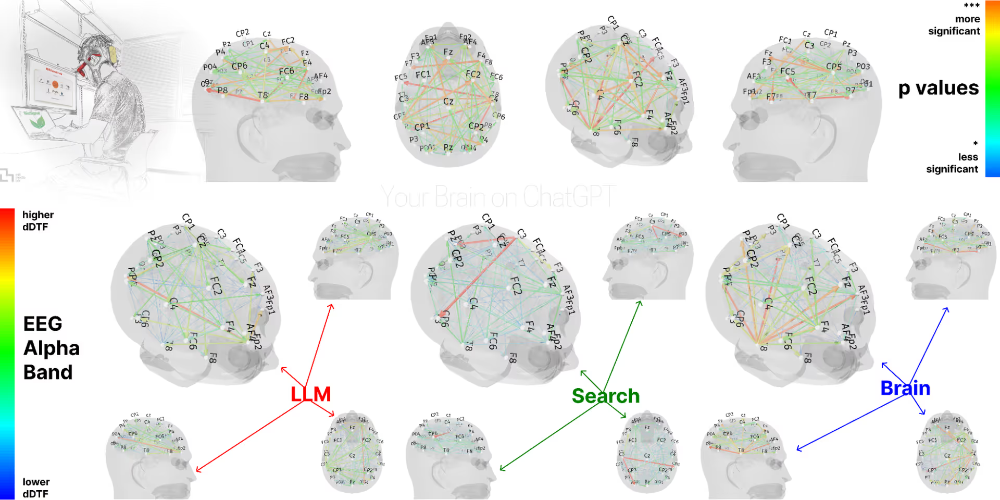
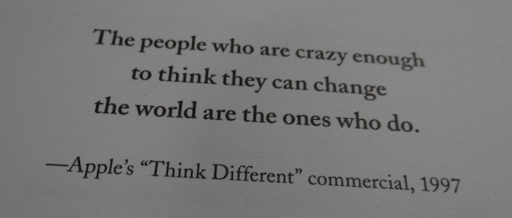

<!-- SELF-INTRO-START -->

_嗨，我是 [黃樺明](https://huam.ing)，我熱愛 [寫作](https://huam.ing/writing)、[耐力運動](https://www.strava.com/athletes/huaminghuang)、[開發提升生活品質的軟體工具](https://github.com/huaminghuangtw)。若有一天必須留下 [墓誌銘](https://huam.ing/2025/7/15/live-each-day-as-if-it-were-your-last)，我希望上面寫著：他致力於 [改善人類的手機使用習慣](https://shortcutomation.com)，也努力 [讓臺灣的學生運動員擁有更好的教育和訓練環境](https://adaptx.tw)。Enoughness，是我從 2023 年開始每天練習的生活哲學，一種「剛剛好」的生活態度。每週，我會在這份電子報分享幾件觸動我 [好奇心](https://huam.ing/weekly-mindware-update) 的事物、想法與學習。如果這封信是朋友轉寄給你的，歡迎 [點此訂閱](https://huam.ing/newsletter)。想看看過往內容？[歷年電子報](https://huam.ing/enoughness) 都在這裡。_

<!-- SELF-INTRO-END -->

---

# 1

Google 台灣第一號員工、前中研院資訊科學研究所副所長 [簡立峰](https://www.google.com/search?q=簡立峰)，在著作《[台灣 AI 大未來](https://huam.ing/taiwan-ai-era)》中提出 AI 時代下的一個隱憂：**「[大腦外包](https://www.google.com/search?q=大腦外包)」（Brain Outsourcing）**。

麻省理工學院（MIT）在 2025 年做了一項名為 _[Your Brain on ChatGPT](https://www.brainonllm.com)_ 的 [研究](https://doi.org/10.48550/arXiv.2506.08872)。研究人員找來 54 個人戴上腦波儀（EEG），追蹤他們在寫作時的大腦活動。受試者被分成三組：

1. AI 輔助的「ChatGPT 組」
2. 只能用傳統搜尋的「Google 搜尋組」
3. 全靠自己想的「純大腦組」

經過四個月的追蹤發現，依賴 ChatGPT 的人，大腦的神經連結性是三組中最弱的：當這群習慣用 AI 的人被要求「脫離 AI」獨立寫作時，大腦的活動模式就像長時間沒運動的肌肉，突然要出力卻使不上勁。

另外，他們在神經活動、語言表現與行為層面上皆呈現出退化跡象。

過度仰賴 AI 寫作的人，對自己寫出來的文章「所有權感」（Ownership）最低，他們甚至很難準確引用或回想起剛剛才寫出來的句子。反觀純大腦組，則展現出廣泛的神經網路連結，對文章的掌控感也最高。

研究人員稱之為「認知債務」（Cognitive Debt）— 拿未來的腦力，透支眼前的便利。

外包出去的能力，最終都會萎縮。這就像 Google Maps 導航造就出一群路痴一樣；過度依賴 AI，最終也會削弱我們內建的思考導航系統。

為了不要淪為大腦外包的空殼，我給自己定了三條 AI 使用鐵則：

1. **先思考，再提問**：我會先釐清自己的立場跟想法，才開始和 AI 合作。
2. **先動筆，再修飾**：我會先寫出一版很糟糕的初稿，才會請 AI 幫忙潤稿。
3. **先決定，再優化**：我會先做好大方向的核心判斷，才利用 AI 進行迭代改進。

做一名知識的「內化者」，而非資訊的「搬運工」。

AI 是想法的「放大器」，而不是想法的「產生器」。0 到 1 的創意突破永遠是人類的主場，而 AI 擅長的是把 1 擴展到 100。

就像 Google 台灣第三號員工、iKala 執行長、《[AI 世界的底層邏輯與生存法則](https://www.books.com.tw/products/0010987512)》的作者 [程世嘉](https://www.google.com/search?q=程世嘉)（Sega）在 [臉書貼文](https://www.facebook.com/segacheng/posts/pfbid02rAECoBPGaNEfR2HaXTcF1CZd926SeZJ3L7aRfcG38dxV8mp6VPYFffC5zDz52QDhl) 中的提醒：

> 我們應該將 AI 當作一個潛力無窮的「協作者」，而不是一個可以外包思考的「替代品」，想也不想就把任務全部丟給 AI 去解決。
>
> 唯有如此，我們才能在享受科技紅利的同時，避免欠下無法償還的「認知債務」，確保我們依然是能獨立思考的人。
>
> 別一開始就放棄思考。

遇到問題時，與其急著向 AI 討標準答案，不如反過來思考如何提高提問的水準。

**「如何問一個好問題？」是我問過 AI 最好的問題。**

# 2

粵劇中的「[虎度門](https://www.google.com/search?q=虎度門)」是舞台兩側的出入口。

演員一旦跨過這道門，就必須放下自我，全情投入表演。

人生如戲，我們在不同階段扮演學生、伴侶、父母。

有時候，我們太執著於某個角色，卻忘了那只是人生的其中一幕。

真正的考驗，不只是如何「入戲」，更是懂得何時「出戲」。

就像粵劇演員要在戲裡盡情演繹，也要在謝幕後卸下妝容、回歸自我。

⚖️ 我們需要學會在「投入」與「抽離」之間取得平衡 — 既能跨過虎度門精彩表演，也能在落幕時瀟灑轉身。

當我們意識到「我只是暫時在扮演這個角色」時，就能更輕盈、自由、自在地生活。

**進入角色，也走出角色。**

# 3

最近在讀《[大格局大思維](https://www.books.com.tw/products/0010970897)》這本書。

和你分享我最喜歡的金句：

> 當你真心相信某件事能成，大腦就會自動開始尋找解決辦法。相信有解，解法就會出現。
>
> Believe it can be done. When you believe something can be done, really believe, your mind will find the ways to do it. Believing a solution paves the way to solution.

> 別只看事物的現狀，要看它未來的潛力。有遠見的人總是能預見未來，而不被現狀困住。
>
> Look at things not as they are, but as they can be. A big thinker always visualizes what can be done in the future. He isn’t stuck with the present.

> 引導智力的思維方式，遠比擁有多少智力更重要。
>
> The thinking that guides your intelligence is much more important than how much intelligence you have.

這讓我聯想到一翻開《[賈伯斯傳](https://www.google.com/search?q=賈伯斯傳)》，那句 [Apple 在 1997 年的廣告](https://youtu.be/9-ZB2O8azI8)：

> 那些瘋狂到自以為能改變世界的人，才是真正改變世界的人。
>
> The people who are crazy enough to think they can change the world are the ones who do.

我們的夢想必須大到超過目前能力所及。如果你的夢想沒有讓你感到恐懼，表示它還不夠大。

愛爾蘭劇作家 [George Bernard Shaw](https://www.google.com/search?q=George+Bernard+Shaw) 曾說：

> 理性的人讓自己適應世界；不理性的人堅持讓世界適應自己。因此，所有的進步都取決於那些不理性的人。
>
> The reasonable man adapts himself to the world; the unreasonable one persists in trying to adapt the world to himself. Therefore, all progress depends on the unreasonable man.

這裡的「不理性」，指的是不願盲從現狀、敢於跳脫既定認知框架的勇氣。

不要被腦中的恐懼推著走，要讓心中的夢想拉著走。請記得：昨天的夢想，是今天的希望，也將會是明天的現實。

當你開始懷疑自己會不會成功時，就已經失敗了。

永遠把眼光放大、把目光放遠，因為大格局思考就算輸了，也比小格局思考下的勝利，更能讓人成長。

瞄準月亮吧！即使失手，你也會落在群星之間。

Think big. Dream big.

— [樺明](https://huam.ing/2026/3/20/enoughness-23)

---

“Some men see things as they are and ask why. Others dream things that never were and ask why not.”
 
— George Bernard Shaw

