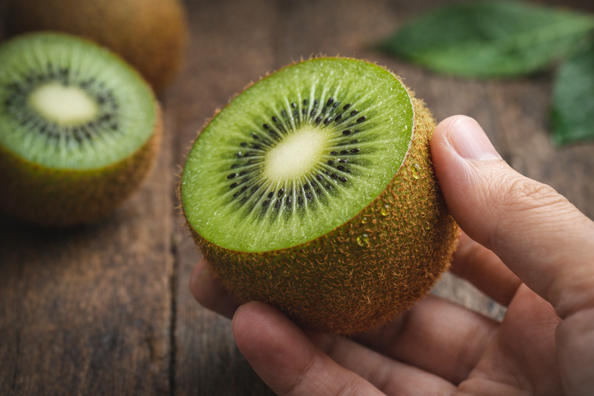

<!-- SELF-INTRO-START -->

_嗨，我是 [黃樺明](https://huam.ing)，我熱愛 [寫作](https://huam.ing/writing)、[耐力運動](https://www.strava.com/athletes/huaminghuang)、[開發提升生活品質的軟體工具](https://github.com/huaminghuangtw)。若有一天必須留下 [墓誌銘](https://huam.ing/2025/7/15/live-each-day-as-if-it-were-your-last)，我希望上面寫著：他致力於 [改善人類的手機使用習慣](https://shortcutomation.com)，也努力 [讓臺灣的學生運動員擁有更好的教育和訓練環境](https://adaptx.tw)。Enoughness，是我從 2023 年開始每天練習的生活哲學，一種「剛剛好」的生活態度。每週，我會在這份電子報分享幾件觸動我 [好奇心](https://huam.ing/weekly-mindware-update) 的事物、想法與學習。如果這封信是朋友轉寄給你的，歡迎 [點此訂閱](https://huam.ing/newsletter)。想看看過往內容？[歷年電子報](https://huam.ing/enoughness) 都在這裡。_

<!-- SELF-INTRO-END -->

---

# 1

你知道嗎？[奇異果的皮其實是可以吃的！🥝](https://www.google.com/search?q=奇異果皮)

而且整顆奇異果最營養的地方，就在皮上。

歐洲營養學期刊（European Journal of Nutrition）的 [一篇文章](https://doi.org/10.1007/s00394-018-1627-z) 指出：**與只吃果肉相比，連皮食用奇異果，可大幅提升多種營養素的攝取量！**

以金色奇異果（SunGold）來說，連皮一起吃可讓膳食纖維、維生素 E 與葉酸的攝取量分別增加約 30—50%，營養密度高於只吃果肉。

> Consumption of whole SunGold kiwifruit (including the skin) increases the fibre, vitamin E and folate contents by 50 %, 32 % and 34 %, respectively, compared with consuming only the edible flesh portion.

如果你覺得表面的絨毛有點噁心，可以用水果刀輕輕刮掉，再用清水沖洗乾淨。

再不然，直接選擇 [黃金奇異果](https://www.google.com/search?q=黃金奇異果) 也是個好方法 — 它的皮比較薄、光滑，甜度也更高，咬下去幾乎無負擔，推薦你試試看！

# 2

最近我在練習用「關心」取代「擔心」。

關心，是回應他人的需求；擔心，是投射自己的焦慮。

關心，是以對方為中心；擔心，是以自己為中心。

關心，會讓對方感到放鬆、平靜、被支持；擔心，只會讓對方焦慮、煩躁、壓力大。

關心，是單純地付出；擔心，是希望有所回報 —「符合自己的期許與期待」。

擔心，是一種負面情緒勒索、自以為是的善意。

擔心，是最無用的事情處理方式。

**[不要「擔心」，要「關心」。](https://huam.ing/2025/10/10/the-power-of-quiet)**

# 3

這週在 [潘政琮基金會（CT Pan Foundation）](https://www.ctpanfoundation.org) 的部落格讀了兩篇讓我深受感動的文章。以下節錄幾段我很喜歡的文字：

《[教育改變的是人類內心的貧窮](https://www.ctpanfoundation.org/post/%E6%95%99%E8%82%B2%E6%94%B9%E8%AE%8A%E7%9A%84%E6%98%AF%E4%BA%BA%E9%A1%9E%E5%85%A7%E5%BF%83%E7%9A%84%E8%B2%A7%E7%AA%AE)》

> 我們希望有一個系統能夠更大量的培育人才，培育有學習力、思考力、判斷力與語言能力的人才，不是只是培育選手。老虎伍茲的基金會一開始也只是專注在選手，後來全面轉向做教育，因為教育改變的是人類內心的貧窮。

> 一直以來我有一個夢想，希望台灣的運動員知書達禮，畢業後可以在社會上的各個崗位發揮他們的長才，讓國人可以看到運動員不是頭腦簡單四肢發達，讓社會看到運動員可以有格局、有思想。

《[你必須先是學生，才是運動員](https://www.ctpanfoundation.org/post/%E3%80%90%E4%BD%A0%E5%BF%85%E9%A0%88%E5%85%88%E6%98%AF%E5%AD%B8%E7%94%9F%EF%BC%8C%E6%89%8D%E6%98%AF%E9%81%8B%E5%8B%95%E5%93%A1%E3%80%91)》

> 學生運動員是一個兼顧學術和體育的人。這種雙重角色需要紀律和時間管理，因為學生運動員必須平衡他們的學業需求與運動訓練和比賽時間表。

> 我們在努力的一直都是教育，因為可以改變社會的因子裡面最重要的還是人。

---

[在美國，如果學業成績沒有達到標準，置物櫃馬上被清空，連練球都不行；在台灣，就算考 0 分也能打球。](https://www.peakforcewecare.com/blog/posts/%E5%9C%A8%E7%BE%8E%E5%9C%8B%EF%BC%8C%E6%88%90%E7%B8%BE%E6%B2%92%E6%9C%89%E9%81%94%E5%88%B0%E6%A8%99%E6%BA%96%EF%BC%8C%E7%BD%AE%E7%89%A9%E6%AB%83%E9%A6%AC%E4%B8%8A%E8%A2%AB%E6%B8%85%E7%A9%BA%EF%BC%8C%E9%80%A3%E7%B7%B4%E7%90%83%E9%83%BD%E4%B8%8D%E8%A1%8C%EF%BC%9B%E5%9C%A8%E5%8F%B0%E7%81%A3%EF%BC%8C%E5%B0%B1%E7%AE%97%E8%80%83-0-%E5%88%86%E4%B9%9F%E8%83%BD%E6%89%93%E7%90%83%E3%80%82)

我知道要兼顧學業和訓練，是一件非常不容易的事，畢竟每個人一天都只有 24 小時。

但如果你可以將「唸書」看成是一種「心智訓練」（Mental Training），也許就能慢慢體會到：唸書其實和睡眠、飲食一樣，是成為「[六邊形戰士](https://www.google.com/search?q=六邊形戰士)」之路中，不可或缺的一環。

頂尖運動員除了優秀的體能、技術之外，還需具備良好的自律、習慣，以及最重要的：**心理韌性**。

網壇傳奇、擁有 20 座大滿貫冠軍、人稱「瑞士特快車」的 [Roger Federer](https://www.google.com/search?q=Roger+Federer)，在 2024 年達特茅斯學院（[Dartmouth College](https://www.google.com/search?q=Dartmouth+College)）的畢業典禮上，和台下年輕人分享了 [這段話](https://youtu.be/pqWUuYTcG-o?t=890s)：

> 負能量只是在浪費精力。你必須成為一個擅長克服艱難時刻的大師，對我而言，那才是冠軍的真正標誌。世界上最頂尖的人之所以頂尖，並非因為他們贏下每一球，而是因為他們知道自己會一次又一次地輸掉，依舊學會如何與之共處。你接受它，如果需要的話，痛快地哭一場，然後，強迫自己擠出微笑。
>
> Negative energy is wasted energy. You want to become a master at overcoming hard moments. That is to me the sign of a champion. The best in the world are not the best because they win every point. It’s because they know they will lose again and again, and have learnt how to deal with it. You accept it, cry it out if you need to, and then force a smile.

美國 NBA 前職業球員、曾就讀於喬治亞理工學院（[Georgia Institute of Technology](https://www.google.com/search?q=Georgia+Institute+of+Technology)）的 [Chris Bosh](https://www.google.com/search?q=Chris+Bosh)，在 [入選籃球名人堂典禮的致詞](https://youtu.be/naCn_91SuVU?t=188s) 中，回憶起自己和已故傳奇球星 [Kobe Bryant](https://www.google.com/search?q=Kobe+Bryant) 同隊的經歷 — 當時 24 歲的他，試圖以早起吃早餐展現鬥志，卻發現 Kobe 早已完成晨練、滿身大汗地裹著冰袋，坐在餐廳準備吃早餐。這讓他深刻體悟到：

> 傳奇不是以擁有過多少成功來定義，而是如何在跌落谷底後反彈。
>
> Legends aren’t defined by their success, they’re defined by how they bounce back from their failures.

如果運動訓練是練「身」，那麼唸書就是練「心」；唯有身心合一，才能在高壓下保持情緒穩定、在困難中堅持到底。這不只是運動場上的最高境界，也是一個人最值得修煉的狀態。

**唸書，不是死記硬背或應付考試，而是給自己一個練習「獨立思考」的機會。**

能夠獨立思考的運動員，才不會 100% 被動接受教練的指令或盲從訓練框架，而是懂得傾聽身體的聲音，並在日常訓練或競技場上，快速動態調整，做出最適合自己的判斷。

如果你不喜歡教科書裡那些生硬的知識，也沒關係，我能理解。但請至少答應我，**用生命守護那顆童年旺盛的好奇心，這是身為一名 [學生運動員的責任](https://www.facebook.com/jeff.hsu.20070611/posts/pfbid02ULfT8javuTaBwYwUvxLG5Vt8BMwzoNkvFgdfHL38LF9z2PymC9efjktYAgsqSa2il)**。

— [樺明](https://huam.ing/2026/3/27/enoughness-24)

---

“Education is not the learning of facts, but the training of the mind to think.”
 
— Albert Einstein

