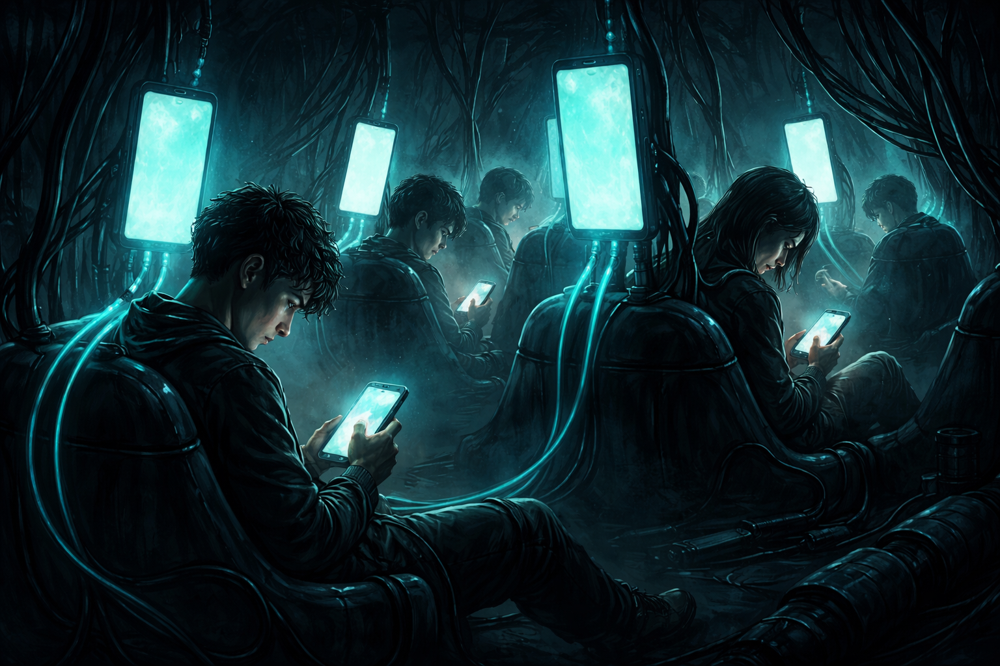
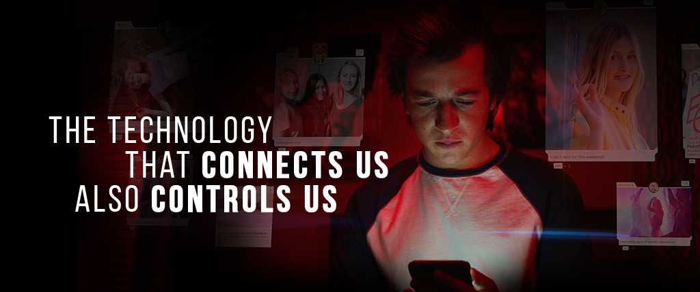

<!-- SELF-INTRO-START -->

_嗨，我是 [黃樺明](https://huam.ing)，我熱愛 [寫作](https://huam.ing/writing)、[耐力運動](https://www.strava.com/athletes/huaminghuang)、[開發提升生活品質的軟體工具](https://github.com/huaminghuangtw)。若有一天必須留下 [墓誌銘](https://huam.ing/2025/7/15/live-each-day-as-if-it-were-your-last)，我希望上面寫著：他致力於 [改善人類的手機使用習慣](https://shortcutomation.com)，也努力 [讓臺灣的學生運動員擁有更好的教育和訓練環境](https://adaptx.tw)。Enoughness，是我從 2023 年開始每天練習的生活哲學，一種「剛剛好」的生活態度。每週，我會在這份電子報分享幾件觸動我 [好奇心](https://huam.ing/weekly-mindware-update) 的事物、想法與學習。如果這封信是朋友轉寄給你的，歡迎 [點此訂閱](https://huam.ing/newsletter)。想看看過往內容？[歷年電子報](https://huam.ing/enoughness) 都在這裡。_

<!-- SELF-INTRO-END -->

---

# 1

捷運上，大家都在滑手機，頭低得快要撞到膝蓋；餐廳裡，一桌人各看各的螢幕，傳食物照比講話還多；公園裡，爸媽推著嬰兒車，眼睛還是黏在手機上，錯過了孩子第一次指著蝴蝶興奮大叫的瞬間。

這些畫面，就像科幻電影裡被機器人控制、專門發電的「[人肉電池](https://www.google.com/search?q=人肉電池)」。

智慧型手機的出現，徹底改寫人類獲取資訊及社交互動的方式。

我們手握能連結全世界的科技，卻失去與真人建立深度連結的本能。

我們看似比以往更緊密相連，內心卻感到前所未有的疏離。

彼此身處同一空間，靈魂卻各自流浪；近在咫尺，卻毫無交集。

手機本該是替人類服務的工具，曾幾何時，變成 [人類在服務手機](https://huam.ing/2026/1/2/enoughness-12/#1)。

# 2

社群媒體創造了空前的連結感，讓我們沉溺於源源不絕的 [多巴胺](https://www.google.com/search?q=多巴胺) 刺激。

然而，它本質上卻如同成癮藥物，讓我們老是幻想著去別的地方、做別的事、和別的人在一起。

我們在虛擬世界中越陷越深，與真實世界漸行漸遠，最終陷入「越連結，越孤單」的矛盾迴圈。

**手機成癮，或許是這個時代正以倍速蔓延，卻沉默無聲的流行病。**

# 3

幾年前，受到 Netflix 紀錄片 《[智能社會：進退兩難](https://www.imdb.com/title/tt11464826/)》（The Social Dilemma）的醍醐灌頂，我開始意識到手機和社群媒體潛藏的心理健康危機，並下定決心 [投入現代人手機成癮議題](https://shortcutomation.com)。

_我常在想，如果可以改變人類的 3C 使用習慣，讓每個人都能學會適時放下手機，或許更多眼神交會的真實對話就會發生。_

_我常在想，如果可以釋放那些被螢幕綁架的時間，讓人們將心力重新投注在自己熱愛的事情上，或許更多天賦會因此被點亮。_

_我常在想，如果可以創造一個沒有電子產品干擾的神聖空間，找回人與人之間失去的溫度，或許躍上新聞版面的，會是更多發生在某個社會角落的溫暖故事。_

**我期待有一天，我們能活在一個沒有數位焦慮的世界。**

**這是我的使命，也是我追求的 [墓誌銘](https://youtu.be/SBDWLvTRmP0)。**

— [樺明](https://huami.ng/2026/4/10/enoughness-26)

---

“There are only two industries that refer to their customers as ‘users’: the illegal drug trade and tech companies. Both thrive by creating addicts and profiting from the addiction.”
 
— The Social Dilemma (2020 film)

