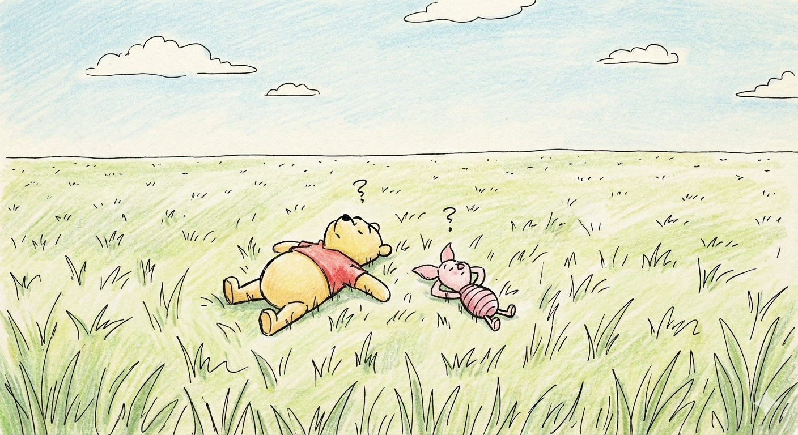
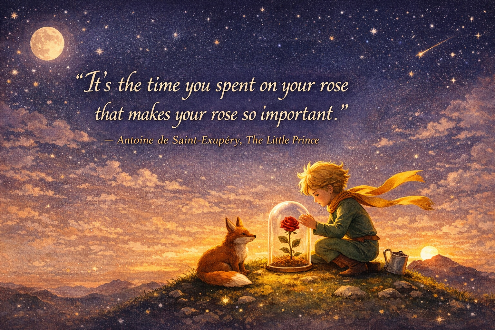

<!-- SELF-INTRO-START -->

_嗨，我是 [黃樺明](https://huam.ing)，我熱愛 [寫作](https://huam.ing/writing)、[耐力運動](https://www.strava.com/athletes/huaminghuang)、[開發提升生活品質的軟體工具](https://github.com/huaminghuangtw)。若有一天必須留下 [墓誌銘](https://huam.ing/2025/7/15/live-each-day-as-if-it-were-your-last)，我希望上面寫著：他致力於 [改善人類的手機使用習慣](https://shortcutomation.com)，也努力 [讓臺灣的學生運動員擁有更好的教育和訓練環境](https://adaptx.tw)。Enoughness，是我從 2023 年開始每天練習的生活哲學，一種「剛剛好」的生活態度。每週，我會在這份電子報分享幾件觸動我 [好奇心](https://huam.ing/weekly-mindware-update) 的事物、想法與學習。如果這封信是朋友轉寄給你的，歡迎 [點此訂閱](https://huam.ing/newsletter)。想看看過往內容？[歷年電子報](https://huam.ing/enoughness) 都在這裡。_

<!-- SELF-INTRO-END -->

---

# 1

《[我可能錯了：森林智者的最後一堂人生課](https://huam.ing/2026/1/23/enoughness-15/#1)》第七課提到一個故事：

有一天，[小熊維尼](https://huam.ing/2026/1/2/enoughness-12/#3)（Pooh）和小豬（Piglet）並肩躺在草坪上，望著天空，想著今天要做什麼。

維尼首先打破沉默：「不如去拜訪大家吧。」

小豬有點猶豫：「我們要不要想個理由？比如說，一起去冒險之類的。」

維尼搖搖頭：「理由很簡單。**今天是星期四，我們去祝大家星期四快樂！**」

他們來到兔子家，那位每天都辛勤工作、家裡總是儲存大量食物的兔子，皺起眉頭問：「為什麼要祝我星期四快樂？星期四有什麼特別的嗎？」

維尼耐心地解釋：「**沒什麼特別的理由，就是想祝你星期四快樂，因為今天是星期四！**」

最討厭在忙碌時被打擾的兔子聽完後，淡淡地說：「喔，我還以為你們是為了什麼正經事來的。」

離開兔子家後，維尼沉思了一會兒，接著說：「兔子很聰明。」

小豬點點頭：「對啊，兔子真的很聰明。」

「而且他有一個腦袋。」維尼補了一句。

「對！他有一顆腦袋。」小豬附和道。

維尼沉默了很久，最後說：「**也許，這就是他什麼都不懂的原因吧。**」

---

兔子和維尼的思維差異在於：兔子理性、計畫性強，總是追求生產力、效率和做「正確」的事；維尼則隨性、直覺和當下導向，行動不為功利，一切順其自然，只用單純的好奇心去體驗生活，強調「存在」本身而非目的。

以前，只要是 [跑步](https://www.strava.com/athletes/huaminghuang) 時間，我一定塞著耳機聽 Podcast，深怕 [大腦](https://huam.ing/2025/8/14/sherlock-holmes-brain-attic) 有一秒閒下來；現在，我刻意在跑步的時候不帶手機、不聽音樂，學習放空，然後什麼都不在乎。

神奇的是，我開始聽見平常聽不見的聲音、想到平常想不到的想法，甚至是覺察到一些平常不會注意到的感受。

別太認真，並不是懶惰，而是 [專注且放鬆](https://youtu.be/T0hKmjsnGSs?t=20m25s)。

老子《道德經》第三十七章寫道：「[無為而無不為](https://zh.wikipedia.org/zh-tw/%E7%84%A1%E7%82%BA%E8%80%8C%E7%84%A1%E4%B8%8D%E7%82%BA)」；有時候 [無所事事](https://huam.ing/wu-wei)，反而能成就最棒的事。

**當維尼，不要當兔子。**

# 2

[第一期](https://huam.ing/2025/10/17/enoughness-1/#8) 提過在生活中「留白」的重要性。

[研究](https://doi.org/10.4103/0973-1229.77424) 指出，歷史上許多偉人，像是愛因斯坦、莫札特和達文西，都非常重視這種「自由漂浮」的思考時間。

神經科學家發現，在這些放鬆的閒置時段，大腦並沒有進入休息狀態，反而是進入一種活躍的「[預設模式網路（Default Mode Network, DMN）](https://doi.org/10.1016/j.neuroimage.2007.02.041)」。

. A default mode of brain function.】")

在 DMN 模式下，大腦會主動尋找連結，並建立關聯性。這通常在我們從事低認知需求的活動（例如散步、煮飯、洗澡）時發生。

那些看似無所事事、甚至有些無聊的時刻，就像核融合反應一樣，正在悄悄聚集能量，準備釋放驚人的創造力。

[J.K. Rowling](https://www.google.com/search?q=J.K.+Rowling) [就是在等待火車的空檔，構思出《哈利波特》的雛形](https://stories.jkrowling.com/my-story#:~:text=A%20few%20years%20later%20in%E2%80%AF1990%2C%20after%20moving%20to%20London%2C%20I%20was%20sitting%20on%20a%20delayed%20train%20back%20home%20from%20Manchester%20when%20suddenly%20I%20had%20the%20idea%20of%20a%20boy%20wizard%20who%20went%20to%20wizarding%20school.%20Harry%20Potter%20and%20Hogwarts%20came%20out%20of%20nowhere%20in%20the%20most%20physical%20rush%20of%20excitement%2C%20and%20ideas%20came%20teeming%20into%20my%20head.)。

# 3

前陣子重讀《[小王子](https://www.google.com/search?q=小王子)》（Le Petit Prince），我重新思考了 [愛](https://huam.ing/love) 的真諦。

《小王子》是法國作家安東尼・聖修伯里（[Antoine de Saint-Exupéry](https://www.google.com/search?q=Antoine+de+Saint-Exupéry)）在 1943 年出版的經典童話。表面上是寫給孩子的故事，實際上卻是聖修伯里的自我投射。他透過故事記錄作為一名飛行員的旅程與冒險，並藉此反思世界文明、戰爭與生命。

這本書被稱為「寫給大人的童話」，全球銷量僅次於聖經，是世界上最受歡迎的法語著作之一。

第二十一章中小王子與狐狸的故事，是我最常想起的一幕：

> 在浩瀚的宇宙裡，小王子離開了他的 B612 星球，來到地球，遇見一隻孤單的狐狸。
>
> 狐狸對小王子說：「你對我來說，只是千千萬萬個小男孩中的一個；我對你來說，也只是千千萬萬隻狐狸中的一隻。但如果你願意馴養我，我們對彼此來說，就會變得非常重要 — 你是我唯一的小男孩，我也是你唯一的狐狸。」
>
> 小王子問：「什麼是『馴養』？」狐狸說：「建立連結，讓彼此變得特別。」
>
> 狐狸告訴小王子，馴養需要耐心 — 每天靠近一點點，[不急著說話，只是靜靜地陪伴](https://huam.ing/2025/10/10/the-power-of-quiet)。
>
> 狐狸接著說：「我本來不在意那片麥田，但因為你的頭髮是金色的，從此麥田的顏色讓我想起你，風吹過麥浪的聲音也變得特別動聽。」
>
> 小王子說：「我明白了，我的玫瑰花也馴養了我。」
>
> 狐狸又說：「人們總是太忙，沒時間真正認識彼此。他們到商店買現成的東西，但友情跟愛情是買不到的。如果你想要朋友，就要花時間馴養。」
>
> 最後，小王子要離開了。狐狸雖然難過，卻說：「因為你馴養了我，麥田的顏色從此有了意義。你去看看那些玫瑰，就會明白為什麼你的玫瑰是獨一無二的。」
>
> 小王子看著花園裡成千上萬的玫瑰，終於懂了：「**你們很美，但卻是空虛的。路過的人以為我的玫瑰和你們一樣，但她單獨一朵就勝過你們全部。因為她是我澆灌的。因為她是我放在玻璃罩中的。因為她是我用屏風保護起來的。因為她身上的毛毛蟲是我除掉的。因為我聽過她發牢騷、吹噓，甚至沉默不語。因為她是我的玫瑰 。**」
>
> 回來後，狐狸告訴小王子一個秘密：「**只有用心體會才能看得清楚，真正重要的東西是看不見的。正是你花在玫瑰身上的時間，才讓她變得如此重要。你要永遠記得，對你馴養過的東西，負起責任。**」

比起玫瑰，我更喜歡明明愛著小王子，卻放手讓他走的狐狸。

因為愛不是佔有，而是願意付出、願意耐心等待、願意讓對方自由。

愛本身不會帶來痛苦，真正讓人痛苦的是佔有慾。

之前看過一句話：

> 喜歡是為了得到，愛是為了付出。

狐狸只在意付出、只想讓小王子知道真愛為何物，然後把自己放在最後面。

喜歡一朵花，你會摘下它；愛一朵花，你會灌溉它。

你也有那朵願意花時間、心思去陪伴和守護的玫瑰嗎？🌹

請記得：那些用心灌溉的時光，才是玫瑰無可取代的原因。

— [樺明](https://huam.ing/2026/4/17/enoughness-27)

---

“One sees clearly only with the heart. Anything essential is invisible to the eyes.”
 
— Antoine de Saint-Exupéry, The Little Prince

