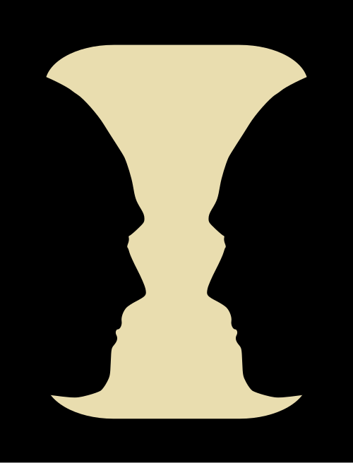
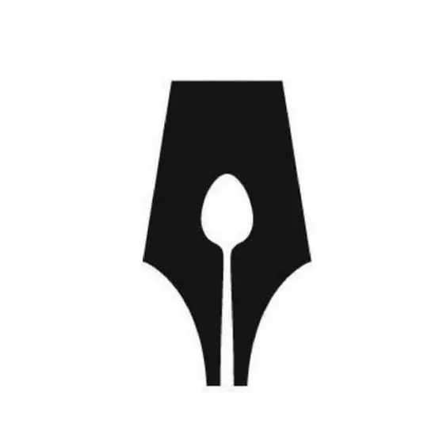
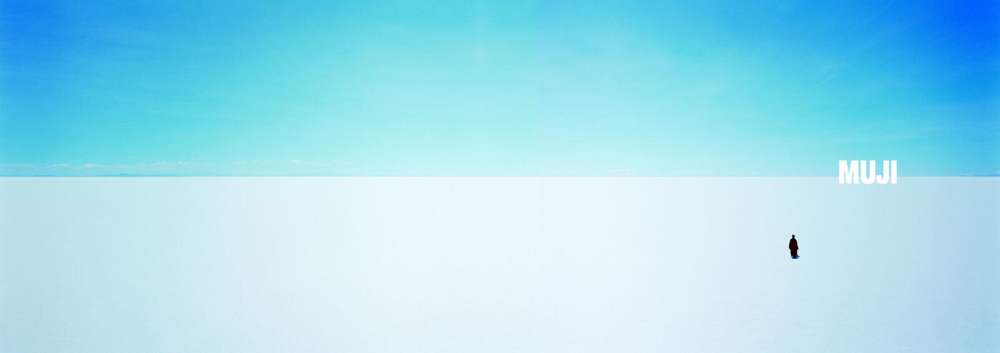

<!-- SELF-INTRO-START -->

_嗨，我是 [黃樺明](https://huam.ing)，我熱愛 [寫作](https://huam.ing/writing)、[耐力運動](https://www.strava.com/athletes/huaminghuang)、[開發提升生活品質的軟體工具](https://github.com/huaminghuangtw)。Enoughness，剛剛好，是我從 2023 年開始每天練習的生活態度。每週，我會在這份電子報分享三件有趣的事。如果這封信是朋友轉寄給你的，歡迎 [點此訂閱](https://huam.ing/newsletter)。想看看過往內容？[歷年電子報](https://huam.ing/enoughness) 都在這裡。_

<!-- SELF-INTRO-END -->

---

# 1

每次看到全聯的促銷傳單或蝦皮的 App 首頁，頭都很痛。滿滿的色塊、龐大的資訊量，看起來都是重點，卻什麼都不突出。

在藝術、設計或攝影中，有一個概念叫「負空間」（Negative Space）。相較於代表畫面主體或焦點元素的「正空間」（Positive Space），負空間是環繞在主體周圍的空白區域。

這些留白，讓我們更能看清楚什麼才是重點。

---

著名的 [魯賓之盃](https://www.google.com/search?q=魯賓之盃)（Rubin vase），只用黑白兩色，卻產生兩種不同的視覺詮釋：看著黑色，是兩張臉；看著白色，卻是一個花瓶。

英國飲食作家協會（[Guild of Food Writers](https://www.gfw.co.uk/)） 的 Logo 也是：筆尖的負空間裡藏了一把湯匙，巧妙地將「寫作」和「飲食」結合在一起。

還有聯邦快遞 [FedEx](https://www.google.com/search?q=FedEx) 的商標，E 和 x 之間藏了一個箭頭，暗示著速度與方向 — 你以前有發現嗎？

")

---

日文有個字叫「[間](https://www.google.com/search?q=Japanese+Ma)」（Ma），強調寂靜、虛無和暫停的美感。

英國設計大師 [Alan Fletcher](https://en.wikipedia.org/wiki/Alan_Fletcher_(graphic_designer)) 在著作《[The Art of Looking Sideways](https://www.google.com/search?q=The+Art+of+Looking+Sideways)》中寫道：

> 空間就是實體。日本人有個字叫 Ma，這個間隔讓整體有了形狀。西方世界卻沒有這個詞，真是遺憾。
>
> Space is substance. The Japanese have a word (ma) for this interval which gives shape to the whole. In the West we have neither word nor term. A serious omission.

老子在《道德經》也說：

> 三十輻共一轂，當其無，有車之用。埏埴以為器，當其無，有器之用。鑿戶牖以為室，當其無，有室之用。故有之以為利，無之以為用。

意思是，輪子的空心、器皿的中空、房間的門窗，正是這些「沒有」讓「有」發揮作用。「有」和「無」加起來，才賦予事物完整的意義。

---

所以說，畫布上 [留白](https://huam.ing/2025/10/17/enoughness-1/#3) 的地方，才是意境所在。

留白，象徵著「空無一物」，卻也因此為「僅有之物」創造出更多被理解的可能。

留白，不是一個需要被填補的空洞，而是一種讓主體更突出、意義更鮮明的存在。

生活也是如此，不論是吃飯時只吃到 [八分飽](https://huam.ing/2025/11/28/enoughness-7/#2)、對話中 [少說一點話](https://huam.ing/2025/10/10/the-power-of-quiet)，或是每天留一段時間 [跟自己相處](https://huam.ing/2026/1/2/enoughness-12/#5-%E4%BA%AB%E5%8F%97-hygge-%E7%9A%84%E6%99%82%E9%96%93)……

適度的留白都是最高宗旨。

# 2

最近讀到一個讓我不斷反芻的故事：

> 一位成功的商人在小漁村度假時，看到一名漁夫駕著小船靠岸，船上有幾條新鮮的大魚。
>
> 商人問他花了多久才捕到這些魚。
>
> 漁夫回答：「只花了一點時間。」
>
> 商人又問：「那你為什麼不多待一會兒，多捕一些魚呢？」
>
> 漁夫說：「這些魚已經足夠養活我的家人了。」
>
> 商人不解地問：「那你剩下的時間都做什麼？」
>
> 漁夫微笑著說：「我會**睡到自然醒，釣釣魚，陪孩子玩，和太太午睡，看看書，傍晚到村裡和朋友喝酒、彈吉他**。我覺得我的生活很充實、很快樂。」
>
> 商人聽了，忍不住笑出聲：「拎北哈佛 MBA 畢業的，我可以幫你！你應該多花點時間捕魚，賺更多錢，然後買更多、更大的船，並組成船隊，自己經商賣魚。接著，搬到像墨西哥城、洛杉磯，甚至紐約這些大城市，經營你的企業帝國。」
>
> 漁夫問：「那要花多久？」
>
> 商人說：「大概十五到二十年。」
>
> 漁夫又問：「然後呢？」
>
> 商人笑著說：「然後你就可以退休啦！搬到一個小漁村，**睡到自然醒，釣釣魚，陪孩子玩，和太太午睡，看看書，傍晚和朋友喝酒、彈吉他**。」
>
> 漁夫對商人點點頭，默默地離開了。

有沒有可能，你現在過的日子，早已是夢寐以求的理想生活？

# 3

前幾天去醫院探病。在地下停車場取車時，剛好路過「[安息室](https://www.google.com/search?q=安息室)」。家人突然轉頭問我：「你會害怕（死亡）嗎？」

我停頓了一下，然後說：「**[比起死亡，我更害怕虛度光陰，害怕自己沒有用盡全力過好每一天。](https://huam.ing/2025/10/14/who-do-we-spend-time-with-across-our-lifetime)**」

---

電影《[鐵達尼號](https://www.imdb.com/title/tt0120338)》（Titanic）中，李奧納多（[Leonardo DiCaprio](https://www.google.com/search?q=Leonardo+DiCaprio)）在晚宴舉杯時那句「[Make each day count](https://youtu.be/JYdCltjvrxg)」，經常在我的腦海中徘徊。

自從聽了 2005 年賈伯斯（Steve Job）在史丹佛大學畢業典禮上的 [演講](https://youtu.be/UF8uR6Z6KLc?t=544) 後，我一直在思考：「什麼才是我最想過上的 [好生活](https://huam.ing/2026/3/6/enoughness-21/#3)？」

也許，生命本身就是一個提問，而我們 [如何活著](https://huam.ing/2025/11/12/ted-taipei-2025)，就是對它的回答。

每天醒來，都是一次歸零、一次新開始，更是另一個全力以赴的機會。

Make each day count.

— [樺明](https://huam.ing/2026/4/24/enoughness-28)

---

“Let every dawn of morning be to you as the beginning of life, and every setting sun be to you as its close.”
 
— John Ruskin

