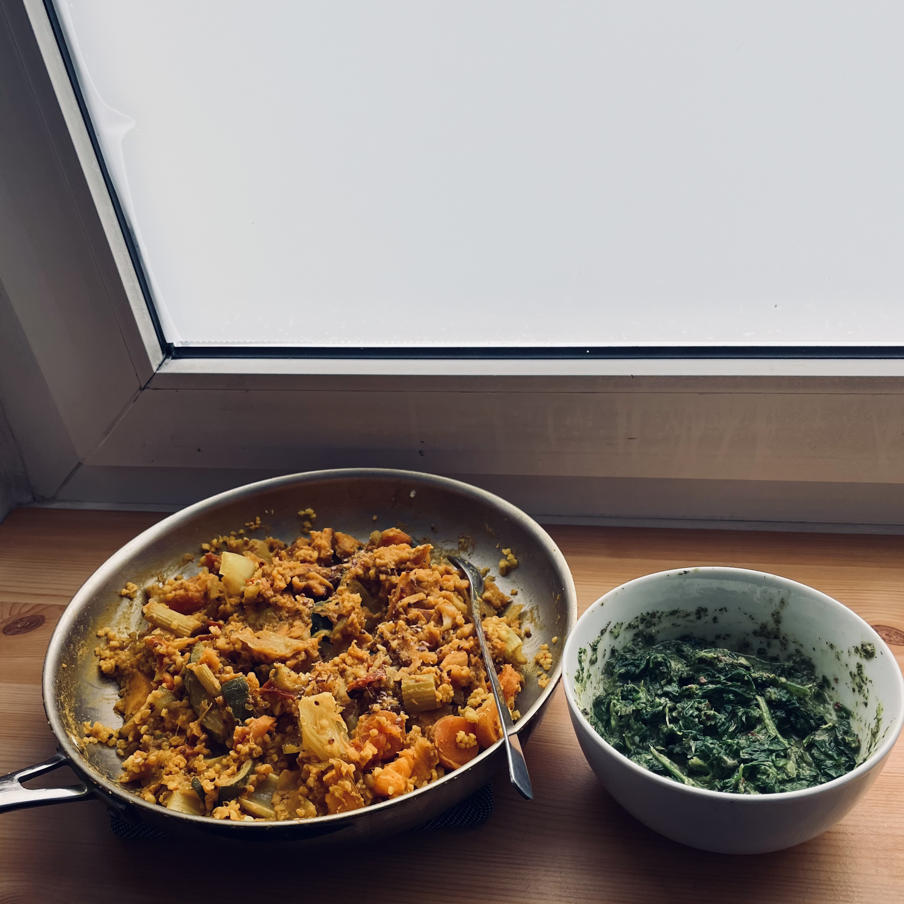
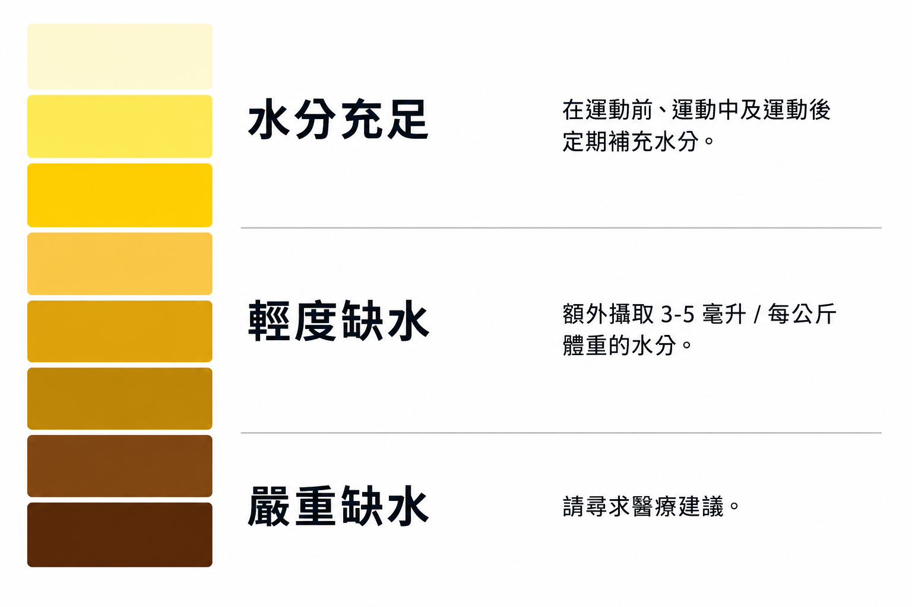
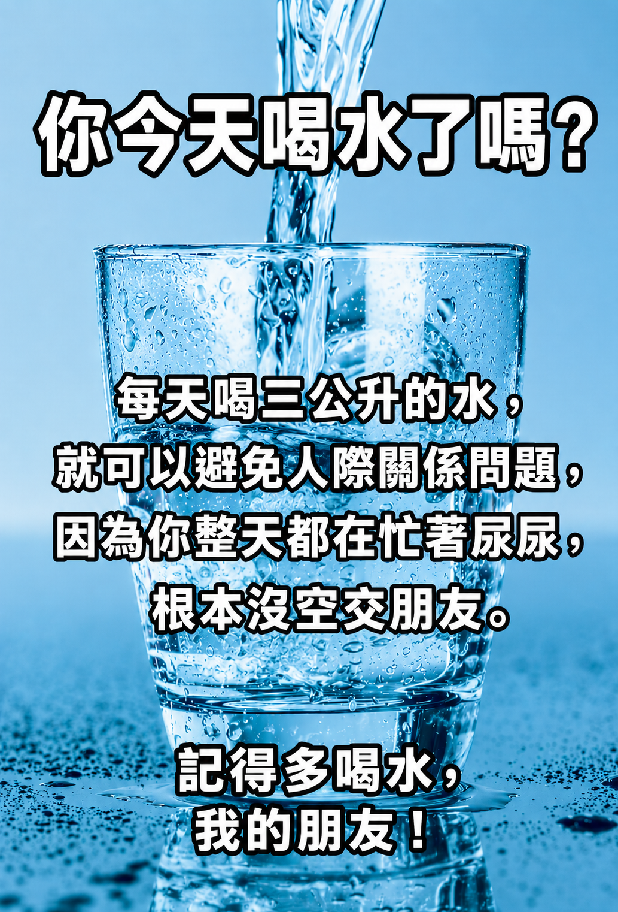

<!-- SELF-INTRO-START -->

_嗨，我是 [黃樺明](https://huam.ing)，我熱愛 [寫作](https://huam.ing/writing)、[耐力運動](https://www.strava.com/athletes/huaminghuang)、[開發提升生活品質的軟體工具](https://github.com/huaminghuangtw)。Enoughness，剛剛好，是我從 2023 年開始每天練習的生活態度。每週，我會在這份電子報分享三件有趣的事。如果這封信是朋友轉寄給你的，歡迎 [點此訂閱](https://huam.ing/newsletter)。想看看過往內容？[歷年電子報](https://huam.ing/enoughness) 都在這裡。_

<!-- SELF-INTRO-END -->

---

# 1

自從開始練習 [八分飽](enoughness-7.md#2) 後，我的吃飯訓練課程又加入了「正念飲食」（Mindful Eating）這個課表。

以前我常把吃飯當成填飽肚子或消磨時間的活動，總是要配個 YouTube 才吃得下去。

自從在 [Michael Gershon](https://www.google.com/search?q=Michael+Gershon) 博士身上學到「[腸腦軸線](https://www.google.com/search?q=腸腦軸線)」（Gut-Brain Axis）」這個概念後，我開始練習專心吃飯。

簡單來說，腸道是人體的「第二大腦」，兩者之間有一條由迷走神經（Vagus Nerve）組成的「高速公路」雙向傳遞訊息。當我們壓力大、焦慮時，腸胃會跟著不舒服；反過來，腸道健康也會影響我們的心情和專注力。

拉丁文有一句諺語：

> Age quod agis

意思是「做什麼，像什麼。」不論做什麼事，專注當下、全心投入。

當我把注意力都放在「咀嚼」和「吞嚥」上，感受每一口慢慢進入身體的過程，食物似乎也變得更美味、更好吃了！（對了，閉上眼睛，並滿懷感激，似乎還有加成作用唷！）

沒有比較沒有傷害。跟現在每次進食都能感受到被滋養、獲得能量比起來，以前好像只吃下沒有靈魂的空殼……

謝謝正念飲食，讓我改善與食物之間的關係。

# 2

如果睡 8 小時，一天有 ⅓ 的時間要貢獻給睡眠。

[大谷翔平](enoughness-8.md#3) 更是會睡到 [12 小時（包含賽前 2 小時午睡）](https://www.google.com/search?q=Shohei+Ohtani+sleep+how+many+hours)，等於有半天都在 [休息](enoughness-20.md#3)。

他在 [GQ 的 10 項貼身小物訪談](https://youtu.be/wkh2mxn49RI) 中，就有 3 項跟睡眠有關：

1. 客製化睡眠枕頭
2. 心率監測器
3. 加重眼罩

很多頂尖的精英運動員（像是 [Roger Federer](https://www.google.com/search?q=Roger+Federer+sleep)、[Usain Bolt](https://www.google.com/search?q=Usain+Bolt+sleep)、[LeBron James](https://www.google.com/search?q=LeBron+James+sleep)）都很喜歡睡覺，他們 [把睡覺當作一天中最重要的事](enoughness-11.md#3)。

睡覺是最有效的恢復方式，比吃任何山珍海味都還要有用。

這是我的睡眠隨身包，裡面包括：

1. 眼罩
2. 耳塞
3. 美容膠帶
4. 凡士林
5. 鎂錠
6. 紙 & 筆

# 眼罩 & 耳塞

優質的睡眠環境需要「暗」跟「靜」：眼罩用來封住眼睛，隔絕光線；耳塞用來封住耳朵，隔絕噪音。

## 美容膠帶

至於美容膠帶呢？用來封住嘴巴。

「[用鼻子呼吸，用嘴巴吃東西](https://www.google.com/search?q=鼻子呼吸+嘴巴呼吸)」是人類呼吸系統的設計邏輯。

睡前，我會用美容膠帶上下直貼嘴巴，幫助自己養成鼻呼吸的習慣。

鼻呼吸不僅能過濾和加濕空氣，還會產生「[一氧化氮](https://www.google.com/search?q=鼻子+呼吸+一氧化氮)」—呼吸道的天然消毒劑，可以對抗病原體，並提升血氧濃度。

相反地，口呼吸容易造成蛀牙、口乾和降低睡眠品質（例如打鼾或睡眠呼吸中止）。

如果你很在意外表，不喜歡變醜，更要注意是否有嘴巴呼吸的習慣。[口呼吸會改變舌頭與臉部肌肉的位置](https://www.google.com/search?q=嘴巴+呼吸+臉型)，尤其是當小朋友還在發育時，容易導致暴牙、下巴消失等容貌改變。

## 凡士林

貼美容膠帶前，我會先在嘴唇上塗一層薄薄的凡士林，除了保濕，早上也比較好把膠帶撕下來。

## 鎂錠

這是從 [Dr. Andrew Huberman](https://youtu.be/XcvhERcZpWw?t=6030s) 身上學到的。我固定在睡前 30–60 分鐘吞一顆 [Doppelherz 夜間舒眠鎂錠](https://www.doppelherz.de/produkte/doppelherz-aktiv-magnesium-500-fuer-die-nacht)。

## 紙 & 筆

醒來後 15–20 分鐘，是我每天最文思泉湧的時候。我不會馬上起身，而是繼續躺著，給腦袋一點時間，把醞釀了一整晚的潛意識推上檯面。

當想法出現時，我會轉身拿起紙筆記下：

* 就寢與起床時間
* 今天最重要的任務
* 任何突然浮現的靈感

確認腦中的想法都寫下後，才會起床開始一天。

# 3

人體有 60–70% 是水份。水在人體內負責調節體溫，並滋養大腦和脊髓。所以，保持體內的水分平衡相當重要。

[一般建議的飲水量是 2–3 公升 / 天。](https://youtu.be/9iMGFqMmUFs?t=3m33s)

身體缺水會造成精力衰退、心情不好、皮膚變乾，以及認知障礙（俗稱「腦霧」）等情況。

經過一整晚睡眠，人體會輕微脫水（Dehydration）；醒來後喝一點鹽水（約 ¼ 茶匙），可以補充流失的電解質。

運動時，可以參考 [The Galpin Equation](https://youtu.be/q37ARYnRDGc?t=2989s)：體重公斤數（kg）× 2 = 每 15–20 分鐘要喝的毫升數（mL）。舉例來說，如果你的體重是 65 kg，則建議每 15–20 分鐘攝取 130 mL 水分。

這個公式不是絕對 — 運動強度、天氣、出汗量和體質都會影響。可以透過觀察尿液顏色（淡黃色為佳）和體感來動態調整飲水量。

關於飲用水過濾，除了市面上的濾壺、濾芯（例如 Brita），Dr. Andrew Huberman [提到](https://youtu.be/at37Y8rKDlA?t=1h44m18s) 一個零成本的做法：在室溫下，將飲用水靜置一段時間，雜質沉澱底部後，倒出上層 ⅔ 飲用。他還 [特別提醒](https://youtu.be/at37Y8rKDlA?t=1h46m3s)，靜置全程必須是「無蓋」（Uncapped）狀態（或用一塊布蓋著），目的是讓內部物質可以蒸發出去。

— 樺明
