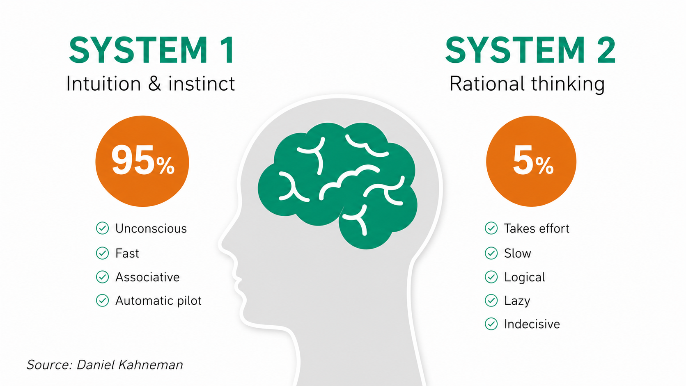
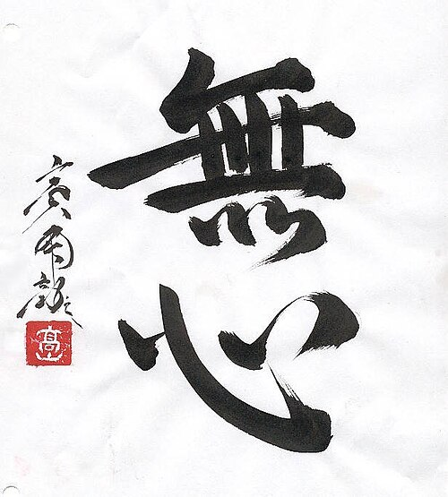

<!-- SELF-INTRO-START -->

_嗨，我是 [黃樺明](https://huam.ing)，喜歡 [寫作](https://huam.ing/writing)、[耐力運動](https://www.strava.com/athletes/huaminghuang)、[用手機寫程式](https://github.com/huaminghuangtw)。Enoughness，剛剛好，是我從 2023 年開始每天練習的生活哲學。每週，我會分享三件有趣的事。如果這封信是朋友轉寄給你的，歡迎 [點此訂閱](https://huam.ing/newsletter)。想看看過往內容？[歷年電子報](https://huam.ing/enoughness) 都在這裡。_

<!-- SELF-INTRO-END -->

---

# 1

2002 年諾貝爾經濟學獎得主 [Daniel Kahneman](https://www.google.com/search?q=Daniel+Kahneman) 在《[快思慢想](https://www.google.com/search?q=快思慢想)》（Thinking, Fast and Flow）中，把大腦分成兩個系統：

1. 快速、直覺的系統 1
2. 緩慢、理性的系統 2

系統 1 專門處理熟練或習慣性動作；但需要深度思考、邏輯推演和創造力的事，只能交給系統 2。

")

現在，請你判斷上圖中兩條線，哪一條比較長？

第一眼會覺得上面那條比較長，對吧？這是系統 1：快、確定、不需解釋。

但如果拿一把尺來量，你會發現他們其實一樣長。這是系統 2：慢、謹慎、需要證據。

儘管理性（系統 2）已經告訴你「兩線等長」，直覺（系統 1）還是認為上面那條線比較長。

系統 1 會先發制人，留下強烈印象；**系統 2 能修正系統 1 的錯誤，且必須刻意、有意識地介入。但修正之後，系統 1 的感受仍持續殘留。**

這說明了：**我們有很多幻覺和認知偏誤，即使在面對明確證據下，也很難完全矯正。**

所以我現在慢慢學會 [對自己的信念保持一點距離](https://www.goodreads.com/work/quotes/95742516-don-t-believe-everything-you-think-why-your-thinking-is-the-beginning)，然後用 [不帶評論和預設立場](enoughness-19.md#3) 的心態去 [觀察](enoughness-15.md#2) 他們。**畢竟，我不知道我不知道的事，我眼中的世界只是冰山一角，只是系統 1 想要讓我看的版本。**

# 2

兩位禪宗學生談起各自的老師。

其中一位很驕傲地說：「我的老師超厲害，他能用三支箭就把樹上的蘋果射下來，還能在落地前把它切成四塊。」

另一位學生聽完，點點頭說：「那真的很了不起。不過，我的老師更厲害。」

「他有什麼特別的本事呢？」第一位學生問。

「他**走路時用心走路；[坐著時用心坐著](enoughness-22.md#3)；[吃飯時用心吃飯](enoughness-30.md#1)。**」

美國社會心理學家 [Jonathan Haidt](https://www.google.com/search?q=Jonathan+Haidt) 在《[象與騎象人](https://www.google.com/search?q=象與騎象人)》（The Happiness Hypothesis）寫道：

> Controlled processing is limited — we can think consciously about one thing at a time only — but automatic processes run in parallel and can handle many tasks at once. If the mind performs hundreds of operations each second, all but one of them must be handled automatically.
>
> 在有意識的情況下，我們一次只能思考一件事。如果心智每秒執行數百個運算，那麼除了其中一項外，其他都必須仰賴自動處理。

**人類的大腦是一台超級電腦，但它一次只能處理一件事。**

前幾天晚上刷完牙、準備洗臉時，突然有個想法：「我剛剛拿的是洗面乳還是牙膏？」

為了確定沒有拿錯，我還特別把牙刷拿起來聞。

**專心做好一件事，不要一心二用，最省力也最可靠**。刷牙就刷牙，不要 [分心](enoughness-16.md#3) 想東想西，果然沒錯。

# 3

小時候去 [高雄市立文化中心](https://www.google.com/maps?q=高雄市立文化中心)，總會看到一群阿公阿嬤在練太極拳。

我一直很納悶：明明手揮一下、腰轉一下就結束的動作，你們為什麼要弄那麼久？

長大後才懂，「慢」才能「以心練身」。太極拳的最高境界是忘掉所有招式，讓身體記憶與本能合而為一，無招勝有招。

清朝形意拳大師 [郭雲深](https://www.google.com/search?q=郭雲深) 曾說：

> 有形有意都是假，拳到無心始見奇。

無心（[Mushin](https://www.google.com/search?q=Mushin)）是一個日文字，代表心無旁騖、心無雜念、心如止水的狀態。並非一片空白或麻木，而是不執著於特定事物，就像流水一樣清澈、像明鏡一樣映照。

但「無心」的境界，並非一蹴可幾。那些看似輕鬆、優雅的動作，其實背後都是無數次反覆練習、卡關、失敗，[站起來](enoughness-32.md#2) 再練一次的累積。

你必須很努力，才能讓一切看起來毫不費力。

台上十分鐘，台下十年功。練到無心處，方見太極真。

— 樺明
