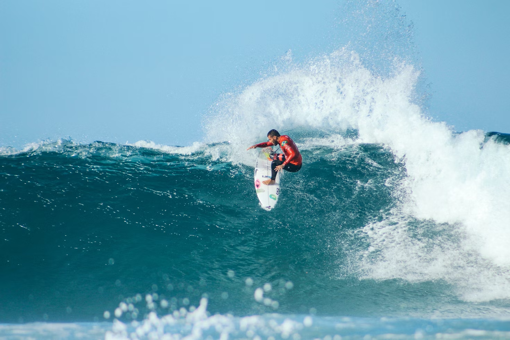

<!-- SELF-INTRO-START -->

_嗨，我是 [黃樺明](https://huam.ing)，我熱愛 [寫作](https://huam.ing/writing)、[耐力運動](https://www.strava.com/athletes/huaminghuang)、[開發提升生活品質的軟體工具](https://github.com/huaminghuangtw)。Enoughness，剛剛好，是我從 2023 年開始每天練習的生活態度。每週，我會在這份電子報分享三件有趣的事。如果這封信是朋友轉寄給你的，歡迎 [點此訂閱](https://huam.ing/newsletter)。想看看過往內容？[歷年電子報](https://huam.ing/enoughness) 都在這裡。_

<!-- SELF-INTRO-END -->

---

# 1

從前有一位老農，他唯一的馬落跑了。當天晚上，鄰居們來到他家，滿懷同情地說：「真倒楣啊，失去馬真是不幸。」

老農只是淡淡地回應：「**也許吧。**」

隔天早上，跑掉的馬竟然帶著七匹野馬回家。到了傍晚，鄰居們又來了，興奮地說：「太好了！你現在有八匹馬，真是好運！」

老農依然只是點點頭：「**也許吧。**」

接下來一天，老農的兒子想馴服其中一匹野馬，結果從馬背上摔下來，斷了腿。鄰居們又跑來搖頭嘆息：「唉，真可憐啊！」

老農還是說：「**也許吧。**」

又過了一天，朝廷的徵兵官來抓壯丁赴戰場打仗，看到他兒子摔斷了腿，便沒有帶走他。到了晚上，鄰居們又來了，鬆了一口氣地說：「真是好消息，你兒子不用去當兵了！」

老農依舊那句：「**也許吧。**」

# 2

美國文學大師 [Cormac McCarthy](https://www.google.com/search?q=Cormac+McCarthy) 在他的犯罪驚悚小說《險路》（No Country for Old Men）中寫道：

> You never know what worse luck your bad luck saved you from.
>
> 你永遠不知道壞運氣究竟幫你避開多少更糟的事情。

好運與厄運像骨牌般緊密相連，彼此牽動。眼前的不幸，往往是未來的轉機；眼前的幸運，也可能成為日後的隱憂。

就像宇宙中某顆新星（Nova）爆發，乍看是絢爛的光芒，卻也可能帶來毀滅。心理學稱之為 [諾瓦效應（The Nova Effect）](https://youtu.be/oGVhOWqsBWM)。

1985 年，Steve Jobs 被自己創辦的蘋果公司開除。這個看似人生的重大挫敗，卻讓他有機會創立 NeXT 和 Pixar。最終不僅重返蘋果，還帶領公司推出 iPhone 等劃時代產品。

[J.K. Rowling](enoughness-27.md#2) 剛開始投稿時，遭到無數個出版社拒絕。這段低潮，反而讓她有時間打磨作品，最終誕生風靡全球的《哈利波特》。

又或者，有個人某天外出辦事時發生車禍，送醫檢查時，卻意外發現早期仍可治癒的腦瘤。

你說，這些是好事還是壞事？

我們無法單獨判斷一件事的好壞，短期的好運與厄運，隨著時間推移，意義也會翻轉。

沒有任何事是永恆的，凡事皆無常，人生的一切起起伏伏都會過去 — 無論是美好的事物，或是痛苦的經歷。

喜憂參半是生活，起起落落是人生。越長大，我越能體會「風水輪流轉」這件事。

好是壞的開始，壞是好的開始，這世間萬物，無非是因果和週期。

高高在上的東西，有一天會跌落神壇；沉潛低谷的東西，有一天也會重見天日。

# 3

去年 12 月某天早晨，我在 [西子灣](https://www.google.com/maps?q=西子灣) 海岸線結束一趟長跑訓練，坐在 [中山大學](https://www.google.com/maps?q=中山大學) 外的防波堤上休息，剛好看見一位正在衝浪的帥哥 🏄‍♂️

觀察了一陣子，我發現他大概有 80% 的時間都在水裡發呆、等浪。好幾次有小浪過來，他都不為所動，就讓浪這樣從身邊過去。

**衝浪者不會盲追每一波浪。他們明白，空檔與低潮是必經的過程，只有持續耐心等待，並讓自己隨時準備就緒，才能在機會來臨時全力以赴。**

當一道完美的浪花終於捲起，他馬上精神百倍，用力划水，站上衝浪板。短短的十幾秒裡，這位衝浪 Boy 看起來超快樂，整個就是百分之百地活在當下。

**衝浪者清楚任何高峰都有低谷。他們知道，浪花終究會結束，所以總是全心全意享受在浪頭的每一刻。**

西子灣的海流不可能一直很溫馴。有一波瘋狗浪直接砸在他頭上，整個人捲進白色水花裡。但他選擇放鬆身體、保持柔軟，像水草一樣順應海流的節奏。等浪過了，他才慢慢浮出水面，重新爬上衝浪板。

**衝浪者懂得與混亂共舞，而非硬碰硬。即使被浪打倒，他們也懂得順勢而為、以柔克剛，因為深知低谷只是短暫的，下一朵浪花很快就會再次湧現。**

人生充滿了未知與變化，有時風平浪靜，有時驚濤駭浪，沒有人能預測下一個浪頭何時來襲。

西子灣的浪人選擇相信週期，在漫長的等待中沉澱自己，並用屬於自己的高光時刻全然地活在當下。

太陽已經完全升起，照亮整個西子灣海灘。我起身伸個懶腰，慢跑回家。

— 樺明
