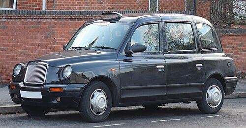

<!-- SELF-INTRO-START -->

_嗨，我是 [黃樺明](https://huam.ing)，喜歡 [寫作](https://huam.ing/writing)、[耐力運動](https://www.strava.com/athletes/huaminghuang)、[用手機寫程式](https://github.com/huaminghuangtw)。Enoughness，剛剛好，是我從 2023 年開始每天練習的生活哲學。每週，我會分享三件有趣的事。如果這封信是朋友轉寄給你的，歡迎 [點此訂閱](https://huam.ing/newsletter)。想看看過往內容？[歷年電子報](https://huam.ing/enoughness) 都在這裡。_

<!-- SELF-INTRO-END -->

---

# 1

前陣子看了紀錄片《[知識：世界上最艱難的計程車考試](https://www.google.com/search?q=The+Knowledge:+The+World’s+Toughest+Taxi+Test)》（The Knowledge: The World’s Toughest Taxi Test）。

倫敦計程車司機（常稱 Black Cab）==以其無與倫比的專業導航能力聞名全球==。他們必須通過世界上最難的地理測驗之一「倫敦知識（The Knowledge）」，熟記倫敦方圓 6 英里內超過 2 萬條街道與上千個地標，培訓往往長達 3 至 4 年，連科學研究都證實這會讓他們的大腦結構（海馬體）發生改變。

you can hold a yellow badge which is the suburban parts of london which is easier to gain or go for the famous Green badge which is the whole of London

 🚖

類似老爺車型的黑頭計程車（Black Cab）

他們必須通過世界上最難的地理測驗之一「倫敦知識（The Knowledge）」，熟記倫敦方圓 6 英里內超過 2 萬條街道與上千個地標，培訓往往長達 3 至 4 年，連科學研究都證實這會讓他們的大腦結構（海馬體）發生改變。

測驗內容：司機必須牢記以查令十字（Charing Cross）為中心、半徑 6 英里範圍內的 320 條主要路線、25,000 條街道，以及沿途所有的地標、建築、商店和劇院等資訊。考試難度：考試完全禁止使用 GPS 與導航。學員必須通過多個階段的口試（稱為 Appearable），向考官精準描述兩點之間的最短行車路線。驚人數據：通常平均需要 2 到 4 年的時間來背誦，且僅有約 1/5 的報考者能最終通過。

[圖片來源：維基百科](https://en.wikipedia.org/wiki/Hackney_carriage)

司機不能看導航！！！！

他必須要所有路線都記起來

有個考試科目就叫 Knowledge of London

「倫敦知識大全」

要熟記倫敦所有街道（大約 25000 條）

所以很常需要三 - 四年才能考到執照

會這樣做是因為他們更熟悉倫敦的路況

可以評估交通高峰、施工區等等

在腦中模擬導航 找出更好更快的路線

而這些司機也因為這些內建知識很受人信任

to be a London black cab driver, one is expected to know over 25,000 roads and 50,000 points of interest and pass a test called “The Knowledge”.

London’s taxi service is the best in the world, in part because our cab drivers know the quickest routes through London’s complicated road network. There are thousands of streets and landmarks within a 6 mile radius of Charing Cross. Anyone who wants to drive an iconic London cab must memorize them all: the Knowledge of London.

The Knowledge was introduced as a requirement for taxi drivers in 1865.

Mastering the Knowledge typically takes students three to four years; it’s a challenge, but plenty of help and support is available if you are determined.

培訓

After passing the taxi-driver [“The Knowledge”](https://london-taxi.co.uk/the-knowledge/) exam, London cabbies will be issued the “Green Badge” — a mark of deep local expertise earned after intensive study (often 2–4 years) memorizing thousands of streets, standard “runs” (paired-point routes), landmarks and optimal paths so drivers can navigate without GPS. The exam is notoriously difficult, with a pass rate of around 30%.

一群倫敦大學學院（University College London）的科學家還 [發現](https://doi.org/10.1073/pnas.070039597)：the hippocampus, the area of the brain used for spatial memory and navigation, is generally larger in taxi drivers than in the general population.

海馬迴是掌控記憶的關鍵區塊，若能借鏡司機的思考模式，不僅能促進 AI 發展，也有望找到預防阿茲海默症（失智症）的方法。

[The exam is notoriously difficult, with a dropout rate of around 70%. Most people quit.](https://youtu.be/xSdMQQ3CqtI?t=8m)

堪稱世界上最難考的駕照

所以考上倫敦計程車司機是個至高無上的榮耀

<https://london-taxi.co.uk/the-knowledge/>

# 2

# 3

— 樺明
