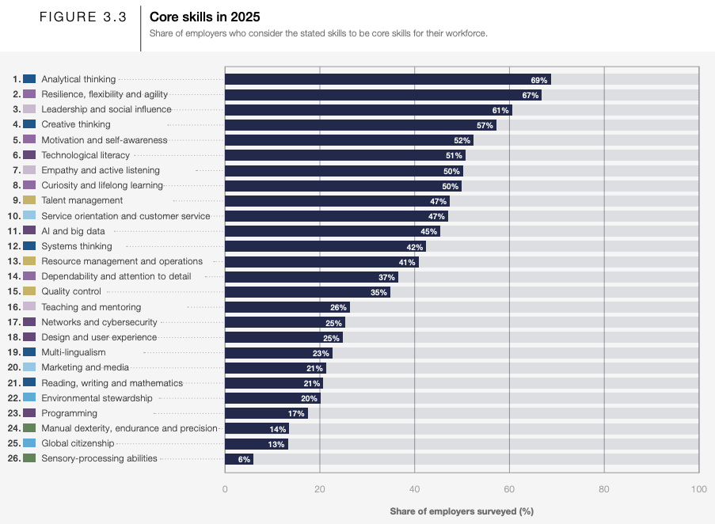
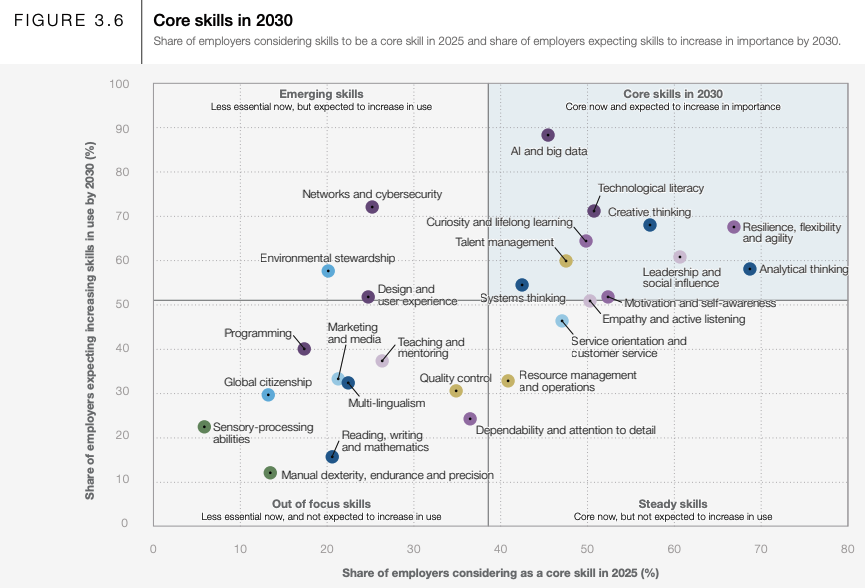

<!-- SELF-INTRO-START -->

_嗨，我是 [黃樺明](https://huam.ing)，喜歡 [寫作](https://huam.ing/writing)、[耐力運動](https://www.strava.com/athletes/huaminghuang)、[用手機寫程式](https://github.com/huaminghuangtw)。Enoughness，剛剛好，是我從 2023 年開始每天練習的生活哲學。每週，我會分享三件有趣的事。如果這封信是朋友轉寄給你的，歡迎 [點此訂閱](https://huam.ing/newsletter)。想看看過往內容？[歷年電子報](https://huam.ing/enoughness) 都在這裡。_

<!-- SELF-INTRO-END -->

---

# 1

國際學生能力評量計畫（Programme for International Student Assessment，PISA）由經濟合作暨發展組織（OECD）主辦，自 2000 年起，每 3 年針對全球各國 15 歲學生進行一次大規模評量，評量內容涵蓋閱讀、數學與科學三大核心素養。

[PISA 不在乎學生是否能複製在校所學，而是評比他們能否從所學中舉一反三，以及在新環境中靈活運用所學知識。](https://youtu.be/7Xmr87nsl74?t=2m39s)

2025 年，PISA 首次加入「數位時代的學習（Learning in the Digital World, LDW）」這個測驗項目。過去，PISA 聚焦在測試學生學習的結果，這是首次將學生學習的過程納入評量範圍。

這個新項目的核心，圍繞的不是學生會不會使用工具，而是能不能「自我調節學習」（Self-Regulated Learning）

What is SRL？自我調解學習指的是…

[PISA 2025 Learning in the Digital World](https://www.oecd.org/en/topics/sub-issues/learning-in-the-digital-world/pisa-2025-learning-in-the-digital-world.html)

在 PISA 2025（國際學生能力評量計劃）中，「數位世界中的學習」（Learning in the Digital World, 簡稱 LDW）被列為該屆的創新領域（Innovative Domain）。

這個評量框架的核心架構與創新機制，有以下幾個關鍵重點：

LDW 的評量主要圍繞著兩個核心維度展開：

1. 自我調節學習（Self-Regulated Learning）
2. 運算與科學探究實踐（Computational & Scientific Inquiry Practices）

In its 2025 cycle, PISA defines learning in the digital world as “the capacity to engage in an iterative and self-regulated process of knowledge building and problem solving using computational tools and practices”.

PISA 2025 將 LDW 定義為「利用運算工具與實踐，參與一個反覆且自主的知識建構與問題解決過程的能力」這裡的「問題解決」是指學生主動利用外部資源來發展個人知識並達成特定目標，而非單純複製現有知識以應對陌生情境 。

The definition recognises learning in a digital world as a self-regulated process that requires learners to be active participants in their learning. It recognises knowledge building and problem solving as particular forms of constructivist learning. In this definition, problem solving does not refer to the reproduction of existing knowledge to an unfamiliar problem situation (as for example in the PISA 2012 definition of problem solving) but rather to the process of using external resources to develop one’s own knowledge and reach a particular goal.

A self-regulated learning cycle also includes a reflective phase, during which learners evaluate their successes or failures to inform their future performance on similar tasks.

There are four main “phases” (see Figure 4): 1) a short introduction to the unit (“Intro”) with discrete pre-test items for students to show what they already know and can do (“Show”); 2) a learning phase in which students work through an embedded tutorial and several interactive, scaffolded tasks (“Learn”); 3) an application phase where they must apply what they learnt in a more open, complex task (“Apply”); and 4) a short reflection phase with self-evaluation questions (“Reflect”).

* **運算思維**：學生具備批判性的元認知意識，能監控自身理解並辨識知識盲區 ；有系統地測試和偵錯運算製品 ；依據環境反饋做出相應行動，並在卡住或面臨反覆負面反饋時表現出適當的求助（help-seeking）行為 。
* **利用運算工具與實踐，參與一個反覆且自主的知識建構與問題解決過程的能力**：學生在反思階段評估自己朝向實現學習目標的進度，以及評估所建構製品相對於任務要求的質量 。
* **監控進度與調適 (Monitor progress and adapt)**：學生管理自身動機與情緒狀態的能力 ；在遭遇困難、挫折、無聊或反覆接收負面反饋時，仍能避免長時間停滯不前或進行無效操作，並主動利用所有可用時間來調整與改善製品 。

**能夠反思自身學習狀況的能力稱為後設認知，這是人類獨有，且 AI 難以學會的能力。**

# 2

世界經濟論壇 (World Economic Forum, WEF) 於 2025 年 1 月發布兩年一度的「[2025年未來工作報告](https://www.weforum.org/publications/the-future-of-jobs-report-2025/)」(The Future of Jobs Report 2025)，

2025 & 2030 十大核心技能

## Core Skills in 2025

The report highlights the specific skills required by workers, ranked by the percentage of surveyed global employers who consider them to be a “core skill” for their workforce:

1. **Analytical thinking** (42%)
2. **Resilience, flexibility and agility** (41%)
3. **Leadership and social influence** (37%)
4. **Creative thinking** (35%)
5. **Motivation and self-awareness** (26%)
6. **Technological literacy** (25%)
7. **Empathy and active listening** (25%)
8. **Curiosity and lifelong learning** (23%)
9. **Talent management** (21%)
10. **Service orientation and customer service** (21%)
11. **AI and big data** (20%)
12. **Systems thinking** (17%)
13. **Resource management and operations** (14%)
14. **Dependability and attention to detail** (13%)
15. **Quality control** (6%)

## Core Skills Outlook for 2030

Looking ahead to 2030, the report evaluates the workforce priorities by categorizing skills into four quadrants based on their current importance and their expected growth or stagnation in use over the five-year horizon:

* **Teaching and mentoring** These skills are already critical to organizations and are projected to solidify their importance even further due to technological advances and workplace transformations:
	* AI and big data
	* Analytical thinking
	* Creative thinking
	* Resilience, flexibility and agility
	* Technological literacy
	* Leadership and social influence
	* Curiosity and lifelong learning
	* Systems thinking
	* Talent management
	* Motivation and self-awareness
* **Networks and cybersecurity** These represent skill sets that are not currently classified as core for most companies but are the top focus areas for building future business capabilities:
	* Networks and cybersecurity
	* Environmental stewardship
* **Design and user experience** These skills remain vital to business operations today but are forecasted to stay relatively stable in their demand over the next five years:
	* Empathy and active listening
	* Service orientation and customer service
	* Resource management and operations
* **Multi-lingualism** While these skills remain important baseline competencies, they represent areas requiring less intensive investment, allowing employers to prioritize resources toward rapidly expanding skill areas instead. Examples include physical abilities like manual dexterity, endurance, and precision

# 3

Taiwanese students consistently rank among the world’s best on the OECD’s PISA test.

[在三個測驗項目均名列世界前五名](https://en.wikipedia.org/wiki/Programme_for_International_Student_Assessment#PISA_2022_ranking_summary)

Taiwan is clearly quite competitive for high test scores, with students often studying and doing homework late into the evening. Anybody who has worked in education here can tell you that. But then students and teachers are mostly focused on weekly test results instead real world use.

PISA 之父 [Andreas Schleicher](https://www.google.com/search?q=Andreas+Schleicher) 在 TED 演講中說：

> [The test of truth in life is not whether we can remember what we’ve learned in school, but whether we’re prepared for change.](https://youtu.be/7Xmr87nsl74?t=3m8s)

Modern economies do not care what you can memorize; they reward what you can actually _do_ with your knowledge in unpredictable, changing environments.

智慧是知識的恰當運用

靈活應對外在環境的變化

教育的目的不在於告訴孩子真理，而在於如何發現真理；不是學會其他人的想法，而是學會想事情的方法。

教育的最終目的是對自己的人生有全盤式的觀點。我們為這個結果承擔責任，同時也為這個結果感到驕傲。

教育讓我們獲取基本知識，但更重要的，教育賦予我們在各種情境中做出判斷的能力，並發揮自己身為人類的全部潛能。

— 樺明
