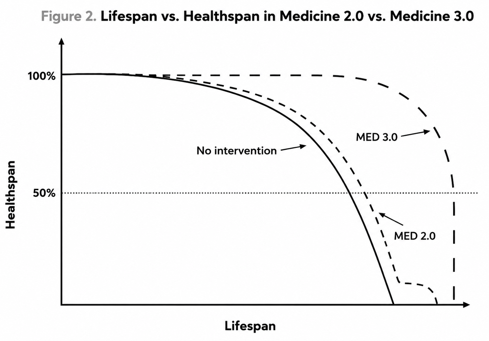

<!-- SELF-INTRO-START -->

_嗨，我是 [黃樺明](https://huam.ing)，喜歡 [寫作](https://huam.ing/writing)、[耐力運動](https://www.strava.com/athletes/huaminghuang)、[用手機寫程式](https://github.com/huaminghuangtw)。Enoughness，剛剛好，是我從 2023 年開始每天練習的生活哲學。每週，我會分享三個讓我不停反思的想法。如果這封信是朋友轉寄給你的，歡迎 [點此訂閱](https://huam.ing/newsletter)。想看看過往內容？[歷年電子報](https://huam.ing/enoughness) 都在這裡。_

<!-- SELF-INTRO-END -->

---

# 1

## 現代四騎士

[Peter Attia](https://www.google.com/search?q=Peter+Attia) 在 **《[超預期壽命](https://www.books.com.tw/products/0011001532)》**（[Outlive: The Science and Art of Longevity](https://www.goodreads.com/book/show/63211112)）提到「[現代四騎士](https://peterattiamd.com/peter-on-the-four-horsemen-of-chronic-disease/)」（The Four Horsemen of Chronic Disease）這個概念。

[世界衛生組織](https://www.google.com/search?q=世界衛生組織) 將它們歸類為「[非傳染性疾病](https://www.who.int/news-room/fact-sheets/detail/noncommunicable-diseases)」（Noncommunicable Diseases，NCDs）— 不會傳染，但會慢慢腐蝕身體：

1. **代謝功能異常**（Metabolic Dysfunction）— 不僅是糖尿病的前奏，更是其他三位騎士的共同源頭，Peter Attia 認為這是最該優先解決的上游問題。
2. **心血管疾病**（Cardiovascular Disease）— 全球頭號殺手。
3. **癌症**（Cancer）— 全球第二號殺手，也是最沉默的騎士。癌細胞可在體內潛伏數十年，毫無症狀，等到有感覺時，往往已到末期 — 這也是為什麼很多人「明明很健康」，卻突然被診斷出癌症。
4. **神經退化性疾病**（Neurodegenerative Disease）— 阿茲海默症、帕金森氏症等。目前無藥可醫，只能預防。

這四名騎士有個共通點：**不會讓我們一下子就死掉，而是慢慢地讓我們死掉。**

更麻煩的是，它們還會**聯手**。

舉例來說，一個人如果長期吃垃圾食物、整天坐著不動，體重就會逐漸增加，心血管負擔也跟著變大，導致心肺功能愈來愈差，氧氣送不到全身各處。當大腦長期缺氧，神經退化的速度就會加快。

[現代四騎士每年帶走超過 4,300 萬條人命，佔全球死亡人數 75% 以上。](https://www.who.int/news-room/fact-sheets/detail/noncommunicable-diseases)

## 醫學 3.0

從古希臘到 19 世紀中葉的醫學 1.0 時代，醫生看病靠 [體液學說](https://www.google.com/search?q=體液學說)（Humorism）— 認為生病是因為體內四種體液失衡。放血，是為了排出過多的體液、讓它們重新恢復平衡。沒有科學驗證，病人只能賭運氣。這時期的人類活不久，死因多半是感染。

19 世紀中葉，[細菌致病學說](https://www.google.com/search?q=細菌致病學說)（Germ Theory of Disease）確立，科學正式走進病房，也是醫學 2.0 的開端。抗生素、疫苗、麻醉、外科手術，讓人類的平均壽命從 40 歲大幅提升至 80 歲。

但醫學 2.0 有個致命傷：**它是「被動」的，死到臨頭才介入** — 心臟病發了才裝支架，癌症轉移了才開始化療。**雖能延長生命，卻伴隨著極差的晚年生活品質。**

這種亡羊補牢的策略已經不管用了，要真正實現長壽 — 所謂**活得久又活得好** — 我們需要換一套思路：**醫學 3.0**。

* 從「被動治療」轉向「主動預防」
* 從「消極等待」改為「積極介入」
* 從「病來了再醫」變成「病來之前就準備好」

醫學 3.0 的目標，是「[方形化生命曲線](https://youtu.be/orFg7At0_mM?t=3m18s)」— 讓健康一直維持在高檔，直到生命最後一刻驟降。

用英國人類學家 [Ashley Montagu](https://www.google.com/search?q=Ashley+Montagu) 的話來說，就是 「[年輕地死去，越晚越好。](https://www.brainyquote.com/quotes/ashley_montagu_103947)」（Die young, as late as possible.）

我曾在日記裡寫下：**我希望在走的那天，還能邊寫日記，邊看最後一次日出，然後行動自如地去跑步、拉單槓、上市場，最後在午休的睡夢中死去。**

對我來說，這才叫「此生足矣」，才是 [人生頂級享受](enoughness-28.md#2)。

歐對了，忘記解釋上圖中「**健康壽命**」（Healthspan）與「**壽命**」（Lifespan）的差別：

* X 軸：壽命（Lifespan）＝活到幾歲。
* Y 軸：健康壽命（Healthspan）＝「健康地」活到幾歲。

Peter Attia 相信，延長 Healthspan 比延長 Lifespan 更重要 — 活得久，不如活得好。

# 2

2022 年 9 月 6 日，英國女王 [伊莉莎白二世](https://www.google.com/search?q=伊莉莎白二世)（Queen Elizabeth II）[離世前兩天，仍堅守崗位、任命新任首相](https://www.google.com/search?q=伊莉莎白二世+過世前+工作)。

健康壽命（Healthspan）＝壽命（Lifespan），完美。

Peter Attia 在一篇關於「[邊際十年](https://peterattiamd.com/marginal-decade-spotlights/)」（Marginal Decade）的文章中寫道：

> 眼科醫師 [Mathea Allansmith](https://www.google.com/search?q=Mathea+Allansmith) 46 歲才開始跑步，從每天 2 英里慢慢累積，6 年後完賽波士頓馬拉松，並在 92 歲高齡，以 11 個多小時 [完成](https://www.instagram.com/womensrunningcommunity/reel/CwOrky4MF6f/) Honolulu 馬拉松，成為史上最年長的女性完賽者。

所以 Attia 提出了一個反向工程的思維框架——**「百歲運動員」（The Centenarian Decathlon）**：為了在生命最後十年仍能維持高品質的生活，先定義那時想要具備的能力，再反推現在需要達到的體能標準。

**百歲運動員 (The Centenarian Decathlon)**

這是一個反向工程的思維框架。為了在生命最後十年（例如 90 或 100 歲）仍能維持高品質的生活，我們必須定義那時想要具備的能力，並以此推導出現在需要達到的體能標準 [17] 。

**■ 概念核心**

大多數人隨著年齡增長，體能會自然衰退（每年約 1-2%）。如果你希望在 80 歲時能抱起孫子（約 13 公斤），你不能等到 80 歲才開始訓練。考慮到肌力和骨密度的自然流失，你現在（40 或 50 歲）可能需要能輕鬆抱起 25 公斤甚至更重，才能為未來的衰退預留緩衝空間。

**項目清單**

阿提亞建議每個人從約 50 個項目中挑選 10 - 15 項作為自己的**「百歲十項全能」**目標。這些項目涵蓋了日常生活所需的關鍵動作：

1. **防跌倒能力**：從地板上站起來，僅使用一隻手支撐（或不支撐）
2. **核心與下肢力量**：從深蹲姿勢抱起一個 30 磅（約 13.6 公斤）的小孩
3. **上肢與肩部穩定性**：將 20 磅（約 9 公斤）的行李箱舉過頭頂放入置物櫃
4. **握力與負重行走**：雙手各提 5 磅雜貨走五個街區（農夫走路）
5. **心肺耐力**：在 3 分鐘內爬四層樓梯，且不會氣喘如牛
6. **平衡感**：單腳站立閉眼 15 秒
7. **爆發力**：連續跳繩 30 下
8. **生活技能**：能在崎嶇山路上徒步 1.5 英里；能夠自行開罐頭（握力）；能夠享受性生活 [18]

# 3

在阿提亞醫師的長壽藥箱中，運動被視為最強效、覆蓋面最廣的「藥物」。沒有任何一種藥物能像運動一樣，同時對四大騎士產生如此顯著的預防效果。醫學 3.0 將運動視為一種需要精確劑量、頻率和強度的處方

運動就算沒有養成運動習慣，也不能讓不動變成習慣

* Do not have a sedentary lifestyle
* Sitting is new smoking.
* Move your body to create energy, and use your energy to create more of it.
	* The more time you spend sitting on the couch, the lazier you’ll get.
	* The more you move, the more energetic you feel.
* Our body is made to move — Move as much as you can throughout the day.
* Stop living in a box: Most people get up in the morning, eat breakfast out of a box, go into a box office, use a box elevator, do their work on a box, talk on a box, go into a box room for meetings, and in the evening, they turn the box on.
* Never sit still for more than 45 minutes.

Don’t Underestimate the Power of Micro Exercises

<https://huam.ing/this-shortcut-got-me-to-exercise-every-single-day>

<https://shosho.tw/blog/vilpa-easy-exercise-strategy/>

**運動的四大支柱**

為了實現百歲運動員的目標，訓練計畫必須涵蓋四個維度：有氧效率（Zone 2）、最大有氧能力（VO2 Max）、肌力（Strength）和穩定性（Stability）。

**● 支柱一：有氧效率 (Zone 2 Training)**

這是有氧代謝的基礎。

**定義：**

Zone 2 是指運動心率維持在最大心率的 60% - 70% 區間。這是一個「最高的可持續有氧輸出」狀態。在此強度下，**身體主要燃燒脂肪作為燃料**，並且乳酸的產生量與清除量達到平衡。

**判斷標準：**

如果不使用乳酸儀，可以用穿戴式裝置的運動心率來判斷，Zone2 的運動心率在你的最大心率的 60% ~ 70% 區間。

**生理效益：**

Zone 2 訓練能極大化粒線體的數量和效率（Mitochondrial efficiency），提高胰島素敏感度，降低靜止心率，並建立強大的代謝靈活性。它是長壽金字塔的底座。

**處方：**

建議每週進行 3-4 小時，分為 3-4 次，每次至少 45-60 分鐘。單次時間過短無法有效刺激粒線體適應 。

**● 支柱二：最大攝氧量 (VO2 Max)**

這是心肺功能的極限指標，與全因死亡率呈現最強的負相關。

**數據支持**：將 VO2 Max 從「低」（後 25%）提升到「低於平均」（25-50%），可降低 50% 的死亡風險。若能提升到「菁英」水平（前 2.5%），死亡風險可降低 5 倍以上。這比戒菸帶來的生存優勢還要巨大 [19]。

[https://jamanetwork.com/journals/jamanetworkopen/fullarticle/2707428](https://jamanetwork.com/journals/jamanetworkopen/fullarticle/2707428)

**訓練方法：**

高強度間歇訓練 (HIIT)。阿提亞常用的方案也是風哥常用的方案是 4 x 4：全力運動 4 分鐘（達到最大心率的 90-95%），然後動態恢復 4 分鐘，重複 4 - 6 組。

**頻率：**

建議**每週進行 1 次**，作為 Zone 2 的補充。

**● 支柱三：肌力 (Strength)**

肌肉是長壽的「儲蓄帳戶」和「護甲」。

**肌少症 (Sarcopenia)：**

隨著年齡增長，肌肉流失是不可避免的。肌肉流失會導致代謝率下降、跌倒風險增加和骨質疏鬆。

**關鍵訓練領域**

**握力 (Grip Strength)：**

不僅是手部力量，更是全身神經肌肉連結的代理指標。

**● 支柱四：穩定性 (Stability)**

穩定性常被忽視，卻是所有運動的基礎。

**定義：**

穩定性不僅是平衡感，而是神經肌肉控制能力——將力量安全地從身體一部分傳遞到另一部分的能力。如果沒有穩定性，強大的肌力只會導致受傷（就像在獨木舟上發射大砲）。

超慢跑達人、銀髮族/樂齡族訓練專家、體育教官：[徐棟英](https://www.google.com/search?q=徐棟英)

> 寧可在瑜珈墊上多流汗，也不要在病床上流眼淚。

---

**現在就是起點**

The last decade of your life is being decided right now.

好消息是，面對這些現代四騎士，我們不是只能束手無策。運動、飲食、睡眠、情緒管理——這些方法聽起來老生常談，但它們確實是最有效的武器。只是這些疾病在初期完全沒有症狀，等到有感的時候，常常已經進入中晚期了。

Peter 在書中反覆強調一個觀念：被動等待的代價是巨大的。因為心血管疾病、癌症這些慢性病，潛伏期長達幾十年 — 你以為的「沒事」，只是還沒爆發而已。

預防的關鍵，就是提早開始。他認為 30 歲，甚至更年輕，就該開始主動管理自己的健康。

每個人的身體都不一樣。醫學 3.0 不相信「平均值的建議」——你的身體很獨特，該根據自己的數據和生活目標，設計專屬的干預策略。

個人化（Hyper-personalization）：醫學 3.0 承認每個個體的生化獨特性。它不依賴平均值，而是基於個人的基因組學、代謝數據、生理指標和生活目標，量身定制策略。

改變生活習慣

只要更早介入，主動採取行動，遵守運動、飲食、睡眠、情緒、藥物等簡單又基本的戰術，就能夠對抗慢病四騎士。

好消息是，對付這些四騎士的方法一點都不神秘：運動、飲食、睡眠、情緒管理。老生常談，但確實有效。

《[超預期壽命](https://peterattiamd.com/outlive/)》這本書傳遞的最重要訊息是：**不要等待**。動脈硬化的斑塊、癌細胞的突變、神經元的退化，都不是在一夜之間發生的，而是在我們感覺「健康」的數十年間悄然累積。

> 我認為人們在停止思考未來時就開始變老。如果你想知道一個人的真實年齡，去聽他們說話。如果他們談論的是過去、以及自己曾經做過的所有事情，那麼他們已經變老了。如果他們談論的是夢想、抱負，以及依然滿懷期待的事物 — 那麼他們依舊年輕。
>
> “I think people get old when they stop thinking about the future,” Ric told me. “If you want to find someone’s true age, listen to them. If they talk about the past and they talk about all the things that happened that they did, they’ve gotten old. If they think about their dreams, their aspirations, what they’re still looking forward to — they’re young.”

> 人們不是因為變老而停止追夢，而是因為停止追夢才變老。
>
> “It is not true that people stop pursuing dreams because they grow old, they grow old because they stop pursuing dreams.” — Gabriel García Márquez

— 樺明
