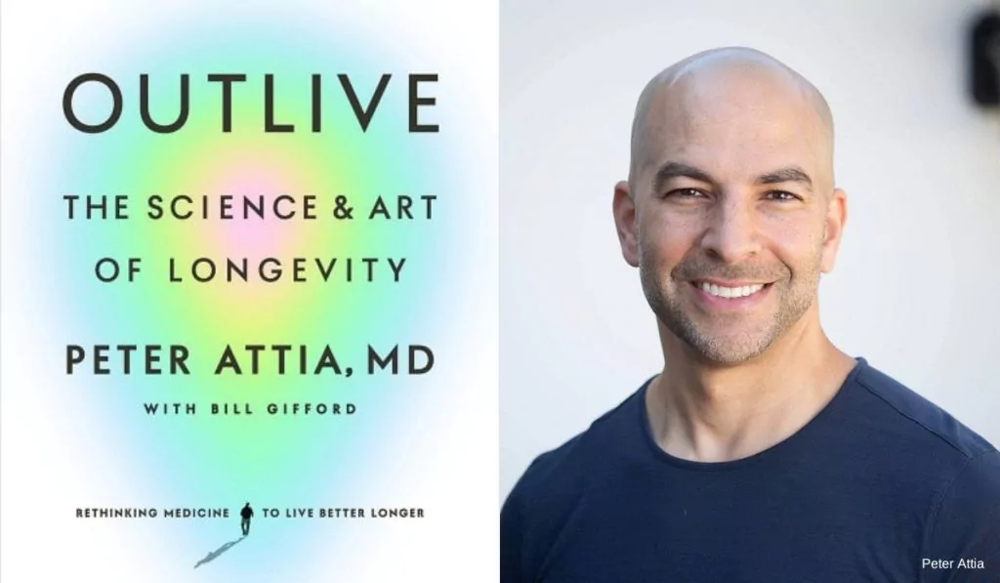
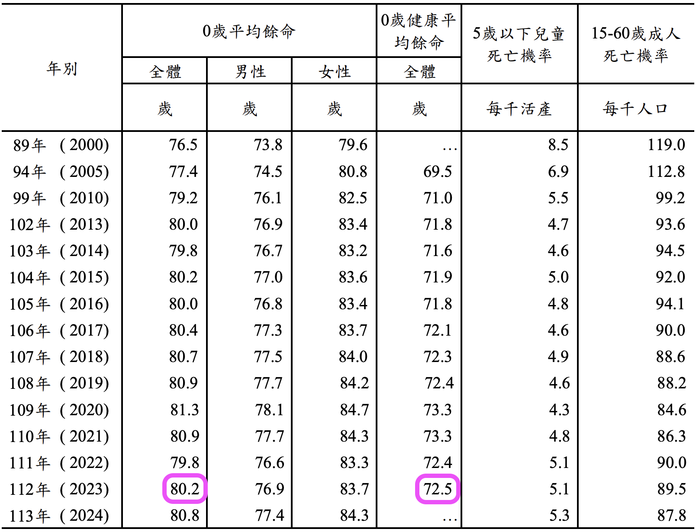
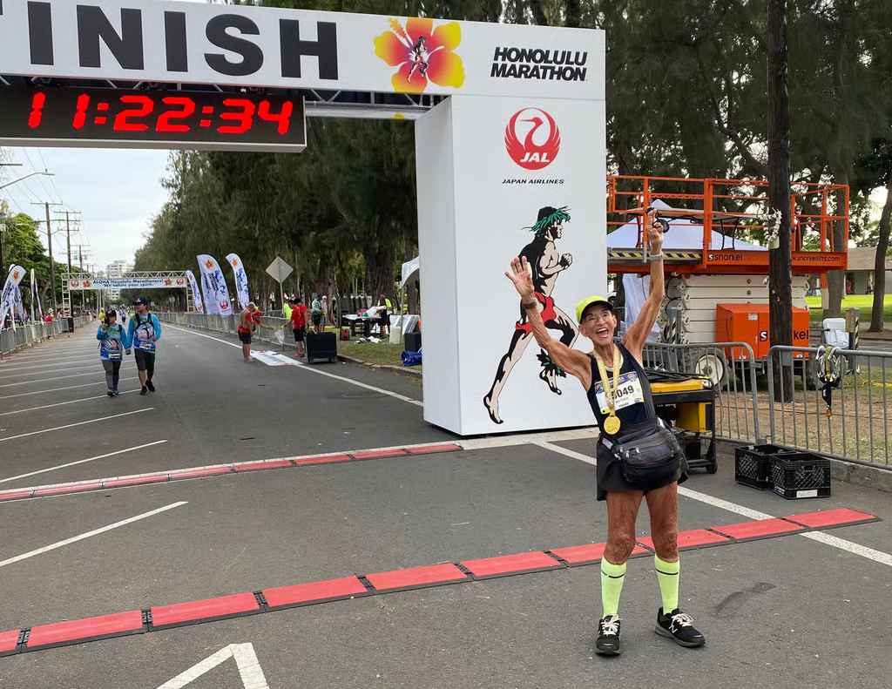
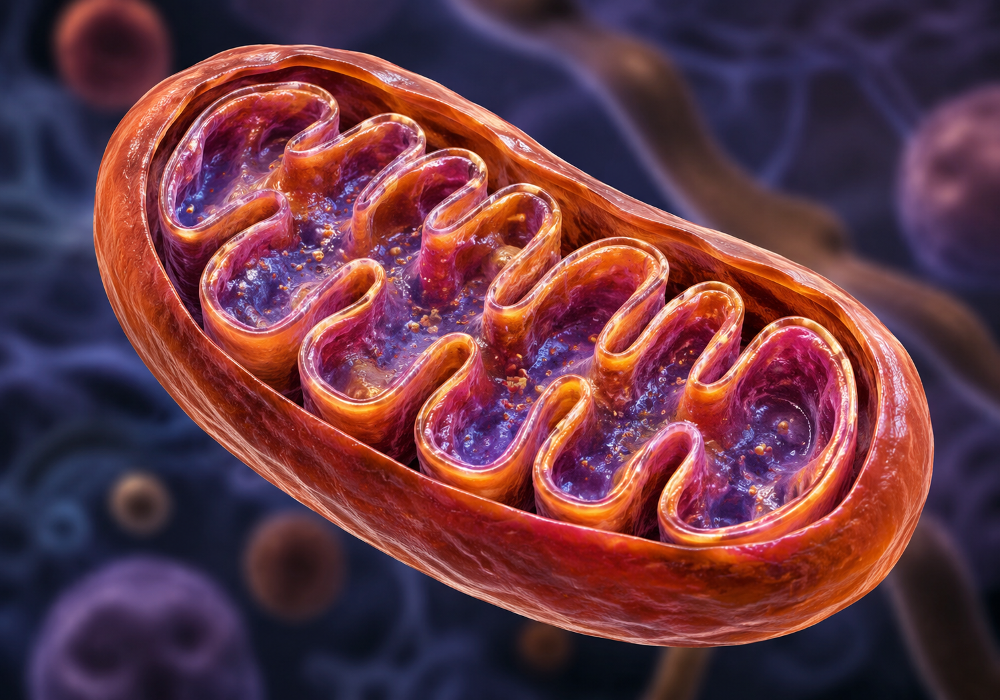

<!-- SELF-INTRO-START -->

_嗨，我是 [黃樺明](https://huam.ing)，喜歡 [寫作](https://huam.ing/writing)、[耐力運動](https://www.strava.com/athletes/huaminghuang)、[用手機寫程式](https://github.com/huaminghuangtw)。Enoughness，剛剛好，是我從 2023 年開始每天練習的生活哲學。每週，我會分享三個讓我不停反思的想法。如果這封信是朋友轉寄給你的，歡迎 [點此訂閱](https://huam.ing/newsletter)。想看看過往內容？[歷年電子報](https://huam.ing/enoughness) 都在這裡。_

<!-- SELF-INTRO-END -->

---

# 1

## 現代四騎士

長壽醫學權威 [Peter Attia](https://www.google.com/search?q=Peter+Attia) 在 《[超預期壽命](https://www.books.com.tw/products/0011001532)》（[Outlive: The Science and Art of Longevity](https://www.goodreads.com/book/show/63211112)）提到「[現代四騎士](https://peterattiamd.com/peter-on-the-four-horsemen-of-chronic-disease/)」（The Four Horsemen of Chronic Disease）這個概念。

[世界衛生組織](https://www.google.com/search?q=世界衛生組織) 將它們歸類為「[非傳染性疾病](https://www.who.int/news-room/fact-sheets/detail/noncommunicable-diseases)」（Noncommunicable Diseases，NCDs）— 不會傳染，但會慢慢腐蝕身體：

1. **代謝功能異常**（Metabolic Dysfunction）：糖尿病的前奏，也是其他三位騎士的共同源頭。
2. **心血管疾病**（Cardiovascular Disease）：全球頭號殺手。
3. **癌症**（Cancer）：全球第二號殺手，也是最沉默的騎士。癌細胞可在體內潛伏數十年，毫無症狀，等到有感覺時，往往已到末期 — 這也是為什麼許多人「明明很健康」，卻突然被診斷出癌症。
4. **神經退化性疾病**（Neurodegenerative Disease）：[阿茲海默症](enoughness-34.md#3)、[帕金森氏症](https://www.google.com/search?q=帕金森氏症) 等。目前無藥可醫，只能預防。

這四名騎士有個共通點：**不會讓我們一下子就死掉，而是慢慢地讓我們死掉。**

更麻煩的是，它們還會**聯手**。

舉例來說，一個人如果長期吃垃圾食物、整天坐著不動，體重就會逐漸增加，心血管負擔也跟著變大，導致心肺功能愈來愈差，氧氣送不到全身各處。當大腦長期缺氧，神經退化速度就會加快。

[現代四騎士每年帶走超過 4,300 萬條人命，佔全球死亡人數 75% 以上。](https://www.who.int/news-room/fact-sheets/detail/noncommunicable-diseases)

## 醫學 3.0

從古希臘到 19 世紀中葉的醫學 1.0 時代，醫生看病靠 [體液學說](https://www.google.com/search?q=體液學說)（Humorism）— 認為生病是因為體內四種體液失衡。放血，是為了排出過多的體液、讓它們重新恢復平衡。沒有科學驗證，病人只能賭運氣。這時期的人類活不久，死因多半是感染。

19 世紀中葉，[細菌致病學說](https://www.google.com/search?q=細菌致病學說)（Germ Theory of Disease）確立，科學正式走進病房，也是醫學 2.0 的開端。抗生素、疫苗、麻醉、外科手術，讓人類的平均壽命從 40 歲大幅提升至 80 歲。

但醫學 2.0 有個致命傷：**它是「被動」的，死到臨頭才介入** — 心臟病發了才裝支架，癌症轉移了才開始化療。**雖能延長生命，卻伴隨著極差的晚年生活品質。**

這種亡羊補牢的策略已經不管用了，要實現長壽 — 所謂**活得久又活得好** — 我們需要換一套系統：**醫學 3.0**。

* 從「被動治療」轉向「主動預防」
* 從「消極等待」改為「積極介入」
* 從「病來了再醫」變成「病來之前就準備好」

Attia 認為，30 歲，甚至更年輕，就該開始主動管理自己的 [健康](https://huam.ing/tags/健康)。

醫學 3.0 的目標，是「[方形化生命曲線](https://youtu.be/orFg7At0_mM?t=3m18s)」— 讓健康一直維持在高檔，直到生命最後一刻驟降。

套用人類學家 [Ashley Montagu](https://www.google.com/search?q=Ashley+Montagu) 的話，就是：

> [年輕地死去，越晚越好。](https://www.brainyquote.com/quotes/ashley_montagu_103947)
>
> Die young, as late as possible.

》")

我曾在日記寫下：**我希望在走的那天，還能邊寫日記，邊看最後一次日出，然後行動自如地去 [跑步](https://www.marathonsworld.com/artapp/mywall.php?uid=963161)、拉單槓、上市場，最後在午休的睡夢中死去。**

對我來說，這才叫「此生足矣」，才稱得上是 [人生頂級享受](enoughness-28.md#2)。

忘記解釋上圖中，Lifespan 與 Healthspan 的差別了：

* X 軸：Lifespan＝壽命＝活到幾歲。
* Y 軸：Healthspan＝健康壽命＝健康地活到幾歲。

Peter Attia 相信，**延長 Healthspan 比延長 Lifespan 更重要 — 活得久，不如活得好**。

英國女王 [伊莉莎白二世](https://www.google.com/search?q=伊莉莎白二世) 就是最好的寫照：

2022 年 9 月 6 日，[離世前兩天，她仍堅守崗位、任命新任首相](https://www.google.com/search?q=伊莉莎白二世+過世前+工作)。

Healthspan＝Lifespan，完美 💯

# 2

有一天早上，你坐在家門口的椅子上曬太陽。

**90 歲的你，希望自己還能做哪些事？**

從地上把孫子抱起來？提著菜籃走去市場？爬四層樓回家？還是打開一個罐頭都不成問題？

把答案寫下來，然後思考：

* 為了實現這些項目，今天的你，需要採取哪些具體行動？
* 為了在最後十年還能維持高生活品質，現在的你，需要達到哪些體能水準？

以下是 Peter Attia 的「[百歲十項全能](https://lifestylemedicine.stanford.edu/how-to-build-your-own-centenarian-decathlon/)」（Centenarian Decathlon）清單：

1. 在崎嶇山路上徒步 2 公里
2. 從地板上站起來，僅用 1 隻手支撐（甚至不支撐）
3. 用深蹲姿勢，抱起 13 公斤的小孩
4. 雙手各提 2 公斤雜貨，走 5 個街區（[農夫走路](https://www.google.com/search?q=農夫走路)）
5. 將 9 公斤行李箱舉過頭頂，放入置物櫃
6. 單腳站立，閉眼 15 秒（[樹式](https://www.google.com/search?q=樹式)）
7. 享受性生活
8. 在 3 分鐘內爬 4 層樓梯，並且不會氣喘如牛
9. 自行開罐頭（[握力](https://www.google.com/search?q=握力)）
10. 連續跳繩 30 下

根據衛生福利部的 [統計](https://dep.mohw.gov.tw/DOS/cp-5083-55378-113.html)，2023 年台灣人的平均壽命為 80.2 歲，其中平均健康壽命為 72.5 歲，代表許多人活到七、八十，最後七、八年卻是 [在病床上度過](enoughness-3.md#2) 的！（我的老天鵝 🤦🏽

在一篇關於「[邊際十年](https://peterattiamd.com/marginal-decade-spotlights/)」（Marginal Decade）的文章中，Peter Attia 寫道：

> 眼科醫師 [Mathea Allansmith](https://www.google.com/search?q=Mathea+Allansmith) 46 歲才開始跑步，從每天 2 英里慢慢累積，6 年後完賽波士頓馬拉松，並在 92 歲高齡，以 11 個多小時 [完成](https://www.instagram.com/womensrunningcommunity/reel/CwOrky4MF6f/) Honolulu 馬拉松，成為史上最年長的女性完賽者。

**人生最後十年，你想要怎麼過呢？**

# 3

Attia 醫師說，[運動](enoughness-22.md#2) 是最強效、覆蓋面最廣的「藥物」。

沒有任何一顆藥丸像運動一樣，能同時對抗代謝異常、心血管疾病、癌症和神經退化這 [四大騎士](#現代四騎士)。

他把運動拆成四大支柱：

## 一、有氧效率（Zone 2）

[Zone 2](https://peterattiamd.com/category/exercise/aerobic-zone-2-training/) 是一種運動強度，大概落在 [最大心率](https://www.google.com/search?q=最大心率) 的 60–70%。

如果把身體想像成一台車，Zone 2 訓練的是這台車的引擎效率 — 同樣一公升汽油可以跑多遠？

用 [運動科學](https://www.google.com/search?q=運動科學) 的行話解釋，Zone 2 讓身體學會更有效率地燃燒脂肪，而不是動不動就靠血糖應急。在這個區間，身體主要用脂肪當燃料。

引擎的核心零件是 [粒線體](https://www.google.com/search?q=粒線體)（Mitochondrion）— 人體細胞的「發電廠」。

（對，就是國中生物課本裡面，長得像毛毛蟲的那個東西 🐛）

Zone 2 可以增加粒線體數量；粒線體越多，新陳代謝能力越好；新陳代謝能力越好，壽命就越長。**Zone 2 是長壽金字塔的底座。**

但有氧引擎不是一天練成的。**粒線體的成長，是以「年」為單位。因此，持之以恆是關鍵。**

如果沒有穿戴式裝置，要如何知道自己在 Zone 2 呢？可以用以下方式判斷：

1. **呼吸檔位法** — Zone 2 讓你在運動全程可以只 [用鼻子呼吸](enoughness-30.md#2)；如果想用嘴巴呼吸，表示強度過高。
2. **[自覺強度法](https://www.google.com/search?q=自覺運動強度)** — Zone 2 讓你在運動全程可以和別人「喇低賽」，或是跟對面的跑友微笑；有點喘，但還能聊天。

多練習，多 [覺察](enoughness-27.md#1)，你就會抓到那個「體感」。

---

以前，我總覺得隔天要肌肉痠痛，才算有練到。畢竟，我們台灣囡仔不是塑膠做的，「吃苦當吃補」是我們的天性。慢下來？不是偷懶是什麼？

後來發現很多頂尖運動員，像 [Tadej Pogačar](https://www.google.com/search?q=Tadej+Pogačar+Zone+2) 和 [Eliud Kipchoge](https://www.google.com/search?q=Eliud+Kipchoge+Zone+2)，會把**大部分訓練時間都花在 Zone 2。**

得知這個職業選手的秘密後，[我才知道自己錯了](enoughness-15.md#1)，而且錯得很離譜。

做 Zone 2 訓練的時候，最難的是控制自己「想要加速」的衝動。身體會不斷告訴你「再快一點」，但你不能。你得學會習慣那種「好像沒練到」的感覺。

請記得：**低強度，才能刺激粒線體生長。粒線體是在持續、穩定、輕鬆的節奏中，慢慢長大的。**

P.S. 想更深入認識 Zone 2 訓練？可以看張修修的 [這支影片](https://youtu.be/yC5Hgm5tJ0U)。祝我們都成為粒線體富翁！🤑

## 二、最大攝氧量（VO2 Max）

Zone 2 是地基，但光有地基不夠，還需要知道屋頂在哪裡。

[最大攝氧量（VO2 Max）](https://peterattiamd.com/category/exercise/high-intensity-zone-5-training/) 大概落在 [最大心率](https://www.google.com/search?q=最大心率) 的 85–95%，代表身體在一分鐘內能運送、吸收、使用多少氧氣。數字越高，引擎越大顆。

我自己常用兩種方法來練：

1. **[挪威 4×4](https://www.google.com/search?q=挪威+間歇+訓練)**：用力 4 分鐘，慢跑恢復 3 分鐘 — 這樣算 1 組，總共做 4 組。
2. **[30/30 衝刺](https://www.google.com/search?q=30/30+衝刺+Billat+Intervals)**：找一個短上坡，用力 30 秒，慢跑下坡當恢復，重複 5 次，休息 5 分鐘 — 這樣算 1 組，總共做 3 組。

這兩種 [高強度間歇訓練](https://www.google.com/search?q=高強度間歇訓練)（High-Intensity Interval Training，HIIT），每週做 1 次就夠了。高強度對身體的衝擊很大，記得先花至少 10–20 分鐘 **[動態熱身](https://www.google.com/search?q=動態熱身)**，再開始衝。

還有一個重點：**每趟強度要保持一樣**。如果最後一趟明顯失速，代表第一趟用力過猛。

千萬別跟我一樣，把「用力」看成「全力」，每趟都跑到快吐了才甘願。這樣身體會被操壞，不是長久之計喔～！🙅‍♂️

## 三、肌力（Strength）

《[超預期壽命](https://www.books.com.tw/products/0011001532)》有一段話：

> 未來三、四十年，你的肌力會以每十年 8–17% 的速度衰退。如果你希望 80 歲還能抱起 13 公斤的孫子，你現在要能穩定地舉起 23–25 公斤。
>
> Over the next thirty or forty years, your muscle strength will decline by about 8 to 17 per­cent per decade—accelerating as time goes on. So, if you want to pick up that thirty-pound grandkid or great-grandkid when you’re eighty, you’re going to have to be able to lift about fifty to fifty-five pounds now. Without hurting yourself. Can you do that?

[肌力](https://peterattiamd.com/category/exercise/strength-muscle-mass/) 是長壽的儲蓄帳戶，趁年輕多存一點，老的時候才有得領。

[鍛鍊肌力](enoughness-7.md#3)，其實不一定要花錢上健身房，在家裡就能徒手練功。

幾個我常做的動作：

1. [橋式](https://www.google.com/search?q=橋式)
2. [哥薩克深蹲](https://www.google.com/search?q=哥薩克深蹲)
3. [反向弓箭步](https://www.google.com/search?q=反向弓箭步)

肌力訓練也不一定要特地騰出時間，直接融入日常生活就好：

* 爬樓梯時，只踩前半段腳掌，讓腳跟懸空 — 每一步都在練小腿。
* 買完菜後，雙手提著購物袋走回家（或是提水桶）— 握力、核心、手臂，一次練完（aka [農夫走路](https://www.google.com/search?q=農夫走路)）。
* 蹲下去搬箱子、抱小孩 — 每次都是硬舉。但要記得三件事：**先靠近，再蹲下，背打直**。[這種姿勢對脊椎的負擔，比直接彎腰搬小很多](https://www.reddit.com/r/Damnthatsinteresting/comments/14tsbrf/a_simple_toy_demo_shows_the_effect_of_lifting/)。

## 四、穩定性（Stability）

[穩定性](https://peterattiamd.com/category/exercise/stability/) 是汽車的底盤、是所有運動和生活動作的基礎。

幾個我常做的核心訓練：

1. [捲腹](https://www.google.com/search?q=捲腹)
2. [死蟲式](https://www.google.com/search?q=死蟲式)
3. [棒式抬腿](https://www.google.com/search?q=棒式抬腿)
4. [膝蓋碰手肘](https://www.google.com/search?q=膝蓋碰手肘)
5. [仰臥交替摸腳跟](https://www.google.com/search?q=仰臥交替摸腳跟)

# 4

《[超預期壽命](https://www.books.com.tw/products/0011001532)》主要想傳遞的訊息是：**不要等待**。

心血管疾病、癌症、糖尿病這些慢性病，都不是一夜造成的，而是在自我感覺「很健康」的那幾十年裡，一點一點地累積。你以為的沒事，只是還沒爆發而已。

好消息是，對付 [現代四騎士](#現代四騎士)，只需要 _立刻_ 改變生活習慣：[運動](https://huam.ing/tags/運動)、[飲食](https://huam.ing/tags/飲食)、[睡眠](https://huam.ing/tags/睡眠)、[情緒管理](https://huam.ing/tags/情緒管理) — 老生常談，但確實有效。

我一直把 [超慢跑](https://www.google.com/search?q=超慢跑) 達人 [徐棟英](https://www.google.com/search?q=徐棟英) 教官的一句話放在心上：

> 寧願在瑜珈墊上多流汗，也不要在病床上流眼淚。

[七、八年的臥病時光，對自己和家人都是折磨。不想度過所有人都覺得你是累贅的七、八年，真的不能再拖了。](#2)

誰不想要：

* 55 歲時，還能騎腳踏車、游泳、跑馬拉松。
* 65 歲時，有體力和熱情去探索一個陌生的國度。
* 75 歲時，散步、爬樓梯、打掃家裡，不會氣喘吁吁。
* 85 歲時，清醒地聽誰邊的人說話、把孫子從地上抱起來。

**這就是你現在運動的原因：Healthspan＝Lifespan。**

讓自己到了那個年紀，可以選擇要怎麼生活，而不是被生活選擇。

**現在就是起點，你的人生最後十年，正在被現在決定。**

最後，我想分享兩段我很喜歡的話：

> 人在停止思考未來時，就開始變老。如果你想知道一個人的真實年齡，去聽他們說話：如果他們談論的是過去，以及自己曾經做過的事，那他們已經老了；如果他們談論的是夢想、抱負、憧憬，以及滿懷期待的事物，那他們依舊年輕。
>
> [“I think people get old when they stop thinking about the future,” Ric told me. “If you want to find someone’s true age, listen to them. If they talk about the past and they talk about all the things that happened that they did, they’ve gotten old. If they think about their dreams, their aspirations, what they’re still looking forward to — they’re young.](https://www.goodreads.com/quotes/11621282-i-think-people-get-old-when-they-stop-thinking-about)

> 人不是因為變老才停止追夢，而是因為停止追夢才變老。
>
> [It is not true that people stop pursuing dreams because they grow old, they grow old because they stop pursuing dreams.](https://www.goodreads.com/quotes/174092-it-is-not-true-that-people-stop-pursuing-dreams-because)

— 樺明
