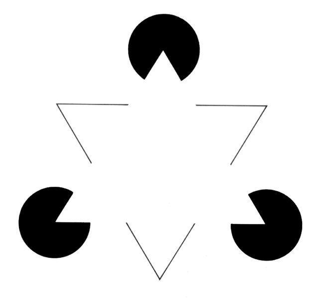
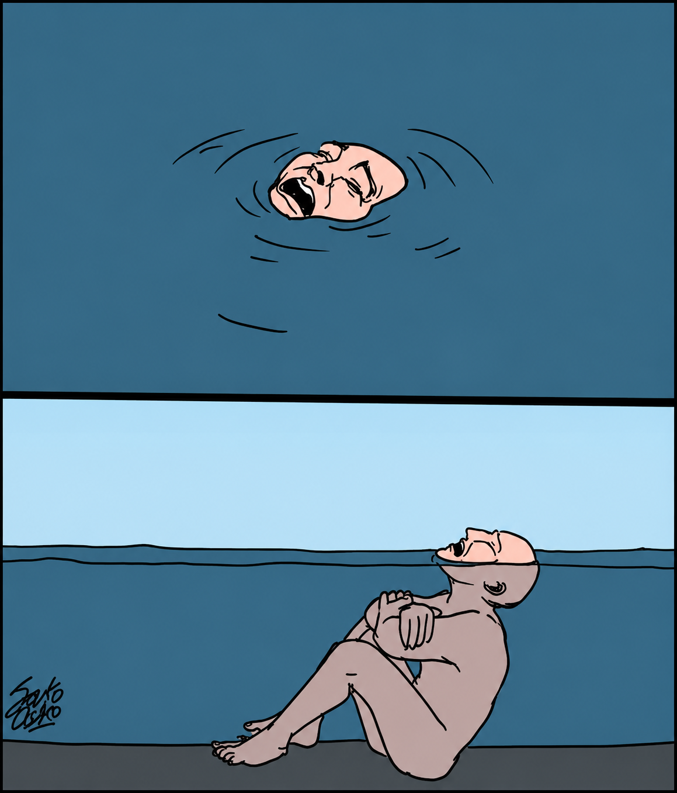

<!-- SELF-INTRO-START -->

_嗨，我是 [黃樺明](https://huam.ing)，喜歡 [寫作](https://huam.ing/writing)、[耐力運動](https://www.strava.com/athletes/huaminghuang)、[用手機寫程式](https://github.com/huaminghuangtw)。Enoughness，剛剛好，是我從 2023 年開始每天練習的生活哲學。每週，我會分享三個讓我不停反思的想法。如果這封信是朋友轉寄給你的，歡迎 [點此訂閱](https://huam.ing/newsletter)。想看看過往內容？[歷年電子報](https://huam.ing/enoughness) 都在這裡。_

<!-- SELF-INTRO-END -->

---

# 1

有一段時間我很喜歡看小朋友的書，常常跑去 [高雄市立總圖](https://www.google.com/maps?q=高雄市立圖書總館) 地下一樓的 [兒童繪本中心](https://www.google.com/search?q=國際繪本中心) 窩一個下午。

某次，我看到有個小孩把一整疊書亂丟在地上，年輕爸爸生氣地說：

> 你真的很沒秩序！

這是**暴力溝通** — 年輕爸爸說的是「我覺得你是什麼」，是 _主觀_ 假設。

如果換個方式說呢？

> 我看到地板上的繪本沒有收好，它們還沒回到該放的位置。

這是**非暴力溝通** — 年輕爸爸說的是「我看到什麼」，是 _客觀_ 事實。

美國心理學家 [Marshall Rosenberg](https://www.google.com/search?q=Marshall+Rosenberg) 在《[非暴力溝通](https://www.books.com.tw/products/0010831754)》（[Nonviolent Communication](https://www.goodreads.com/work/quotes/2766138-nonviolent-communication-a-language-of-life---life-changing-tools-for-h)）提到一個框架：

1. **觀察**：說出你看到的客觀事實，不加評論
2. **感受**：表達情緒，而不是意見或想法
3. **需要**：連結到內心哪個需要沒被滿足
4. **請求**：提出具體可行的行動，而不是模糊的要求

回頭看圖書館的場景。如果這位爸爸在開口前先緩下來，套用這四個步驟，他可能會這樣說：

> 我看到地板上的繪本沒有收好，它們還沒回到該放的位置。（觀察）
>
> 我有點困擾，圖書館是大家共用的空間，希望我們能一起維護。（感受＋需要）
>
> 可以請你把它們撿起來放回書架上嗎？（請求）

看出差別了嗎？

「你真的很沒秩序」是一個**身分標籤**。孩子聽到的不是「我做了什麼」，而是「我是什麼」。

非暴力溝通剛好相反。它說的是可以改變的行為 — 孩子只需要去把書撿起來。

更重要的是，非暴力溝通讓孩子有機會理解行為背後的原因 — 圖書館是公共空間，要尊重他人權利。

當孩子長期處在這樣的溝通環境，不知不覺會內化這個流程：**先觀察，說出感受，連結需要，最後提出請求**。

而這，或許是為人父母能給孩子最珍貴的 [禮物](https://huam.ing/ted-taipei-2025) 之一。

# 2

[大腦](enoughness-31.md#1) 喜歡填補未知資訊。

看到「台大醬料」，自動讀成「台大醫科」。

圖片缺了一部分，還是看到完整的三角形。

有時候，大腦還會自己編故事：

* 對方已讀不回 → _假設_ 他在生氣。
* 同事沒打招呼 → _假設_ 他討厭我。
* 老闆沒稱讚你 → _假設_ 他很不滿。

又或者，主管傳來一句：

> 明天來找我一下。

結果自己腦補：

> 要被罵了……
>
> 要被裁員了……
>
> 我搞砸什麼了……

隔天，主管笑著說：

> 你最近做得不錯，想跟你談升遷。

古羅馬哲學家 [Seneca](https://www.google.com/search?q=Seneca) 曾說：

> 我們在想像中受苦，遠比現實中受苦還要多。
>
> We suffer more in imagination than in reality.

假設之所以痛苦，是因為我們把自己編的故事當成事實，然後為它受苦。

《[打破人生幻鏡的四個約定](https://www.books.com.tw/products/0011003800)》（[The Four Agreements](https://www.goodreads.com/work/quotes/376130-the-four-agreements-a-practical-guide-to-personal-freedom)）中第三個約定：

> 不要預設立場。
>
> Don’t make assumptions.

作者進一步說：

> 我們之所以會做出各種假設，是因為沒有勇氣提問 🙋🏽
>
> We make all sorts of assumptions because we don’t have the courage to ask questions.

為什麼呢？

* 因為提問等於承認自己不知道；假設可以假裝已經懂了。
* 因為提問後還要等答案；假設能馬上結束不確定感。
* 因為提問需要勇氣；假設只要躲在想像中就好。

[拋開對事情的評價，不要預設立場](enoughness-19.md#3)，我正在學習成爲這樣的人。

# 3

你有沒有遇過這種人？當你分享一個看似「沒有出路」的興趣，對方直接說：

> 這沒辦法養家糊口吧！
>
> 先考慮現實吧……
>
> 不會餓死嗎？

好奇的人不一樣。他會問：

> 那是怎樣的體驗？
>
> 什麼時候開始產生興趣的？
>
> 過程中最讓你感到興奮的是什麼？

工作上也是。當有人提出一個尚未成熟的初步想法，喜歡評論的人會說：

> 這肯定行不通啦！

好奇的人：

> 有意思 🤨 你覺得如果我們朝這方向持續做個 5 年會怎樣？

以前，看到伴侶的網購包裹，我常脫口而出：

> 妳怎麼又亂買東西了？

如果我夠好奇，也許可以先問：

> 妳為什麼想買這東西？

理解她的購買動機後，再評論也不遲。

瑞士心理學家 [Carl Jung](https://www.google.com/search?q=Carl+Jung) 曾說：

> 思考是困難的，所以多數人選擇直接評論。
>
> Thinking is difficult, that’s why most people judge.

**評論的人給答案，好奇的人問問題。**

朋友們，像 5 歲的好奇寶寶一樣，打破砂鍋問到底吧！

")

— 樺明
