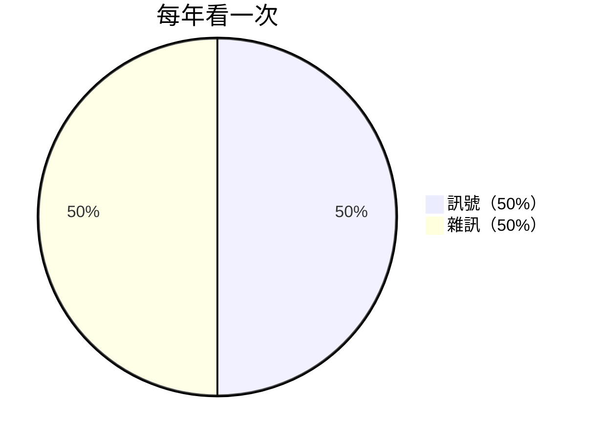
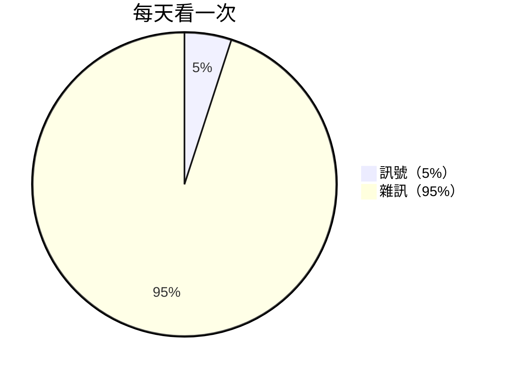
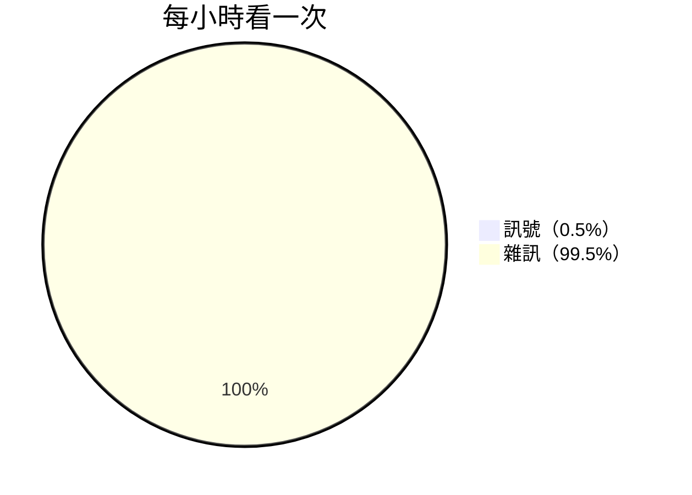

<!-- SELF-INTRO-START -->

_嗨，我是 [黃樺明](https://huam.in/about)，喜歡 [寫作](https://huam.ing/writing)、[耐力運動](https://www.strava.com/athletes/huaminghuang)、[用手機寫程式](https://github.com/huaminghuangtw)。Enoughness，剛剛好，是我從 2023 年開始每天練習的生活哲學。每週，我會分享三個想法，陪你打造剛剛好的生活。如果這封信是朋友轉寄給你的，歡迎 [點此訂閱](https://huam.ing/newsletter)。想看看過往內容？[歷年電子報](https://huam.ing/enoughness) 都在這裡。_

<!-- SELF-INTRO-END -->

---

# 1

30 歲的隔天，我決定去 [二延平步道](https://www.google.com/search?q=二延平步道&udm=2) 度過一個 [數位排毒](https://www.google.com/search?q=數位排毒) 日 📵

在高鐵嘉義站排隊等候「台灣好行」阿里山線巴士，輪到我時剛好沒座位了。司機回頭看了一眼，最後同意我用站的。感謝他讓我直接上車，不用再等一小時。

山路彎來彎去，我也跟著搖來搖去。只好拉緊把手，在走道上努力站穩。

前面一整排乘客都在 [滑手機](enoughness-26.md)，我好奇大家都在滑什麼。訊息、限動、股票，五花八門，但有個共同點：

**幾乎是過去 24 小時內才出現的內容。**

沒有人在讀一年前的部落格文章，更沒有人在讀一百年前的紙本書。

台灣出版界的老大哥 [郝明義](https://www.google.com/search?q=郝明義) 在《[越讀者](https://www.books.com.tw/products/0010762864)》中，以「**第三類文盲**」形容不懂得利用書與網路，去享受閱讀樂趣的人。

想像有兩個人，同樣都滑了十分鐘手機：

* A 忙著看鄉民在 PTT 上為了「南部粽 vs 北部粽」吵翻天；
* B 利用這十分鐘，去了解 [寒武紀大爆發](https://www.google.com/search?q=寒武紀大爆發) 為何發生。

[在速食資訊橫行的時代，長文成了奢侈品](https://www.onlywin.work)；從頭到尾讀完一本書，更是現代人的奢求。

當文明愈進步，[我們愈該在意自己讀的，是人類的智慧結晶，還是糟粕](https://huam.ing/sherlock-holmes-brain-attic) 。

# 2

以前，只要一有空檔，我就要滑手機：等車的時候滑、吃飯的時候滑，連等紅綠燈那兩分鐘，也要低頭滑個兩下。

你問我到底在滑什麼？可能就是一個「安全感」吧……害怕漏掉訊息、害怕跟不上時事、害怕成為局外人。

還記得 [2021 年 10 月 4 日](https://www.google.com/search?q=2021+臉書大當機) 那天，碰上臉書和 Instagram 同時癱瘓。當時的我還是社群媒體重度成癮者，看到怎麼滑都是黑畫面的手機，直接原地崩潰。

這種深怕錯過的 [焦慮](enoughness-26.md#3)，叫 [錯失恐懼症](https://www.google.com/search?q=錯失恐懼症+FOMO)（FOMO，Fear Of Missing Out）。

2004 年，美國風險投資家 [Patrick McGinnis](https://www.google.com/search?q=Patrick+McGinnis) 在《[Social Theory at HBS: McGinnis’ Two FOs](https://www.harbus.org/post/social-theory-at-hbs-mcginnis-two-fos-2)》中，首次提出這個詞。

FOMO 源自 [生物本能](enoughness-41.md#2) 對歸屬感和認同感的渴望，讓我們不斷追逐最新潮的資訊，和大家都在討論的話題。

錯失恐懼症的另一面，是 [錯過的快樂](https://www.google.com/search?q=錯過的快樂+JOMO)（JOMO，Joy Of Missing Out）。簡單來說：

* FOMO = 怕錯過
* JOMO = 錯過了，那又怎樣 🤷

> 需要知道的事，終究會知道；不知道的事，或許真的不需要知道。

我平常 [沒在看新聞](#3)，常常連颱風要來了都不知道。但我還是有辦法做好防颱準備，因為鄰居或家人總會告訴我。

所以，別害怕錯過資訊。真正重要的資訊，總會換個形式，在別的地方再次出現。就像打電話：如果真的很重要，對方會再打一次；如果沒有再次來電，代表沒那麼重要。

想要擁抱 JOMO，欣然接受「錯過」的樂趣，可以從幾件小事開始：

1. **覆盤時間**：回顧一天，[哪些事是出於責任義務，哪些事是真心想做的？](https://x.com/naval/status/908052298957332480)
2. **活在當下**：把注意力拉回眼前。跟好友家人吃飯時，把手機收起來，專心聊天。
3. **練習感恩**：睡前回想三件值得感謝的事。[成功是得到你想要的，快樂是想要你得到的。](https://www.goodreads.com/quotes/4808-success-is-getting-what-you-want-happiness-is-wanting-what)
4. **主動說不**：不是每通電話都要接、每個邀約都要出席。JOMO 不是冷漠或斷開社交聯繫，而是劃清個人界線；JOMO 是一種解放，以及有意識地缺席。
5. **數位斷食**：每天刻意保留一段沒有 3C 產品（tech-free）的神聖時間，然後 [和自己的思緒相處](enoughness-1.md#3)。可能是坐在陽台上喝杯茶，晚餐後在夜光下散步，或是在日記裡留下一段文字。

錯過的，真的不會怎樣。

不知道的，也不會影響人生。

天不會塌，明天的太陽照樣升起。

沒有人在 [臨終前](enoughness-3.md#2) 會說：「早知道就多去應酬。」他們後悔的，是沒能多陪家人、沒建立深度連結、沒有忠於自己。

**無知便是福；選擇性無知，是一種超能力**。當你開始享受「[這個我不知道，而且我一點都不想知道](https://wiwi.blog/blog/missing-out)」的快感，或有勇氣說出「[我不想知道我不想知道的事](https://www.onlywin.work/p/3b0)」時，就自由了 🫶

# 3

你是否曾經相信，看新聞是「負責任」的公民該做的事？

統計學家 [Nassim Nicholas Taleb](https://www.google.com/search?q=Nassim+Nicholas+Taleb) 在《[反脆弱](https://www.books.com.tw/products/0010590630)》（[Antifragile](https://www.goodreads.com/book/show/13530973-antifragile)）寫道：

> 你看數據的次數越頻繁，得到的雜訊就越多（而不是有價值的訊號）；因此，雜訊/訊號比就越高。
>
> The more frequently you look at data, the more noise you are disproportionally likely to get (rather than the valuable part called the signal); hence the higher the noise to signal ratio.

訊號（signal）通常持久、變化緩慢；雜訊（noise）則隨機、四處亂竄。

因此，當你看得越頻繁，捕捉到的雜訊就越多，雜訊/訊號比也就越高：

他接著寫道：

> 在網路時代，這件事很難被接受。我始終很難解釋 — 你得到的數據越多，反而越不知道發生了什麼事。
>
> This is hard to accept in the age of the Internet. It has been very hard for me to explain that the more data you get, the less you know what’s going on.

這讓我想到新聞：**看得越多，對世界的了解反而越少**。更何況，這世界每天發生的事，24 小時可能也不夠我們看完 0.0001%。

[研究發現](https://doi.org/10.1038/s41562-023-01538-4)，新聞標題每多一個負面詞，點擊率就多 2.3%。「震驚」、「誇張」、「爆出」……這些聳動字眼，並非為了傳遞資訊而生（不然幹嗎不直接寫重點？），而是騙你掉進點擊誘餌（clickbait）的陷阱，好讓平台多榨取收益。

[貝特里奇頭條定律](https://www.google.com/search?q=貝特里奇頭條標題定律)（Betteridge’s Law of Headlines）則指出，任何以問號結尾的新聞標題，內容通常是胡說八道，只是記者用來騙取點擊率的行銷手法。

> 新聞對心靈的傷害，就像糖對身體一樣：好吃、好消化，卻傷人於無形。
>
> — [Rolf Dobelli](https://www.google.com/search?q=Rolf+Dobelli)，《[拒看新聞的生活藝術](https://www.books.com.tw/products/0010850742)》（[Die Kunst des digitalen Lebens](https://www.goodreads.com/book/show/48581422-stop-reading-the-news)）

看新聞，其實是一種「[外包思考](enoughness-23.md#1)」的行為。不相信嗎？把新聞關掉一個星期，你會發現自己有很多「想法」，只是新聞標題。

世界盃誰贏了、川普今天說了什麼、iPhone 又推出什麼新功能。看新聞很像吃垃圾食物，餵得飽一時的興奮，卻餵不飽長遠的成長。我的經驗是還會帶來一種說不上來的空虛感 ☹️

那怎麼辦？

_只吸收「歷久彌新」（Timeless）的內容 — 那些多年後依然適用、價值不減的知識，並忽略「當下即時」（Timely）的新聞。專注在不會變的事情，就不會被變來變去的東西搞得心神不寧。_

《[銀色馬](https://en.wikipedia.org/wiki/The_Adventure_of_Silver_Blaze)》（The Adventure of Silver Blaze）有個故事：

比賽前夕，備受矚目的冠軍賽馬離奇失蹤，馴馬師被發現陳屍在附近的荒野。大家忙著追查兇手，福爾摩斯卻對「狗沒叫」這件事起疑。

狗沒叫，代表來者是牠認識的人，也就是馴馬師本人。他為了賭局，趁夜想弄傷馬腳，反被受驚嚇的馬一腳踢死。

新聞也是這樣。**最該被大眾知道的，也許是那些「沒被報導」的消息。**

戒新聞不是件容易的事，因為安靜令人感到不安。畢竟，電視再吵，也比自己內心的聲音好聽。

那就聽取 [Taleb 的建議](https://www.goodreads.com/quotes/7588210-to-be-completely-cured-of-newspapers-spend-a-year-reading)，先從讀上星期的報紙開始吧！

— 樺明
