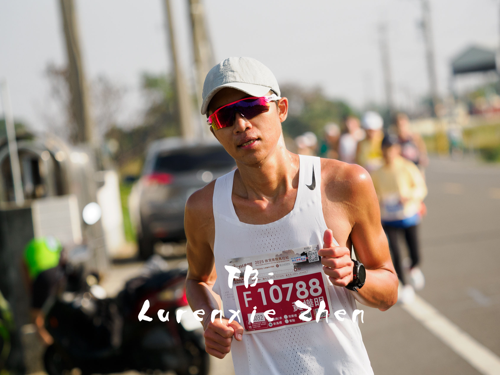
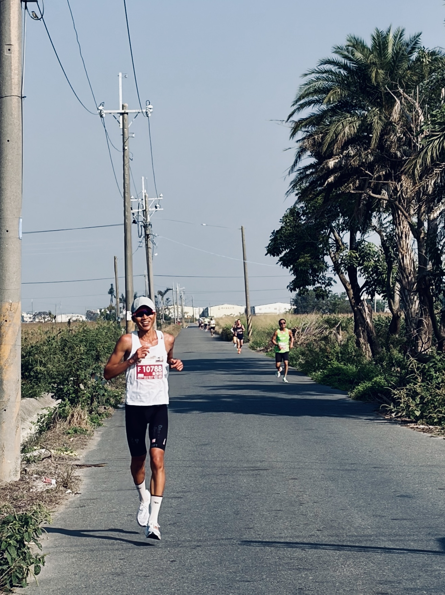
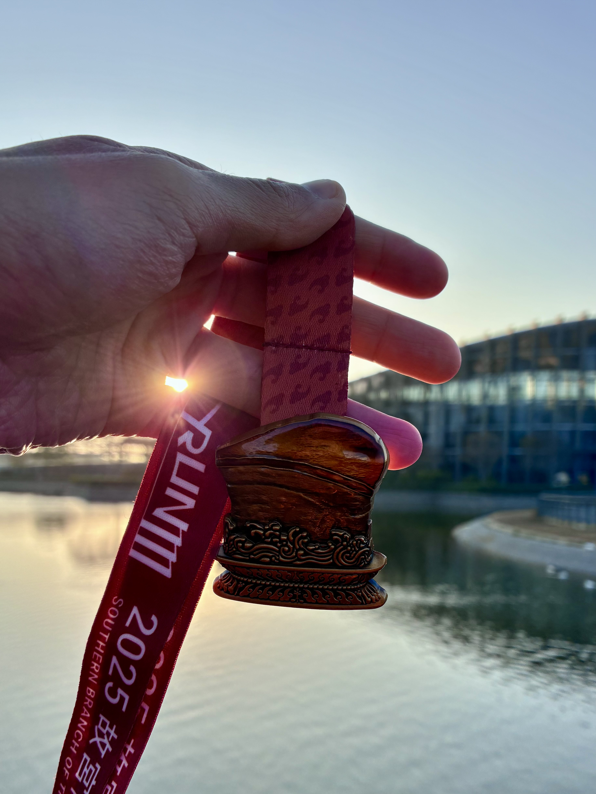
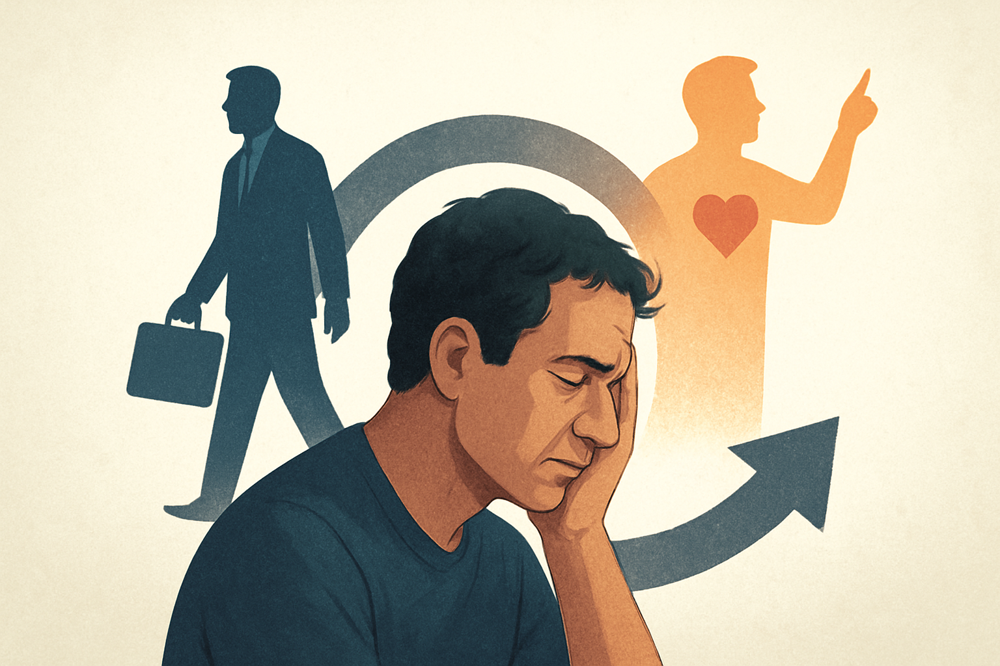

<!-- SELF-INTRO-START -->

_嗨，我是 [黃樺明](https://huam.ing)，我熱愛 [寫作](https://huam.ing/writing)、[耐力運動](https://www.strava.com/athletes/huaminghuang)、[開發提升生活品質的軟體工具](https://github.com/huaminghuangtw)。Enoughness，剛剛好，是我從 2023 年開始每天練習的生活態度。每週，我會在這份電子報分享三件有趣的事。如果這封信是朋友轉寄給你的，歡迎 [點此訂閱](https://huam.ing/newsletter)。想看看過往內容？[歷年電子報](https://huam.ing/enoughness) 都在這裡。_

<!-- SELF-INTRO-END -->

---

# 1

**生活中最難的，不是向認識的人道別，而是和過去的自己說再見。**

以前，我花很多時間思考「我到底是誰？」，卻始終百思不得其解。

後來，我體會到：太刻意地想要回答這個問題，不僅多餘，甚至危險。

越長大，越覺察：**我，只是存在。**

在這趟人生旅途中，我不過是來旅行的。

此時此刻的我，是短暫且稍縱即逝的。

我，從未「完成」，也不會有「完成」的一天。

我，永遠都是「正在進行中」的作品。

我，永遠都處於「正在成為」的狀態。

我，沒有起點、中點或終點，也沒有所謂的 V1 或 V2 版本。

沒有過去的我需要緊抓不放，也沒有未來的我需要過度擔憂；

只有我 — 那個不完美，卻仍持續迭代、更新、進步、成長、變強的我。

👉 閱讀全文：《[和過去的自己說再見](https://huam.ing/2025/12/11/goodbye-past-me)》

# 2

上週日，我參加了位於嘉義太保的 [故宮南院馬拉松](https://www.strava.com/activities/16680278744)。

這是我的第二場馬拉松，也是在台灣的初馬。

這次賽事最棒的福利，莫過於參賽者能憑號碼牌免費參觀故宮南院。我特地在前一天朝聖了「甲子萬年：國立故宮博物院百年院慶特展」。除了欣賞精緻的汝窯青瓷、北宋蘇氏三代瀟灑飄逸的書法字跡外，更親眼目睹了千年巨作、鎮院三寶 — 范寬〈谿山行旅圖〉、郭熙〈早春圖〉與李唐〈萬壑松風圖〉。

不過，為了迎接隔天的重頭戲，不得不早早收心。畢竟要在 03:30 準時從床上彈起來，還要睡滿 9 小時，我在前天傍晚 18:30 就乖乖躺平，比老人還養生的作息。

起床後，先用 30 分鐘的寫作喚醒大腦，接著享用我每天百吃不膩的靈魂早餐：[燕麥粥配水煮蛋](https://huam.ing/2025/11/14/enoughness-5/#3)。

接著在瑜伽墊上用 [Blackroll](https://blackroll.com) 滾筒仔細按摩、拉筋，把還在沈睡的肌肉喚醒。

抵達號稱「全臺最美馬拉松會場」後，迅速完成寄物，在停車場做 [馬克操](https://www.google.com/search?q=馬克操) 熱身，當然也沒忘了賽前最重要的儀式 — 排隊上廁所。

一切就緒後，吸了一包果膠，06:30 鳴槍出發，正式踏上這場 42 公里的旅程。

---

很多人說：「**一場馬拉松，從第 30 公里處才真正開始。**」

所以，按照自己的配速前進，不被別人的節奏打亂，是一件非常重要的事。

在長跑中，如果說有什麼必須戰勝的對手，那便是 [過去的自己](https://huam.ing/2025/12/11/goodbye-past-me)。

在這條賽道上，唯一的競爭者，只有 [昨天的自己](https://huam.ing/2025/8/30/you-and-your-timeline)。

---

也有很多人說：「**當你報名馬拉松時，基本上也報名了痛苦。**」

好不容易來到最後 3 公里，每一步都變得異常沈重 — 大腿緊到快抽筋，呼吸也變得急促 — 身體不斷發出訊號，叫我停下來。

就在極限邊緣，我想起了 [村上春樹](https://www.google.com/search?q=村上春樹) 在《[關於跑步，我說的其實是……](https://www.goodreads.com/work/quotes/2475030)》裡的那句名言：

> Pain is inevitable. Suffering is optional.
>
> 痛是難免的，苦是甘願的。

身體的疼痛（Pain），是無法避免的生理反應；但心靈的受苦（Suffering），卻是可以選擇的心理狀態。

於是，我試著抽離雙腳痠痛的事實，不再去想還有多遠，而是專注在當下的每一步。

盯著前方跑友的背影、看著腳下的路面、在心中默數 1 到 100…

「我不行了」，不過是個隨時能重新改寫的念頭。

在任何情況下，我永遠可以選擇與痛共存，但不必為苦所困。

正如 1962 年電影《[阿拉伯的勞倫斯](https://www.imdb.com/title/tt0056172/)》（Lawrence of Arabia）中的一句 [經典台詞](https://youtu.be/TvQViPBAvPk)：

> The trick is not minding that it hurts.
>
> 訣竅在於，不在意它會痛。

---

還有很多人說：「**在馬拉松的世界裡，只有累積，沒有奇蹟。**」

最無聊的練習，沉澱出最扎實的基本功。

沒有捷徑，也沒有速成的秘訣。

只有每天重複的浪漫。

奧斯卡影帝 [Will Smith](https://www.google.com/search?q=Will+Smith) 的「[堆磚塊](https://youtu.be/wIsgyIq_kFs?t=128s)」心態，正是這種精神的最佳寫照：

> You don’t try to build a wall. You don’t start by saying, I’m going to build the biggest, baddest wall that’s ever been built. You say, I’m going to lay this brick as perfectly as a brick can be laid. You do that every single day, and soon you have a wall.
>
> 你不說：「我要蓋出一道完美的牆。」你說：「我要完美地擺放每塊磚頭，有一天，我就會蓋出一道完美的牆。」

跑步也是如此。那一磚一瓦的堆疊，正是腳下跨出的每一步。

當我不再被遙遠的 42 公里震懾住，選擇把注意力拉回當下，專心把每一步跑穩、跑好；不知不覺中，看似不可能的距離，都會被甩在身後。

---

> “It’s not always the people who start out the smartest who end up the smartest.” — Carol S. Dweck, [Mindset: How You Can Fulfil Your Potential](https://www.goodreads.com/work/quotes/40330)

人生不是短跑衝刺，而是一場沒有終點的馬拉松；關鍵不是贏在起跑線，或爭一時之先，而是細水長流、走得長遠。

重點是「走得遠」，而不是「跑得快」。

就像一顆大樹，並非一夜之間就能長成，而是在多年前就種下樹苗，經過漫長的灌溉與照料，最後才能迎來綠蔭。

**贏過自己、專心致志、享受過程，這些都是馬拉松教我的事。**

# 3

矽谷知名天使投資人 [Naval Ravikant](https://www.google.com/search?q=Naval+Ravikant) 在 [訪談中](https://youtu.be/KyfUysrNaco?t=4910) 說道：

> 人生中許多掙扎，往往是因為我們內心同時存在兩個互相衝突的慾望。

簡單來說，就是苦於「現實」與「理想」的脫節：

1. 一方面想要穩定高薪的工作，另一方面又想要全職追求熱情。

	結果：既對工作感到空虛，又害怕追求夢想帶來的不確定性。

2. 一方面想要表達內心的真實想法，另一方面又希望被外界的眼光喜歡。

	結果：既對自己產生懷疑，又因忽略本心而焦躁不安。

3. 一方面想要維持這段關係的安穩，另一方面又渴望離開這個不再讓自己成長的環境。

	結果：既感到窒息與拉扯，又無法在關係中做自己。

要緩解這種壓力，方法之一就是承認自己有兩個相互衝突的慾望，然後：

1. 選定一個，下好離手，並坦然接受失去另一個。
2. 暫時擱置，讓慾望安靜，稍後再決定。

P.S. 這集是我最喜歡的 Podcast 集數之一，滿滿的人生智慧，[歡迎閲讀我的筆記](https://huam.ing/44-harsh-truths-about-human-nature/)。

— [樺明](https://huam.ing/2025/12/12/enoughness-9)

---

“Don’t do what you can do. Try what you can’t do.”
 
— William Faulkner

